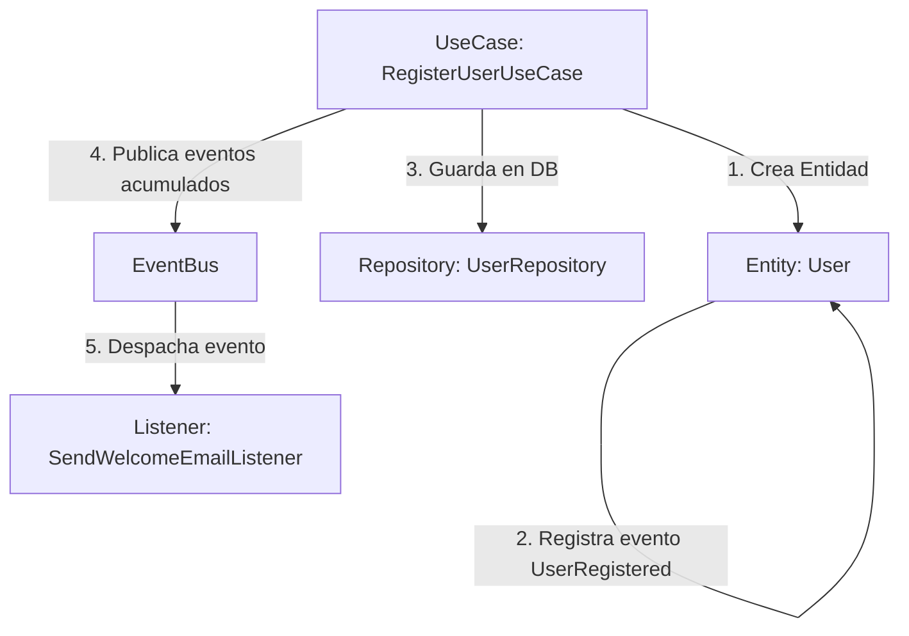

# Guía Didáctica: Eventos de Dominio (Domain Events) en Arquitectura Hexagonal

Esta guía explica conceptualmente qué son los **Eventos de Dominio**, por qué se utilizan en DDD/Arquitectura Hexagonal, y presenta un **ejemplo completo paso a paso** para que puedas implementar tus propios eventos de dominio a futuro de manera independiente.

---

## 💡 ¿Qué es un Evento de Dominio?

Un **Evento de Dominio** representa **algo importante que ya ocurrió en el pasado del negocio**. 

Es una notificación inmutable que se emite cuando el estado de una entidad del dominio cambia de forma relevante.

### Reglas Clave:
1. **Siempre se nombran en tiempo pasado**:
   - ❌ `CreateTenant` (Es un comando/acción).
   - ✅ `TenantCreatedDomainEvent` (Es el hecho histórico que ya ocurrió).
   - ✅ `UserPasswordChangedDomainEvent`
   - ✅ `ProductPublishedDomainEvent`

2. **Son Inmutables**: Una vez que el evento se crea y se emite, no puede ser modificado, ya que representa un hecho del pasado.

3. **Desacoplan el sistema**: El dominio declara que "algo ocurrió". Quienes reaccionan (Listeners / Escuchadores) se encargan de ejecutar efectos secundarios (enviar emails, auditorías, notificaciones) sin ensuciar la lógica principal.

---

## 🏗️ Flujo Completo Paso a Paso (Ejemplo Didáctico)

Imaginemos un flujo sencillo: **Registro de un Nuevo Usuario (`User`)** donde, al registrarse, queremos enviar un correo de bienvenida sin acoplar esa lógica al Caso de Uso principal.



---

### Paso 1: Definir la Clase del Evento de Dominio

Ubicación: `Src/User/Domain/Events/UserRegisteredDomainEvent.php`

```php
<?php

namespace Src\User\Domain\Events;

use Src\Shared\Domain\Events\DomainEvent;

final class UserRegisteredDomainEvent extends DomainEvent
{
    public function __construct(
        string $aggregateId, // UUID del usuario que se registró
        public readonly string $email,
        public readonly string $name,
        ?string $eventId = null,
        ?string $occurredOn = null
    ) {
        parent::__construct($aggregateId, $eventId, $occurredOn);
    }

    public static function eventName(): string
    {
        return 'user.registered';
    }

    public function toArray(): array
    {
        return [
            'aggregate_id' => $this->aggregateId(),
            'email' => $this->email,
            'name' => $this->name,
            'event_id' => $this->eventId(),
            'occurred_on' => $this->occurredOn(),
        ];
    }
}
```

---

### Paso 2: Registrar el Evento dentro de la Entidad de Dominio

Ubicación: `Src/User/Domain/Entities/User.php`

```php
<?php

namespace Src\User\Domain\Entities;

use Src\Shared\Domain\Aggregate\AggregateRoot;
use Src\User\Domain\Events\UserRegisteredDomainEvent;

class User extends AggregateRoot
{
    // ... propiedades de la entidad ...

    public static function create(
        Uuid $id,
        UserName $name,
        UserEmail $email,
        // ...
    ): self {
        $user = new self($id, $name, $email, ...);

        // REGISTRAR EL EVENTO DE DOMINIO
        $user->record(new UserRegisteredDomainEvent(
            aggregateId: $id->value(),
            email: $email->value(),
            name: $name->value()
        ));

        return $user;
    }
}
```

---

### Paso 3: Publicar los Eventos acumulados desde el Caso de Uso

Ubicación: `Src/User/Application/UseCase/RegisterUserUseCase.php`

```php
<?php

namespace Src\User\Application\UseCase;

use Src\Shared\Domain\Contracts\EventBus;
use Src\User\Domain\Entities\User;
use Src\User\Application\Contracts\Repositories\UserRepositoryInterface;

class RegisterUserUseCase
{
    public function __construct(
        private UserRepositoryInterface $repository,
        private EventBus $eventBus
    ) {}

    public function execute(RegisterUserDTO $dto): void
    {
        // 1. Crear entidad (esto acumula el evento UserRegisteredDomainEvent internamente)
        $user = User::create(...);

        // 2. Persistir en base de datos
        $this->repository->save($user);

        // 3. Extraer y Publicar los eventos de dominio acumulados
        $this->eventBus->publish(...$user->pullDomainEvents());
    }
}
```

---

### Paso 4: Crear un Listener (Escuchador) en Infraestructura

Ubicación: `Src/User/Infrastructure/Listeners/SendWelcomeEmailListener.php`

```php
<?php

namespace Src\User\Infrastructure\Listeners;

use Src\User\Domain\Events\UserRegisteredDomainEvent;
use Illuminate\Support\Facades\Mail;

class SendWelcomeEmailListener
{
    public function handle(UserRegisteredDomainEvent $event): void
    {
        // Aquí ejecutas la tarea secundaria (ej: enviar email de bienvenida)
        // Mail::to($event->email)->send(new WelcomeMail($event->name));
    }
}
```

---

## 📋 Lista de Chequeo Rápida para Crear tus Eventos a Futuro

Cuando quieras agregar un nuevo evento de dominio a tu sistema:

1. 🟢 **Crear el Evento**: Extiende de `DomainEvent` en `Src\<Contexto>\Domain\Events\<Nombre>DomainEvent.php`.
2. 🟢 **Registrarlo en la Entidad**: Usa `$this->record(new TuEvento(...))` dentro del método de negocio correspondiente.
3. 🟢 **Publicarlo en el Caso de Uso**: Asegúrate de tener inyectado `EventBus` y llamar a `$this->eventBus->publish(...$entity->pullDomainEvents())`.
4. 🟢 **Escucharlo (Opcional)**: Si necesitas un efecto secundario (email, webhook, log de auditoría), crea un Listener en `Infrastructure/Listeners/`.
