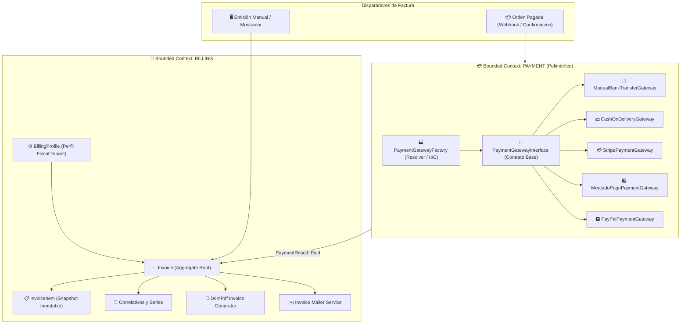

# 📋 Guía y Plan de Implementación Integral: Contexto de Facturación (Billing) y Pasarelas de Pago Polimórficas (Payment Gateways)
## Módulo de Facturación y Pagos (Tenant) - OwoMarket

Este documento establece la **especificación técnica, arquitectura y hoja de ruta por fases** para el desarrollo del **Módulo de Facturación** y el **Contrato Polimórfico de Métodos de Pago** en **OwoMarket**.

---

## 🎯 1. Objetivos del Módulo

1. **Facturación Autónoma e Inmediata para el Tenant:**
   - El comerciante puede emitir facturas y comprobantes directamente desde su Backoffice (ventas de mostrador, pedidos manuales, cotizaciones) sin depender de que el Marketplace público esté terminado.
   - Generación automática de facturas cuando una orden cambie a estado `paid`.
   - Control de correlativos automáticos sin saltos (ej: `FAC-2026-000001`), snapshot inmutable de datos fiscales (emisor y receptor), desglose de impuestos (IVA/Tax) y descuentos.
   - Generación de PDF profesional con diseño fiscal y envío automático por correo electrónico.

2. **Arquitectura de Pagos Polimórfica y Desacoplada (Evitar el infierno de integraciones):**
   - **Patrón Strategy + Inyección de Dependencias + Fábrica de Pasarelas (`PaymentGatewayFactory`):**
   - Interfaz unificada `PaymentGatewayInterface` que cualquier pasarela (manual o digital) debe implementar.
   - Suministro de métodos **Manuales/Offline** (Transferencia Bancaria, Contra Entrega / POS) y pasarelas **Digitales** (Stripe, MercadoPago, PayPal, Webpay) como adaptadores intercambiables.

---

## 🗺️ 2. Mapa de Arquitectura y Relación de Contextos



---

## 💳 3. Arquitectura del Contrato Polimórfico de Pagos (`src/Payment/`)

Para que conectar nuevas pasarelas no sea un infierno, se utiliza el **Patrón Strategy** con contratos estrictos de entrada y salida:

### 3.1. Contrato Base: `PaymentGatewayInterface.php`
```php
namespace Src\Payment\Domain\Contracts;

use Src\Payment\Domain\ValueObjects\PaymentResult;
use Src\Payment\Domain\ValueObjects\RefundResult;
use Src\Payment\Domain\ValueObjects\WebhookResult;

interface PaymentGatewayInterface
{
    /**
     * Identificador único de la pasarela (ej: 'manual_transfer', 'stripe', 'mercadopago').
     */
    public function getIdentifier(): string;

    /**
     * Nombre legible para el cliente.
     */
    public function getDisplayName(): string;

    /**
     * Procesa un cobro (creación de sesión de checkout, cargo directo o instrucciones de pago).
     */
    public function charge(array $paymentData): PaymentResult;

    /**
     * Procesa un reembolso parcial o total.
     */
    public function refund(string $transactionId, float $amount, ?string $reason = null): RefundResult;

    /**
     * Procesa e interpreta el webhook de notificación asíncrona de la pasarela.
     */
    public function handleWebhook(array $payload, array $headers = []): WebhookResult;
}
```

### 3.2. Factoría y Registro Dinámico: `PaymentGatewayFactory.php`
```php
namespace Src\Payment\Infrastructure\Factory;

use Src\Payment\Domain\Contracts\PaymentGatewayInterface;
use InvalidArgumentException;

final class PaymentGatewayFactory
{
    /** @var array<string, class-string<PaymentGatewayInterface>> */
    private array $gateways = [];

    public function register(string $identifier, string $gatewayClass): void
    {
        $this->gateways[$identifier] = $gatewayClass;
    }

    public function make(string $identifier, array $config = []): PaymentGatewayInterface
    {
        if (! isset($this->gateways[$identifier])) {
            throw new InvalidArgumentException("La pasarela de pago '{$identifier}' no está soportada.");
        }

        return app()->makeWith($this->gateways[$identifier], ['config' => $config]);
    }
}
```

---

## 🗄️ 4. Esquemas de Base de Datos (Tenant Database)

### 4.1. Migración: `create_billing_profiles_table.php`
`database/migrations/tenant/2026_08_18_000001_create_billing_profiles_table.php`

```php
Schema::create('billing_profiles', function (Blueprint $table) {
    $table->uuid('id')->primary();
    $table->string('legal_name');                  // Razón Social / Nombre Comercial
    $table->string('tax_id');                      // Identificador Fiscal (RUT / RFC / NIF / CIF / RUC)
    $table->string('billing_email');               // Correo para notificaciones fiscales
    $table->string('phone')->nullable();
    $table->string('address_line_1');
    $table->string('address_line_2')->nullable();
    $table->string('city');
    $table->string('state');
    $table->string('postal_code');
    $table->string('country');
    $table->string('invoice_prefix')->default('FAC-'); // Prefijo de factura (ej: FAC-, INV-)
    $table->unsignedBigInteger('next_invoice_number')->default(1); // Próximo correlativo
    $table->text('invoice_footer_notes')->nullable();
    $table->string('logo_path')->nullable();
    $table->json('metadata')->nullable();
    $table->timestamps();
});
```

### 4.2. Migración: `create_invoices_table.php`
`database/migrations/tenant/2026_08_18_000002_create_invoices_table.php`

```php
Schema::create('invoices', function (Blueprint $table) {
    $table->uuid('id')->primary();
    $table->string('order_id')->nullable();         // Opcional si es factura de venta directa/manual
    $table->string('customer_id')->nullable();
    
    $table->string('invoice_number')->unique();     // Ej: FAC-2026-000001
    $table->enum('status', ['draft', 'issued', 'paid', 'cancelled', 'refunded'])->default('issued');
    $table->date('issue_date');
    $table->date('due_date')->nullable();
    $table->string('currency')->default('USD');
    
    // Importes contables inmutables
    $table->decimal('subtotal', 12, 2);
    $table->decimal('tax_amount', 12, 2)->default(0);
    $table->decimal('discount_amount', 12, 2)->default(0);
    $table->decimal('total', 12, 2);
    
    // Método y estado de pago
    $table->string('payment_method')->default('manual'); // 'manual_transfer', 'cash', 'stripe', etc.
    $table->string('payment_status')->default('paid');
    $table->timestamp('paid_at')->nullable();
    
    // Snapshot inmutable de datos fiscales del cliente receptor
    $table->string('billing_customer_name');
    $table->string('billing_customer_tax_id')->nullable();
    $table->string('billing_customer_email');
    $table->json('billing_customer_address');
    
    // Snapshot inmutable de datos fiscales del emisor al emitir la factura
    $table->json('issuer_snapshot');
    
    $table->string('pdf_path')->nullable();
    $table->text('notes')->nullable();
    $table->json('metadata')->nullable();
    $table->timestamps();
    $table->softDeletes();
});
```

### 4.3. Migración: `create_invoice_items_table.php`
`database/migrations/tenant/2026_08_18_000003_create_invoice_items_table.php`

```php
Schema::create('invoice_items', function (Blueprint $table) {
    $table->uuid('id')->primary();
    $table->uuid('invoice_id');
    $table->foreign('invoice_id')->references('id')->on('invoices')->cascadeOnDelete();
    $table->string('product_id')->nullable();
    $table->string('product_variant_id')->nullable();
    $table->string('description');
    $table->string('sku')->nullable();
    $table->integer('quantity');
    $table->decimal('unit_price', 12, 2);
    $table->decimal('tax_rate', 5, 2)->default(0);  // Porcentaje (ej: 16.00 ó 19.00)
    $table->decimal('tax_amount', 12, 2)->default(0);
    $table->decimal('discount_amount', 12, 2)->default(0);
    $table->decimal('subtotal', 12, 2);
    $table->decimal('total', 12, 2);
    $table->timestamps();
});
```

---

## 🏗️ 5. Estructura de Directorios del Módulo (`src/Billing/`)

```text
src/Billing/
├── Domain/
│   ├── Entities/
│   │   ├── Invoice.php                 # Aggregate Root
│   │   ├── InvoiceItem.php             # Entidad de línea de factura
│   │   └── BillingProfile.php          # Perfil fiscal de la tienda
│   ├── ValueObjects/
│   │   ├── InvoiceId.php
│   │   ├── InvoiceNumber.php           # Correlativo con prefijo (ej. FAC-2026-000001)
│   │   ├── InvoiceStatus.php           # Enum/VO de estados (draft, issued, paid, cancelled)
│   │   ├── TaxId.php                   # Identificador fiscal (RUT / RFC / NIF / RUC)
│   │   ├── BillingAddress.php          # Dirección fiscal inmutable
│   │   ├── InvoiceAmount.php           # Importes y totales monetarios
│   │   └── InvoiceDate.php             # Fecha de emisión y vencimiento
│   ├── Events/
│   │   ├── InvoiceIssuedDomainEvent.php
│   │   └── InvoiceCancelledDomainEvent.php
│   └── Exceptions/
│       ├── InvalidInvoiceStateException.php
│       ├── InvoiceNotFoundException.php
│       └── BillingProfileNotFoundException.php
├── Application/
│   ├── Contracts/
│   │   ├── Repositories/
│   │   │   ├── InvoiceRepositoryInterface.php
│   │   │   └── BillingProfileRepositoryInterface.php
│   │   └── Services/
│   │       ├── InvoicePdfGeneratorInterface.php
│   │       └── InvoiceMailerInterface.php
│   ├── DTOs/
│   │   ├── CreateDirectInvoiceData.php
│   │   ├── FilterInvoicesCriteria.php
│   │   └── UpdateBillingProfileData.php
│   └── UseCases/
│       ├── CreateDirectInvoiceUseCase.php
│       ├── ConsultInvoiceByIdUseCase.php
│       ├── FilterInvoicesUseCase.php
│       ├── CancelInvoiceUseCase.php
│       ├── GenerateInvoicePdfUseCase.php
│       ├── ResendInvoiceMailUseCase.php
│       ├── ConsultBillingProfileUseCase.php
│       └── UpdateBillingProfileUseCase.php
└── Infrastructure/
    ├── Eloquent/
    │   ├── Models/
    │   │   ├── Invoice.php
    │   │   ├── InvoiceItem.php
    │   │   └── BillingProfile.php
    │   └── Repositories/
    │       ├── EloquentInvoiceRepository.php
    │       └── EloquentBillingProfileRepository.php
    ├── Services/
    │   ├── DomPdfInvoiceGeneratorService.php
    │   └── LaravelInvoiceMailerService.php
    └── Http/
        ├── Controller/
        │   ├── ViewBillingIndexGETController.php
        │   ├── ViewBillingSettingsGETController.php
        │   ├── ViewInvoiceDetailGETController.php
        │   ├── CreateDirectInvoicePOSTController.php
        │   ├── FilterInvoicesPOSTController.php
        │   ├── DownloadInvoicePdfGETController.php
        │   ├── CancelInvoicePOSTController.php
        │   ├── ResendInvoiceMailPOSTController.php
        │   └── UpdateBillingProfilePUTController.php
        ├── Request/
        │   ├── CreateDirectInvoiceFormRequest.php
        │   ├── FilterInvoicesFormRequest.php
        │   └── UpdateBillingProfileFormRequest.php
        └── Routes/
            ├── tenant.php
            └── apiTenant.php
```

---

## 🎨 6. Interfaz de Usuario en el Dashboard del Tenant (`resources/js/Pages/tenant/modules/billing/`)

1. **`BillingIndexPage.tsx`**:
   - Tarjetas KPI: **Total Facturado ($)**, **Facturas Emitidas**, **Facturas Pagadas**, **Facturas Anuladas**.
   - Filtros: Búsqueda por número / cliente / NIF, selectores de estado y rango de fechas.
   - Tabla reactiva Flowbite con número de factura, cliente, fecha, total, badge de estado y menú de acciones:
     - 👁️ Ver Detalle Imprimible
     - 📄 Descargar PDF binario
     - ✉️ Reenviar al correo del cliente
     - 🚫 Anular Factura (con modal de confirmación)
   - Botón `+ Emitir Factura Manual / Directa` que abre el modal de emisión directa.

2. **`ShowInvoiceDetailPage.tsx`**:
   - Vista con diseño formal de documento tributario:
     - Encabezado con Logo de la tienda y snapshot fiscal del emisor.
     - Bloque fiscal del cliente (Razón social, Tax ID, dirección, email).
     - Tabla detallada de ítems con SKU, descripción, cantidad, precio unitario, tasa de IVA y subtotal.
     - Cuadro de resumen: Subtotal neto, IVA/Impuestos desglosados, Descuentos y Total Final.
     - Barra de herramientas: Imprimir, Descargar PDF y Enviar por Correo.

3. **`BillingSettingsPage.tsx`**:
   - Formulario para configurar la identidad fiscal de la tienda:
     - Razón Social, Identificación Tributaria (RUT / RFC / NIF / RUC).
     - Correo fiscal y teléfono.
     - Dirección legal (calle, ciudad, estado, código postal, país).
     - Prefijo de facturación (ej: `FAC-`, `INV-`) y número correlativo inicial.
     - Logo para documentos fiscales y notas al pie legales.

4. **Integración en el Sidebar (`SidebarDashboardComponent.tsx`)**:
   - Nueva sección o elemento **Facturación**:
     - 🧾 **Facturas**: `/billing/backoffice/${user_id}/module`
     - ⚙️ **Datos Fiscales**: `/billing/backoffice/${user_id}/settings`

---

## 📋 7. Plan de Implementación por Fases

### 📌 FASE 1: Base de Datos y Perfil Fiscal del Tenant
- [ ] Migraciones en `database/migrations/tenant/`:
  - `create_billing_profiles_table.php`
  - `create_invoices_table.php`
  - `create_invoice_items_table.php`
- [ ] Entidad `BillingProfile` + Value Objects (`TaxId`, `BillingAddress`).
- [ ] Repositorio Eloquent `BillingProfileRepository` + Casos de Uso `ConsultBillingProfileUseCase` y `UpdateBillingProfileUseCase`.
- [ ] Endpoint `/api-tenant/billing/profile` + Tests unitarios y de integración.
- ➔ `commit: feat(billing): implement billing profiles and database migrations`

### 📌 FASE 2: Dominio Core de Facturación y Emisión Manual
- [ ] Entidades `Invoice` y `InvoiceItem` con invariantes de cálculo matemático (subtotal, IVA, descuento, total).
- [ ] Value Objects `InvoiceId`, `InvoiceNumber`, `InvoiceStatus`, `InvoiceAmount`, `InvoiceDate`.
- [ ] Casos de Uso `CreateDirectInvoiceUseCase`, `ConsultInvoiceByIdUseCase`, `FilterInvoicesUseCase`, `CancelInvoiceUseCase`.
- [ ] Tests unitarios de Dominio y Casos de Uso.
- ➔ `commit: feat(billing): implement invoice domain entities, value objects and core use cases`

### 📌 FASE 3: Infraestructura, Repositorios Eloquent y Endpoints API
- [ ] Modelos Eloquent en `src/Billing/Infrastructure/Eloquent/Models/` (`Invoice.php`, `InvoiceItem.php`, `BillingProfile.php`).
- [ ] `EloquentInvoiceRepository` con soporte para filtros multicriterio, correlativos atómicos y paginación.
- [ ] Controladores HTTP y FormRequests en `src/Billing/Infrastructure/Http/`.
- [ ] Rutas API registradas en `routes/tenantApi.php` (`/api-tenant/billing/*`).
- [ ] Tests de Integración y Feature con PestPHP (`BillingApiTest.php`).
- ➔ `commit: feat(billing): implement billing eloquent repositories, controllers and api tests`

### 📌 FASE 4: Servicios de Generación de PDF (DomPdf) y Envío de Correo
- [ ] Instalación/configuración de `barryvdh/laravel-dompdf`.
- [ ] Plantilla Blade elegante de documento fiscal en `resources/views/invoices/pdf.blade.php`.
- [ ] Implementación de `DomPdfInvoiceGeneratorService` y `LaravelInvoiceMailerService`.
- [ ] Controlador de descarga directa `DownloadInvoicePdfGETController` y reenvío por correo `ResendInvoiceMailPOSTController`.
- [ ] Tests de generación de PDF y Mailer.
- ➔ `commit: feat(billing): implement invoice pdf generation and mailer services`

### 📌 FASE 5: Contrato Polimórfico de Métodos de Pago (`src/Payment/`)
- [ ] Contrato `PaymentGatewayInterface` con métodos estándar `charge()`, `refund()`, `handleWebhook()`.
- [ ] Fábrica `PaymentGatewayFactory` con registro dinámico y soporte para inyección de dependencias.
- [ ] Adaptadores iniciales:
  - `ManualBankTransferGateway` (Transferencia bancaria / Pago manual).
  - `CashOnDeliveryGateway` (Pago contra entrega / Efectivo).
- [ ] Integración para que pagos completados generen o marquen facturas como pagadas.
- [ ] Tests unitarios y de integración de pasarelas.
- ➔ `commit: feat(payment): implement polymorphic payment gateway interface, factory and manual adapters`

### 📌 FASE 6: Servicios Frontend y Vistas en el Dashboard del Tenant
- [ ] Tipos TypeScript (`Invoice.d.ts`, `InvoiceItem.d.ts`, `BillingProfile.d.ts`, `FormInvoice.d.ts`).
- [ ] `BillingServices.ts` con todos los métodos Axios tipados.
- [ ] Vistas React Flowbite:
  - `BillingIndexPage.tsx` (KPIs, tabla reactiva, filtros, modales de anulación y emisión directa).
  - `ShowInvoiceDetailPage.tsx` (Vista previa de documento fiscal e impresión).
  - `BillingSettingsPage.tsx` (Formulario de datos fiscales).
- [ ] Enlace en Sidebar y Navbar móvil del Tenant.
- ➔ `commit: feat(billing-ui): implement tenant billing dashboard, index, printable invoice view and fiscal settings`

### 📌 FASE 7: Testing Integral, QA y Validación Final
- [ ] Ejecución de suite completa de pruebas: `php artisan test`.
- [ ] Verificación de tipos: `npm run types`.
- [ ] Formateo con Pint: `vendor/bin/pint`.
- ➔ `commit: test(billing): full billing test suite and code styling`
