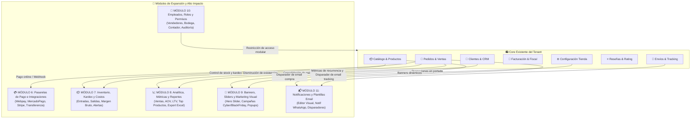

# 📋 Plan Maestro de Desarrollo: Módulos Avanzados y de Expansión del Tenant (Fase 2.0)
## OwoMarket - Arquitectura Hexagonal y Domain-Driven Design (DDD)

Este documento detalla la planificación arquitectónica, diseño de base de datos, casos de uso, infraestructura y componentes frontend para los **6 Módulos Avanzados de Alto Impacto** del Backoffice del Inquilino en **OwoMarket**.

---

## 🗺️ Mapa General del Ecosistema de Módulos Avanzados

---

## 🚦 Orden Recomendado de Ejecución por Prioridad

| Prioridad | Módulo | Contexto (`src/`) | Justificación Comercial |
| :---: | :--- | :--- | :--- |
| 🥇 **1** | **💳 Pasarelas de Pago e Integraciones** | `src/PaymentGateway/` | Habilita el cobro online real (Webpay, MercadoPago, Stripe, Transferencias) para cerrar ventas. |
| 🥈 **2** | **📦 Control de Inventario y Kardex** | `src/Inventory/` | Control de compras, mermas, costo unitario, cálculo de margen bruto y alertas de stock crítico. |
| 🥉 **3** | **📈 Analítica, KPIs y Reportes** | `src/Analytics/` | Visibilidad financiera, reportes de ventas, ticket promedio (AOV), ranking de productos y exportación contable. |
| 🏅 **4** | **🎨 Banners, Sliders y Marketing** | `src/Marketing/` | Control visual del storefront público, promociones temporales (Cyber/Navidad) y barras de aviso. |
| 🎖️ **5** | **👥 Empleados, Roles y Permisos** | `src/TenantStaff/` | Permite al inquilino delegar funciones a su equipo (Ventas, Bodega, Contabilidad) con accesos restringidos. |
| 🎗️ **6** | **📬 Plantillas Email y Notificaciones** | `src/Notification/` | Comunicación de marca automatizada y personalizable por eventos (compra, despacho, factura). |

---

# 💳 MÓDULO 6: Pasarelas de Pago e Integraciones (`src/PaymentGateway/`)
**Tablas:** `tenant_payment_gateways`, `tenant_payment_transactions`

### 🎯 Objetivos:
- Configuración multicriterio de métodos de pago por tienda: **Webpay Plus (Transbank)**, **MercadoPago**, **Stripe**, **PayPal** y **Transferencia Bancaria Directa**.
- Almacenamiento seguro de credenciales con cifrado (API Keys, Secret Keys, Commerce Codes).
- Toggle para modo Sandbox (Pruebas) vs Producción.
- Registro transaccional y logs de auditoría de webhooks (IPN) para validación de transacciones.

### 📌 Desglose por Fases:
#### 🔹 Fase 1: Dominio Core de Pasarelas y Transacciones (`src/PaymentGateway/Domain/`)
- [ ] Entidades: `PaymentGateway` (Aggregate Root), `PaymentTransaction` (Entidad de registro de pago).
- [ ] Value Objects: `GatewayId`, `GatewayProvider` (`webpay`, `mercadopago`, `stripe`, `paypal`, `bank_transfer`), `GatewayConfig` (Value object con credenciales cifradas y validación de esquema por proveedor), `TransactionId`, `TransactionStatus` (`pending`, `approved`, `rejected`, `refunded`), `Money`.
- [ ] Excepciones: `UnsupportedPaymentProviderException`, `PaymentGatewayNotFoundException`, `InvalidGatewayCredentialsException`.
- [ ] Tests unitarios de dominio.
- ➔ `commit: feat(payment-gateway): implement payment gateway domain entities and value objects`

#### 🔹 Fase 2: Capa de Aplicación, DTOs y Casos de Uso (`src/PaymentGateway/Application/`)
- [ ] Contratos de repositorio: `PaymentGatewayRepositoryInterface`, `PaymentTransactionRepositoryInterface`.
- [ ] DTOs: `ConfigureGatewayData`, `ProcessPaymentWebhookData`, `FilterTransactionsCriteria`, `PaymentGatewaySummaryData`.
- [ ] Casos de uso:
  - `ConfigurePaymentGatewayUseCase`: Activa o actualiza credenciales de un proveedor.
  - `ListConfiguredGatewaysUseCase`: Lista métodos de pago habilitados para el checkout y backoffice.
  - `RegisterPaymentTransactionUseCase`: Registra intento de cobro y vinculación con pedido.
  - `HandleGatewayWebhookUseCase`: Actualiza estado de la transacción y del pedido correspondiente.
  - `FilterPaymentTransactionsUseCase`: Consulta transacciones con filtros de fecha, método, estado y paginación.
- [ ] Tests unitarios de aplicación con Mockery.
- ➔ `commit: feat(payment-gateway): implement payment gateway use cases and repository contracts`

#### 🔹 Fase 3: Infraestructura, Modelos Eloquent y Service Provider (`src/PaymentGateway/Infrastructure/Eloquent/`)
- [ ] Migración tenant: `create_tenant_payment_gateways_table`, `create_tenant_payment_transactions_table`.
- [ ] Modelos Eloquent: `Src\PaymentGateway\Infrastructure\Eloquent\Models\PaymentGateway.php`, `PaymentTransaction.php` con cifrado de atributos sensibles (`encrypted:json`).
- [ ] Repositorios Eloquent: `EloquentPaymentGatewayRepository.php`, `EloquentPaymentTransactionRepository.php`.
- [ ] Proveedor `PaymentGatewayServiceProvider.php` registrado en `bootstrap/providers.php`.
- [ ] Tests de integración con base de datos tenant.
- ➔ `commit: feat(payment-gateway): implement payment gateway eloquent models, repositories and provider`

#### 🔹 Fase 4: Endpoints API REST y FormRequests (`src/PaymentGateway/Infrastructure/Http/`)
- [ ] FormRequests: `ConfigureGatewayFormRequest.php`, `FilterTransactionsFormRequest.php`.
- [ ] Controladores API:
  - `GET    /api-tenant/payment-gateway` (lista pasarelas y estado)
  - `POST   /api-tenant/payment-gateway/{provider}` (configura credenciales y activa/desactiva)
  - `POST   /api-tenant/payment-gateway/transactions/filter` (historial de transacciones)
  - `GET    /api-tenant/payment-gateway/transactions/{id}` (detalle de transacción)
- [ ] Rutas tenant API y Feature Tests.
- ➔ `commit: feat(payment-gateway): implement payment gateway api controllers, routes and feature tests`

#### 🔹 Fase 5: Servicios Frontend y Definición de Tipos TypeScript (`resources/js/`)
- [ ] Tipos: `PaymentGateway.d.ts`, `PaymentTransaction.d.ts`, `FormPaymentGateway.d.ts`.
- [ ] Servicio Axios `PaymentGatewayServices.ts` con tipado estricto `ApiResponse`.
- ➔ `commit: feat(payment-gateway): implement frontend payment gateway types and services`

#### 🔹 Fase 6: Vistas del Dashboard en React Flowbite (`resources/js/pages/tenant/modules/payment/`)
- [ ] Vista `PaymentGatewayIndexPage.tsx`:
  - Cards de pasarelas (Webpay Plus, MercadoPago, Stripe, PayPal, Transferencia Bancaria).
  - Modal de configuración de credenciales con visualizador de modo Sandbox / Producción.
  - Pestaña de historial de transacciones con badges de estado y modal de detalle.
- [ ] Controlador Web Inertia y navegación en barra lateral.
- ➔ `commit: feat(payment-gateway): implement payment gateway backoffice ui in react flowbite`

#### 🔹 Fase 7: Testing Integral, QA y Validación Final
- [ ] Prueba End-to-End (`PaymentGatewayLifecycleEndToEndTest.php`) y suite completa.
- ➔ `commit: test(payment-gateway): complete payment gateway module test suite and quality assurance`

---

# 📦 MÓDULO 7: Control de Inventario, Kardex y Costos (`src/Inventory/`)
**Tablas:** `tenant_stock_movements`, `tenant_stock_adjustments`, `tenant_inventory_alerts`

### 🎯 Objetivos:
- Trazabilidad y Kardex de movimientos de stock: Entradas (compras a proveedor), Salidas (ventas, despachos), Ajustes manuales y Mermas (pérdidas/daños).
- Registro del **Costo Unitario de Compra** para calcular el **Margen Bruto de Ganancia** en tiempo real.
- Configuración de umbral de stock crítico por producto/variante con panel de alertas automáticas.

### 📌 Desglose por Fases:
#### 🔹 Fase 1: Dominio Core de Inventario y Kardex (`src/Inventory/Domain/`)
- [ ] Entidades: `StockMovement` (Registro inmutable de kardex), `InventoryItem` (Balance consolidado con costo promedio ponderado).
- [ ] Value Objects: `MovementId`, `MovementType` (`purchase_in`, `sale_out`, `adjustment_in`, `adjustment_out`, `loss_waste`, `return_in`), `Quantity`, `UnitCost`, `ReferenceType`, `StockAlertThreshold`.
- [ ] Excepciones: `InsufficientStockException`, `InvalidStockMovementException`.
- [ ] Tests unitarios de dominio.
- ➔ `commit: feat(inventory): implement inventory domain entities, value objects and unit tests`

#### 🔹 Fase 2: Capa de Aplicación, DTOs y Casos de Uso (`src/Inventory/Domain/`)
- [ ] Contratos de repositorio: `StockMovementRepositoryInterface`, `InventoryBalanceRepositoryInterface`.
- [ ] DTOs: `RecordStockMovementData`, `FilterKardexCriteria`, `StockAlertItemData`, `InventoryMetricsData`.
- [ ] Casos de uso:
  - `RecordStockMovementUseCase`: Registra movimiento, actualiza existencias en producto/variante y recalcula costo promedio.
  - `FilterKardexMovementsUseCase`: Filtra historial por producto, tipo de movimiento, fecha y usuario.
  - `ConsultLowStockAlertsUseCase`: Detecta productos por debajo del umbral de seguridad.
  - `GetInventoryValuationMetricsUseCase`: Calcula valor total del inventario a precio de costo y precio de venta.
- [ ] Tests unitarios de aplicación con Mockery.
- ➔ `commit: feat(inventory): implement inventory use cases, dtos and repository contracts`

#### 🔹 Fase 3: Infraestructura, Modelos Eloquent y Service Provider (`src/Inventory/Infrastructure/Eloquent/`)
- [ ] Migración tenant: `create_tenant_stock_movements_table`.
- [ ] Modelos Eloquent: `Src\Inventory\Infrastructure\Eloquent\Models\StockMovement.php`.
- [ ] Repositorio Eloquent: `EloquentStockMovementRepository.php` con transacciones seguras (`lockForUpdate`).
- [ ] Proveedor `InventoryServiceProvider.php` registrado en `bootstrap/providers.php`.
- [ ] Tests de integración con base de datos tenant.
- ➔ `commit: feat(inventory): implement inventory eloquent models, repository and service provider`

#### 🔹 Fase 4: Endpoints API REST y FormRequests (`src/Inventory/Infrastructure/Http/`)
- [ ] FormRequests: `RecordStockMovementFormRequest.php`, `FilterKardexFormRequest.php`.
- [ ] Controladores API:
  - `POST   /api-tenant/inventory/movement` (ingreso o salida de stock)
  - `POST   /api-tenant/inventory/kardex/filter` (historial paginado de movimientos)
  - `GET    /api-tenant/inventory/alerts/low-stock` (listado de alertas de stock crítico)
  - `GET    /api-tenant/inventory/metrics/valuation` (valoración económica del inventario)
- [ ] Rutas tenant API y Feature Tests.
- ➔ `commit: feat(inventory): implement inventory api controllers, routes and feature tests`

#### 🔹 Fase 5: Servicios Frontend y Definición de Tipos TypeScript (`resources/js/`)
- [ ] Tipos: `InventoryKardex.d.ts`, `FormStockMovement.d.ts`, `InventoryMetrics.d.ts`.
- [ ] Servicio Axios `InventoryServices.ts` con tipado estricto `ApiResponse`.
- ➔ `commit: feat(inventory): implement frontend inventory types and services`

#### 🔹 Fase 6: Vistas del Dashboard en React Flowbite (`resources/js/pages/tenant/modules/inventory/`)
- [ ] Vista `InventoryIndexPage.tsx`:
  - KPIs de Valoración Total de Inventario, Unidades en Stock, Ítems con Stock Bajo y Movimientos del Mes.
  - Tabla interactiva de Kardex con filtros por producto, tipo de movimiento y fechas.
  - Modal para **Registrar Entrada / Ajuste / Merma** con selector de producto/variante, cantidad y costo unitario.
  - Tab de **Alertas de Stock Crítico** con botón de reabastecimiento rápido.
- [ ] Controlador Web Inertia y navegación en barra lateral.
- ➔ `commit: feat(inventory): implement inventory backoffice ui with flowbite kardex and alerts`

#### 🔹 Fase 7: Testing Integral, QA y Validación Final
- [ ] Prueba End-to-End (`InventoryLifecycleEndToEndTest.php`) y suite completa.
- ➔ `commit: test(inventory): complete inventory module test suite and quality assurance`

---

# 📈 MÓDULO 8: Analítica Avanzada, KPIs y Reportes (`src/Analytics/`)
**Tablas:** Consolidación sobre `orders`, `order_items`, `customers`, `products`, `invoices`

### 🎯 Objetivos:
- Dashboard de Inteligencia Comercial con gráficos en tiempo real: Ingresos, pedidos, conversión y ticket promedio (AOV).
- Ranking de **Top 10 Productos Más Vendidos** por unidades y recaudación.
- Análisis de retención y valor de vida de clientes (**LTV**).
- Motor de exportación de libros de ventas y reportes a **Excel (CSV / XLSX)**.

### 📌 Desglose por Fases:
#### 🔹 Fase 1: Dominio Core de Analítica (`src/Analytics/Domain/`)
- [ ] Modelos de Dominio / Value Objects: `DateRange`, `RevenueMetrics`, `AOVMetric`, `TopSellingProductItem`, `SalesByPeriodCollection`.
- [ ] Tests unitarios de dominio.
- ➔ `commit: feat(analytics): implement analytics domain value objects and metrics entities`

#### 🔹 Fase 2: Capa de Aplicación, DTOs y Casos de Uso (`src/Analytics/Application/`)
- [ ] Contrato: `AnalyticsRepositoryInterface`, `ExportReportServiceInterface`.
- [ ] DTOs: `AnalyticsFilterCriteria`, `SalesOverviewReportData`, `CustomerCohortData`.
- [ ] Casos de uso:
  - `GetSalesOverviewUseCase`: Obtiene serie de tiempo de ventas (diarias/mensuales) y comparativa de período anterior.
  - `GetTopSellingProductsUseCase`: Top productos por unidades y monto.
  - `GetCustomerAnalyticsUseCase`: Tasa de clientes nuevos vs recurrentes y AOV.
  - `ExportSalesReportUseCase`: Genera archivo descargable CSV/XLSX de ventas.
- [ ] Tests unitarios de aplicación con Mockery.
- ➔ `commit: feat(analytics): implement analytics use cases, dtos and repository contracts`

#### 🔹 Fase 3: Infraestructura, Servicios de Consulta y Service Provider (`src/Analytics/Infrastructure/Eloquent/`)
- [ ] Repositorio Eloquent optimizado con agregaciones SQL (`EloquentAnalyticsRepository.php`).
- [ ] Servicio de exportación: `CsvReportExportService.php`.
- [ ] Proveedor `AnalyticsServiceProvider.php` registrado en `bootstrap/providers.php`.
- [ ] Tests de integración con base de datos tenant.
- ➔ `commit: feat(analytics): implement analytics eloquent repository and export services`

#### 🔹 Fase 4: Endpoints API REST y FormRequests (`src/Analytics/Infrastructure/Http/`)
- [ ] FormRequests: `AnalyticsFilterFormRequest.php`.
- [ ] Controladores API:
  - `POST   /api-tenant/analytics/overview` (métricas y gráficos de ventas)
  - `POST   /api-tenant/analytics/top-products` (top ventas y rentabilidad)
  - `POST   /api-tenant/analytics/customers` (métricas de recurrencia y AOV)
  - `GET    /api-tenant/analytics/export/sales` (descarga de reporte CSV)
- [ ] Rutas tenant API y Feature Tests.
- ➔ `commit: feat(analytics): implement analytics api controllers, routes and feature tests`

#### 🔹 Fase 5: Servicios Frontend y Definición de Tipos TypeScript (`resources/js/`)
- [ ] Tipos: `AnalyticsMetrics.d.ts`, `AnalyticsChartData.d.ts`.
- [ ] Servicio Axios `AnalyticsServices.ts` con tipado estricto `ApiResponse`.
- ➔ `commit: feat(analytics): implement frontend analytics types and services`

#### 🔹 Fase 6: Vistas del Dashboard en React Flowbite (`resources/js/pages/tenant/modules/analytics/`)
- [ ] Vista `AnalyticsDashboardPage.tsx`:
  - Selector de rango de fechas (Hoy, Últimos 7 días, Este mes, Últimos 30 días, Rango personalizado).
  - Gráfico interactivo de ingresos y pedidos en el tiempo.
  - Grid de KPIs: Facturación Total, Ticket Promedio (AOV), Pedidos Completados, Tasa de Cancelación.
  - Tabla de **Top 10 Productos Más Vendidos** con barras visuales de contribución.
  - Botón de descarga **"Exportar Reporte a Excel"**.
- [ ] Controlador Web Inertia y navegación en barra lateral.
- ➔ `commit: feat(analytics): implement analytics dashboard backoffice ui with charts and export`

#### 🔹 Fase 7: Testing Integral, QA y Validación Final
- [ ] Prueba End-to-End (`AnalyticsLifecycleEndToEndTest.php`) y suite completa.
- ➔ `commit: test(analytics): complete analytics module test suite and quality assurance`

---

# 🎨 MÓDULO 9: Banners, Sliders y Marketing Visual (`src/Marketing/`)
**Tablas:** `tenant_banners`, `tenant_announcement_bars`

### 🎯 Objetivos:
- Gestión del Carrusel Principal (Home Hero Slider) con títulos, subtítulos, links de destino y ordenamiento.
- Creación de Banners Promocionales Temporales (Cyber, Black Friday, Liquidación) con fecha/hora de inicio y expiración automática.
- Barra de Anuncios Superior Flotante (Announcement Bar) para avisos de envío gratis o promociones destacadas.

### 📌 Desglose por Fases:
#### 🔹 Fase 1: Dominio Core de Banners y Marketing (`src/Marketing/Domain/`)
- [ ] Entidades: `Banner` (Aggregate Root), `AnnouncementBar`.
- [ ] Value Objects: `BannerId`, `BannerPlacement` (`home_hero`, `category_header`, `popup_promo`, `footer_banner`), `BannerPosition`, `BannerDateRange`, `TargetUrl`.
- [ ] Tests unitarios de dominio.
- ➔ `commit: feat(marketing): implement marketing domain entities, value objects and unit tests`

#### 🔹 Fase 2: Capa de Aplicación, DTOs y Casos de Uso (`src/Marketing/Application/`)
- [ ] Contrato: `BannerRepositoryInterface`, `AnnouncementBarRepositoryInterface`.
- [ ] DTOs: `CreateBannerData`, `UpdateBannerData`, `FilterBannersCriteria`.
- [ ] Casos de uso: `CreateBannerUseCase`, `UpdateBannerUseCase`, `ListActiveBannersByPlacementUseCase`, `DeleteBannerUseCase`, `ConfigureAnnouncementBarUseCase`.
- [ ] Tests unitarios de aplicación con Mockery.
- ➔ `commit: feat(marketing): implement marketing use cases, dtos and repository contracts`

#### 🔹 Fase 3: Infraestructura, Modelos Eloquent y Service Provider (`src/Marketing/Infrastructure/Eloquent/`)
- [ ] Migración tenant: `create_tenant_banners_table`, `create_tenant_announcement_bars_table`.
- [ ] Modelos Eloquent: `Banner.php`, `AnnouncementBar.php`.
- [ ] Repositorios Eloquent y Service Provider registrado en `bootstrap/providers.php`.
- [ ] Tests de integración con base de datos tenant.
- ➔ `commit: feat(marketing): implement marketing eloquent models, repositories and provider`

#### 🔹 Fase 4: Endpoints API REST y FormRequests (`src/Marketing/Infrastructure/Http/`)
- [ ] FormRequests: `CreateBannerFormRequest.php`, `UpdateBannerFormRequest.php`.
- [ ] Controladores API REST y Feature Tests.
- ➔ `commit: feat(marketing): implement marketing api controllers, routes and feature tests`

#### 🔹 Fase 5: Servicios Frontend y Definición de Tipos TypeScript (`resources/js/`)
- [ ] Tipos: `Banner.d.ts`, `FormBanner.d.ts`.
- [ ] Servicio Axios `MarketingServices.ts`.
- ➔ `commit: feat(marketing): implement frontend marketing types and services`

#### 🔹 Fase 6: Vistas del Dashboard en React Flowbite (`resources/js/pages/tenant/modules/marketing/`)
- [ ] Vista `MarketingBannersPage.tsx`:
  - Listado de Banners con miniatura visual, fechas de vigencia y badge de estado activo/programado/expirado.
  - Modal de Creación/Edición con previsualización en vivo de la imagen del banner y enlace de destino.
  - Configuración de la Barra de Anuncios Superior con selector de color de fondo y texto.
- [ ] Controlador Web Inertia y navegación.
- ➔ `commit: feat(marketing): implement marketing banners backoffice ui in react flowbite`

#### 🔹 Fase 7: Testing Integral, QA y Validación Final
- [ ] Prueba End-to-End (`MarketingLifecycleEndToEndTest.php`) y suite completa.
- ➔ `commit: test(marketing): complete marketing module test suite and quality assurance`

---

# 👥 MÓDULO 10: Empleados, Roles y Permisos (`src/TenantStaff/`)
**Tablas:** `tenant_staff_users`, `tenant_roles`, `tenant_audit_logs`

### 🎯 Objetivos:
- Crear cuentas secundarias para colaboradores de la tienda con roles predefinidos: **Vendedor / Atención**, **Bodeguero / Despacho**, **Contador / Finanzas**, **Administrador General**.
- Asignación granular de permisos por módulo (Lectura, Creación, Modificación, Eliminación).
- Registro de Auditoría (`tenant_audit_logs`): Trazabilidad de qué empleado modificó un pedido, editó stock o emitió una factura.

### 📌 Desglose por Fases:
#### 🔹 Fase 1: Dominio Core de Staff y Permisos (`src/TenantStaff/Domain/`)
- [ ] Entidades: `StaffUser` (Aggregate Root), `TenantRole`, `AuditLog`.
- [ ] Value Objects: `StaffId`, `StaffEmail`, `StaffRoleType` (`owner`, `admin`, `sales`, `warehouse`, `accountant`, `custom`), `PermissionSet`.
- [ ] Tests unitarios de dominio.
- ➔ `commit: feat(tenant-staff): implement staff and roles domain entities, value objects and unit tests`

#### 🔹 Fase 2: Capa de Aplicación, DTOs y Casos de Uso (`src/TenantStaff/Application/`)
- [ ] Contrato: `StaffUserRepositoryInterface`, `AuditLogRepositoryInterface`.
- [ ] DTOs y Casos de uso: `CreateStaffUserUseCase`, `UpdateStaffUserUseCase`, `ListStaffUsersUseCase`, `RecordAuditLogUseCase`, `FilterAuditLogsUseCase`.
- [ ] Tests unitarios de aplicación con Mockery.
- ➔ `commit: feat(tenant-staff): implement staff use cases, dtos and repository contracts`

#### 🔹 Fase 3: Infraestructura, Modelos Eloquent y Service Provider (`src/TenantStaff/Infrastructure/Eloquent/`)
- [ ] Migración tenant: `create_tenant_staff_users_table`, `create_tenant_audit_logs_table`.
- [ ] Modelos Eloquent, Repositorio y Service Provider registrado en `bootstrap/providers.php`.
- [ ] Tests de integración con base de datos tenant.
- ➔ `commit: feat(tenant-staff): implement staff eloquent models, repositories and provider`

#### 🔹 Fase 4: Endpoints API REST y FormRequests (`src/TenantStaff/Infrastructure/Http/`)
- [ ] FormRequests: `CreateStaffUserFormRequest.php`, `UpdateStaffUserFormRequest.php`.
- [ ] Controladores API REST y Feature Tests.
- ➔ `commit: feat(tenant-staff): implement staff api controllers, routes and feature tests`

#### 🔹 Fase 5: Servicios Frontend y Definición de Tipos TypeScript (`resources/js/`)
- [ ] Tipos: `TenantStaff.d.ts`, `FormStaffUser.d.ts`, `AuditLog.d.ts`.
- [ ] Servicio Axios `TenantStaffServices.ts`.
- ➔ `commit: feat(tenant-staff): implement frontend staff types and services`

#### 🔹 Fase 6: Vistas del Dashboard en React Flowbite (`resources/js/pages/tenant/modules/staff/`)
- [ ] Vista `StaffIndexPage.tsx`:
  - Listado de colaboradores con avatar, rol, estado activo y fecha de último acceso.
  - Modal para Invitar / Crear Empleado con selector de rol y permisos por módulo.
  - Pestaña de Registro de Auditoría con filtros por empleado, acción y fecha.
- [ ] Controlador Web Inertia y navegación.
- ➔ `commit: feat(tenant-staff): implement staff management backoffice ui in react flowbite`

#### 🔹 Fase 7: Testing Integral, QA y Validación Final
- [ ] Prueba End-to-End (`StaffLifecycleEndToEndTest.php`) y suite completa.
- ➔ `commit: test(tenant-staff): complete staff module test suite and quality assurance`

---

# 📬 MÓDULO 11: Plantillas de Email y Notificaciones (`src/Notification/`)
**Tablas:** `tenant_email_templates`, `tenant_notification_logs`

### 🎯 Objetivos:
- Personalización de los correos automáticos enviados a los clientes:
  - **Confirmación de Compra** (con resumen de ítems y total).
  - **Pedido Despachado con Tracking** (con empresa transportista y link de seguimiento).
  - **Factura Emitida** (con archivo PDF adjunto).
  - **Recuperación de Carrito Abandonado**.
- Editor de plantillas con vista previa en tiempo real y variables dinámicas (`{{customer_name}}`, `{{order_id}}`, `{{tracking_number}}`, `{{store_name}}`).

### 📌 Desglose por Fases:
#### 🔹 Fase 1: Dominio Core de Notificaciones (`src/Notification/Domain/`)
- [ ] Entidades: `EmailTemplate` (Aggregate Root), `NotificationLog`.
- [ ] Value Objects: `TemplateId`, `TemplateEvent` (`order_confirmed`, `order_shipped`, `invoice_created`, `cart_abandoned`), `SubjectTemplate`, `BodyHtmlTemplate`.
- [ ] Tests unitarios de dominio.
- ➔ `commit: feat(notification): implement notification domain entities, value objects and unit tests`

#### 🔹 Fase 2: Capa de Aplicación, DTOs y Casos de Uso (`src/Notification/Application/`)
- [ ] Contrato: `EmailTemplateRepositoryInterface`, `TemplateRendererInterface`.
- [ ] DTOs y Casos de uso: `GetEmailTemplateByEventUseCase`, `UpdateEmailTemplateUseCase`, `RenderEmailPreviewUseCase`, `SendDynamicEmailNotificationUseCase`.
- [ ] Tests unitarios de aplicación con Mockery.
- ➔ `commit: feat(notification): implement notification use cases, dtos and repository contracts`

#### 🔹 Fase 3: Infraestructura, Modelos Eloquent y Service Provider (`src/Notification/Infrastructure/Eloquent/`)
- [ ] Migración tenant: `create_tenant_email_templates_table`.
- [ ] Modelos Eloquent, Repositorio y Service Provider registrado en `bootstrap/providers.php`.
- [ ] Tests de integración con base de datos tenant.
- ➔ `commit: feat(notification): implement notification eloquent models, repositories and provider`

#### 🔹 Fase 4: Endpoints API REST y FormRequests (`src/Notification/Infrastructure/Http/`)
- [ ] FormRequests: `UpdateEmailTemplateFormRequest.php`, `PreviewTemplateFormRequest.php`.
- [ ] Controladores API REST y Feature Tests.
- ➔ `commit: feat(notification): implement notification api controllers, routes and feature tests`

#### 🔹 Fase 5: Servicios Frontend y Definición de Tipos TypeScript (`resources/js/`)
- [ ] Tipos: `EmailTemplate.d.ts`, `FormEmailTemplate.d.ts`.
- [ ] Servicio Axios `NotificationServices.ts`.
- ➔ `commit: feat(notification): implement frontend notification types and services`

#### 🔹 Fase 6: Vistas del Dashboard en React Flowbite (`resources/js/pages/tenant/modules/notification/`)
- [ ] Vista `EmailTemplatesPage.tsx`:
  - Listado de eventos de notificación disponibles.
  - Editor de plantilla con inserción de etiquetas dinámicas en un clic (`{{order_id}}`, `{{customer_name}}`).
  - Previsualizador interactivo de correo con datos simulados en tiempo real.
- [ ] Controlador Web Inertia y navegación.
- ➔ `commit: feat(notification): implement email templates backoffice ui in react flowbite`

#### 🔹 Fase 7: Testing Integral, QA y Validación Final
- [ ] Prueba End-to-End (`NotificationLifecycleEndToEndTest.php`) y suite completa.
- ➔ `commit: test(notification): complete notification module test suite and quality assurance`

---

## 🎯 Resumen del Ciclo de Desarrollo por Módulo:

Cada módulo seguirá estrictamente las **7 Fases del Protocolo de Calidad de OwoMarket**:
1. 🔹 **Fase 1**: Dominio Core (Entities, VOs, Exceptions, Unit Tests).
2. 🔹 **Fase 2**: Capa de Aplicación (DTOs, Repository Interfaces, Use Cases, Application Unit Tests con Mockery).
3. 🔹 **Fase 3**: Infraestructura Eloquent (Migraciones, Modelos Eloquent, Repositorios, Service Provider, Integration Tests).
4. 🔹 **Fase 4**: Endpoints API REST (FormRequests, Controllers, Routes, Feature Tests).
5. 🔹 **Fase 5**: Frontend Services & TypeScript (Tipos `.d.ts`, Axios Services con tipado estricto `ApiResponse`).
6. 🔹 **Fase 6**: Vistas Flowbite React (Dashboard Page, Componentes, Modales, Inertia Web Controller, Rutas y Menú).
7. 🔹 **Fase 7**: Testing Integral E2E, QA, Laravel Pint y Checkings en Plan Maestro.
