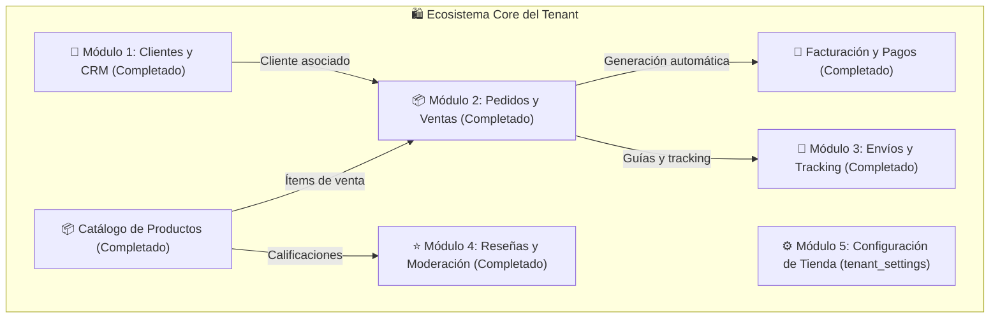

# 📋 Plan Maestro de Desarrollo por Fases: Módulos Satélite y Core del Tenant
## OwoMarket - Arquitectura Hexagonal y DDD

Este documento define la planificación detallada, arquitectura y desglose por fases de los nuevos módulos a desarrollar para el Tenant basados en las migraciones existentes en el sistema.

---

## 🗺️ Mapa General de Módulos a Desarrollar

---

# 👥 MÓDULO 1: Clientes y CRM (`src/Customer/`) ✅ COMPLETADO
**Tablas:** `customers`, `addresses`

### 🎯 Objetivos:
- Directorio de clientes con datos demográficos, contacto, RUT/RFC y preferencias de marketing.
- Libreta de múltiples direcciones (despacho, facturación, casa, oficina) por cliente.
- Consulta de métricas por cliente: Total clientes, activos, suscritos y nuevos este mes.

---

### 📌 Desglose por Fases - Módulo Clientes:

#### 🔹 Fase 1: Dominio Core de Clientes y Direcciones (`src/Customer/Domain/`) ✅
- [x] Entidad `Customer` (Aggregate Root) con métodos de ciclo de vida (`updateProfile`, `toggleActive`, `setMarketingPreference`).
- [x] Entidad `CustomerAddress` vinculada al cliente (`is_default`, tipo de dirección).
- [x] Value Objects inmutables: `CustomerId`, `CustomerEmail`, `CustomerPhone`, `CustomerName`, `BirthDate`, `Gender`, `AddressId`, `AddressType`.
- [x] Excepciones de dominio: `CustomerNotFoundException`, `DuplicateCustomerEmailException`, `CustomerAddressNotFoundException`.
- [x] Tests unitarios de dominio.
- ➔ `commit: feat(customer): implement customer domain entities and value objects`

#### 🔹 Fase 2: Capa de Aplicación, DTOs y Casos de Uso (`src/Customer/Application/`) ✅
- [x] Contratos de repositorio: `CustomerRepositoryInterface`.
- [x] DTOs de entrada y salida: `CreateCustomerData`, `UpdateCustomerData`, `FilterCustomersCriteria`, `CustomerAddressInputData`, `PaginatedCustomerResult`, `CustomerMetricsData`.
- [x] Casos de uso:
  - `CreateCustomerUseCase`
  - `ConsultCustomerByIdUseCase`
  - `FilterCustomersUseCase` (búsqueda por nombre, email, teléfono, estado, marketing, género y paginación)
  - `UpdateCustomerUseCase`
  - `DeleteCustomerUseCase` (soft deletes)
  - `AddCustomerAddressUseCase`, `DeleteCustomerAddressUseCase` & `SetDefaultCustomerAddressUseCase`
  - `GetCustomerMetricsUseCase` (total clientes, activos, marketing, nuevos este mes)
- [x] Tests unitarios de aplicación con Mockery.
- ➔ `commit: feat(customer): implement customer application use cases and dtos`

#### 🔹 Fase 3: Infraestructura, Modelos Eloquent y Repositorios (`src/Customer/Infrastructure/`) ✅
- [x] Modelos Eloquent en `src/Customer/Infrastructure/Eloquent/Models/`: `Customer.php` y `Address.php`.
- [x] Repositorio `EloquentCustomerRepository.php` con transacciones seguras, sincronización de direcciones y filtros dinámicos.
- [x] `CustomerServiceProvider.php` registrado en `bootstrap/providers.php`.
- [x] Tests de integración de repositorios.
- ➔ `commit: feat(customer): implement eloquent customer repositories and service provider`

#### 🔹 Fase 4: Endpoints API REST y FormRequests (`src/Customer/Infrastructure/Http/`) ✅
- [x] FormRequests: `CreateCustomerFormRequest`, `UpdateCustomerFormRequest`, `FilterCustomersFormRequest`, `AddCustomerAddressFormRequest`.
- [x] Controladores API:
  - `GET  /api-tenant/customer/metrics`
  - `GET  /api-tenant/customer/{id}`
  - `POST /api-tenant/customer/create`
  - `PUT  /api-tenant/customer/{id}`
  - `DELETE /api-tenant/customer/{id}`
  - `POST /api-tenant/customer/filter`
  - `POST /api-tenant/customer/{id}/address`
  - `DELETE /api-tenant/customer/{id}/address/{address_id}`
  - `POST /api-tenant/customer/{id}/address/{address_id}/default`
- [x] Rutas registradas en `src/Customer/Infrastructure/Http/Routes/apiTenant.php`.
- [x] Tests de Feature API Tenant.
- ➔ `commit: feat(customer): implement customer api controllers, routes and feature tests`

#### 🔹 Fase 5: Servicios Frontend y Definición de Tipos TypeScript (`resources/js/`) ✅
- [x] Tipos: `Customer.d.ts`, `FormCustomer.d.ts`, `ErrorsFormCustomer.d.ts`.
- [x] Servicio Axios `CustomerServices.ts` con todos los métodos tipados.
- ➔ `commit: feat(customer): implement frontend customer types and customer axios service`

#### 🔹 Fase 6: Vistas del Dashboard en React Flowbite (`resources/js/pages/tenant/modules/customer/`) ✅
- [x] `CustomerIndexPage.tsx`: Tarjetas KPI (Total Clientes, Activos, Suscritos a Marketing, Nuevos Este Mes), barra de búsqueda, tabla reactiva con modales de creación rápida, edición y eliminación.
- [x] `ShowCustomerDetailPage.tsx`: Ficha 360° del cliente con libreta de direcciones interactiva, acciones para definir predeterminada y modal para agregar nuevas direcciones.
- [x] Controladores Inertia Web y rutas en `routes/tenant.php` (`/customer/backoffice/...`).
- [x] Integración en Sidebar y Navbar móvil.
- ➔ `commit: feat(customer): implement customer dashboard views, 360 detail page and navigation links`

#### 🔹 Fase 7: Testing Integral y QA del Módulo de Clientes ✅
- [x] Pruebas unitarias, de integración, Feature y E2E completas (`CustomerLifecycleEndToEndTest.php`).
- [x] `npm run types` y `vendor/bin/pint`.
- ➔ `commit: test(customer): customer module full test suite and quality assurance`

---

# 📦 MÓDULO 2: Gestión de Pedidos y Ventas (`src/Order/`) ✅ COMPLETADO
**Tablas:** `orders`, `order_items`

### 🎯 Objetivos:
- [x] Gestión completa del flujo de ventas y pedidos: `pending` ➔ `confirmed` ➔ `processing` ➔ `shipped` ➔ `delivered` ➔ `cancelled` / `refunded`.
- [x] Emisión manual de órdenes en Backoffice (ventas telefónicas, cotizaciones) y recepción de compras online.
- [x] Cálculo matemático exacto integrando Impuestos (Tax), Envíos (Shipping) y Cupones (Coupon).
- [x] **Puente con Facturación:** Generación instantánea de Factura (`Invoice`) con 1 clic al confirmar el pago.

---

### 📌 Desglose por Fases - Módulo Pedidos:

#### 🔹 Fase 1: Dominio Core de Pedidos e Ítems (`src/Order/Domain/`) ✅
- [x] Entidad `Order` (Aggregate Root) con métodos de máquina de estados (`confirm`, `process`, `markAsShipped`, `markAsDelivered`, `cancel`, `refund`, `markPaymentPaid`, `markPaymentFailed`).
- [x] Entidad `OrderItem` con cálculo inmutable de subtotales y cantidades mínimas.
- [x] Value Objects: `OrderId`, `OrderNumber` (ej. `ORD-20260818-XXXX`), `OrderStatus`, `PaymentStatus`, `Money`, `Currency`, `OrderItemId`.
- [x] Excepciones de dominio: `OrderNotFoundException`, `InvalidOrderStateTransitionException`, `EmptyOrderItemsException`, `InvalidOrderAmountException`.
- [x] Tests unitarios de dominio (`OrderDomainTest.php`, `OrderItemDomainTest.php`, `OrderStatusDomainTest.php`).
- ➔ `commit: feat(order): implement order domain entities, value objects and unit tests`

#### 🔹 Fase 2: Capa de Aplicación y Casos de Uso (`src/Order/Application/`) ✅
- [x] Contrato `OrderRepositoryInterface`.
- [x] DTOs de entrada y salida: `CreateOrderData`, `OrderItemInputData`, `FilterOrdersCriteria`, `PaginatedOrderResult`, `OrderMetricsData`.
- [x] Casos de uso:
  - `CreateOrderUseCase`
  - `ConsultOrderByIdUseCase` & `ConsultOrderByOrderNumberUseCase`
  - `FilterOrdersUseCase` (por estado, cliente, rango de fechas, montos, método de pago)
  - `ConfirmOrderUseCase`, `ProcessOrderUseCase`, `ShipOrderUseCase`, `DeliverOrderUseCase`
  - `CancelOrderUseCase` & `RefundOrderUseCase`
  - `UpdateOrderPaymentStatusUseCase`
  - `GetOrderMetricsUseCase` (Ventas totales, pedidos pendientes, completados)
- [x] Tests unitarios de aplicación con Mockery (`OrderUseCasesTest.php`).
- ➔ `commit: feat(order): implement order application use cases, dtos and repository contract`

#### 🔹 Fase 3: Infraestructura, Eloquent y Repositorios (`src/Order/Infrastructure/`) ✅
- [x] Modelos Eloquent en `src/Order/Infrastructure/Eloquent/Models/`: `Order.php`, `OrderItem.php`.
- [x] Repositorio `EloquentOrderRepository.php` transaccional con sincronización de ítems y consultas agregadas.
- [x] `OrderServiceProvider.php` registrado en `bootstrap/providers.php`.
- [x] Tests de integración (`OrderRepositoryTest.php`).
- ➔ `commit: feat(order): implement order eloquent models, repository and service provider`

#### 🔹 Fase 4: Endpoints API REST y FormRequests (`src/Order/Infrastructure/Http/`) ✅
- [x] FormRequests: `CreateOrderFormRequest`, `UpdateOrderStatusFormRequest`, `UpdateOrderPaymentStatusFormRequest`, `FilterOrdersFormRequest`.
- [x] Controladores API:
  - `GET  /api-tenant/order/metrics`
  - `GET  /api-tenant/order/{id}`
  - `GET  /api-tenant/order/number/{orderNumber}`
  - `POST /api-tenant/order/create`
  - `POST /api-tenant/order/{id}/status`
  - `POST /api-tenant/order/{id}/cancel`
  - `POST /api-tenant/order/{id}/payment-status`
  - `POST /api-tenant/order/filter`
- [x] Rutas registradas en `src/Order/Infrastructure/Http/Routes/apiTenant.php` y `routes/tenantApi.php`.
- [x] Tests de Feature API Tenant (`OrderApiTest.php`).
- ➔ `commit: feat(order): implement order api controllers, routes and feature tests`

#### 🔹 Fase 5: Servicios Frontend y Definición de Tipos TypeScript (`resources/js/`) ✅
- [x] Tipos: `resources/js/types/models/Order.d.ts`, `FormOrder.d.ts`, `ErrorsFormOrder.d.ts`.
- [x] Servicio Axios `resources/js/services/OrderServices.ts` con soporte completo de filtros, creación, transiciones de estado, anulación y estados de pago.
- ➔ `commit: feat(order): implement frontend order types and services`

#### 🔹 Fase 6: Vistas del Dashboard en React Flowbite (`resources/js/pages/tenant/modules/order/`) ✅
- [x] `OrderIndexPage.tsx`: Métricas KPI, pipeline de estados con filtros por pestaña (Todas, Pendientes, En Proceso, Enviadas, Entregadas), tabla interactiva, modal de creación manual y modal de transición de estados.
- [x] `ShowOrderDetailPage.tsx`: Vista 360° del pedido con historial de estados, datos de entrega, desglose de ítems y botón directo para **"Generar Factura Fiscal"** mediante el puente con el módulo Billing.
- [x] Controladores Web Inertia (`ViewOrderIndexGETController.php`, `ViewOrderDetailGETController.php`) y rutas en `src/Order/Infrastructure/Http/Routes/tenant.php` y `routes/tenant.php`.
- [x] Integración de navegación en `SidebarDashboardComponent.tsx` y `NavBarMovilDashboardComponent.tsx`.
- ➔ `commit: feat(order): implement tenant order management dashboard and detail views`

#### 🔹 Fase 7: Testing Integral y QA del Módulo de Pedidos ✅
- [x] Prueba End-to-End (`OrderLifecycleEndToEndTest.php`): Creación de orden con múltiples productos ➔ Cálculo exacto de impuestos, envío y descuentos ➔ Transición a confirmada y en preparación ➔ Cobro y actualización a pagada ➔ Facturación fiscal automática con el módulo Billing ➔ Despacho con courier ➔ Entrega exitosa ➔ Flujo de anulación de orden secundaria y métricas agregadas.
- [x] Suite completa: `php artisan test` (265 passing tests, 1266 assertions), `npm run types` (`tsc --noEmit`) 100% limpio y `vendor/bin/pint`.
- ➔ `commit: test(order): complete order module test suite and quality assurance`

---

# 🚚 MÓDULO 3: Envíos Físicos y Guías de Despacho (`src/Shipment/`) ✅ COMPLETADO
**Tablas:** `shipments`

### 🎯 Objetivos:
- [x] Crear envíos para órdenes en estado de preparación.
- [x] Asignar número de seguimiento (`tracking_number`), empresa de transporte (`carrier`) y costo real.
- [x] Actualizar automáticamente la orden asociada a `shipped` o `delivered`.

---

### 📌 Desglose por Fases - Módulo Envíos:
#### 🔹 Fase 1: Dominio Core de Envíos y Guías de Despacho (`src/Shipment/Domain/`) ✅
- [x] Entidad `Shipment` (Aggregate Root) con métodos de transición de ciclo de vida (`assignTrackingNumber`, `markAsDelivered`, `updateCarrierAndService`, `updateNotes`).
- [x] Value Objects inmutables: `ShipmentId`, `TrackingNumber`, `Carrier`, `ShipmentServiceType`, `ShipmentCost`, `ShipmentStatus` (enum `pending`, `in_transit`, `delivered`).
- [x] Excepciones de dominio: `ShipmentNotFoundException`, `InvalidShipmentDataException`, `ShipmentAlreadyDeliveredException`.
- [x] Tests unitarios de dominio: `ShipmentDomainTest.php` y `ShipmentValueObjectsTest.php` (16 tests, 51 aserciones).
- ➔ `commit: feat(shipment): implement shipment domain entities, value objects and unit tests`

#### 🔹 Fase 2: Capa de Aplicación, DTOs y Casos de Uso (`src/Shipment/Application/`) ✅
- [x] Contrato `ShipmentRepositoryInterface`.
- [x] DTOs: `CreateShipmentData`, `UpdateTrackingData`, `FilterShipmentsCriteria`, `PaginatedShipmentResult`, `ShipmentMetricsData`.
- [x] Casos de uso: `CreateShipmentUseCase`, `UpdateShipmentTrackingUseCase`, `MarkShipmentAsDeliveredUseCase`, `ConsultShipmentByIdUseCase`, `ConsultShipmentByOrderIdUseCase`, `FilterShipmentsUseCase`, `GetShipmentMetricsUseCase`.
- [x] Tests unitarios de aplicación con Mockery (`ShipmentUseCasesTest.php`, 8 tests, 31 aserciones).
- ➔ `commit: feat(shipment): implement shipment application use cases, dtos and repository contract`

#### 🔹 Fase 3: Infraestructura, Modelos Eloquent y Service Provider (`src/Shipment/Infrastructure/`) ✅
- [x] Modelo Eloquent `src/Shipment/Infrastructure/Eloquent/Models/Shipment.php`.
- [x] Repositorio `EloquentShipmentRepository.php` transaccional con sincronización automática de estado con el modelo `Order` (`shipped` y `delivered`).
- [x] Proveedor `ShipmentServiceProvider.php` registrado en `bootstrap/providers.php`.
- [x] Tests de integración con base de datos tenant (`ShipmentRepositoryTest.php`, 2 tests, 23 aserciones).
- ➔ `commit: feat(shipment): implement shipment eloquent model, repository and service provider`

#### 🔹 Fase 4: Endpoints API REST y FormRequests (`src/Shipment/Infrastructure/Http/`) ✅
- [x] FormRequests de validación: `CreateShipmentFormRequest.php`, `UpdateShipmentTrackingFormRequest.php`, `FilterShipmentsFormRequest.php`.
- [x] Controladores API REST (`src/Shipment/Infrastructure/Http/Controller/`):
  - `GET  /api-tenant/shipment/metrics`
  - `POST /api-tenant/shipment/create`
  - `GET  /api-tenant/shipment/{id}`
  - `GET  /api-tenant/shipment/order/{orderId}`
  - `POST /api-tenant/shipment/{id}/tracking`
  - `POST /api-tenant/shipment/{id}/deliver`
  - `POST /api-tenant/shipment/filter`
- [x] Rutas registradas en `src/Shipment/Infrastructure/Http/Routes/apiTenant.php` y `routes/tenantApi.php`.
- [x] Tests de Feature API Tenant (`ShipmentApiTest.php`, 7 tests, 33 aserciones).
- ➔ `commit: feat(shipment): implement shipment api controllers, routes and feature tests`

#### 🔹 Fase 5: Servicios Frontend y Definición de Tipos TypeScript (`resources/js/`) ✅
- [x] Tipos: `resources/js/types/models/Shipment.d.ts`, `FormShipment.d.ts`, `ErrorsFormShipment.d.ts`.
- [x] Servicio Axios `resources/js/Services/ShipmentServices.ts` con tipado estricto `ApiResponse`, consultas por ID, orden, actualización de tracking, entrega y métricas.
- ➔ `commit: feat(shipment): implement frontend shipment types and services`

#### 🔹 Fase 6: Modal/Pestaña de Despachos en el Backoffice y Detalle de Pedido (`ShowOrderDetailPage.tsx`) ✅
- [x] Sección y listado interactivo de Guías de Despacho en `ShowOrderDetailPage.tsx` con soporte de couriers, número de tracking con badges, costos reales, timeline de entrega y botón para marcar como entregado.
- [x] Modal interactivo "+ Generar Guía de Despacho" con selección de courier, servicio, costo, número de seguimiento opcional y notas.
- [x] Modal de actualización de tracking y courier en caliente con feedback visual inmediato.
- ➔ `commit: feat(shipment): implement shipment tracking ui and integration in order detail`

#### 🔹 Fase 7: Testing Integral, QA y Validación Final (`ShipmentLifecycleEndToEndTest.php`) ✅
- [x] Prueba End-to-End (`ShipmentLifecycleEndToEndTest.php`): Ciclo de vida completo desde creación en preparación ➔ asignación de tracking con cambio a en tránsito y sincronización de orden ➔ consulta y filtrado ➔ entrega con sincronización de orden ➔ múltiples envíos y cálculo de métricas agregadas.
- [x] Suite completa: `php artisan test` (299 tests, 1448 assertions passing), `npm run types` 100% limpio y `vendor/bin/pint`.
- ➔ `commit: test(shipment): complete shipment module test suite and quality assurance`

---

# ⭐ MÓDULO 4: Reseñas y Calificaciones de Productos (`src/Review/`) ✅ COMPLETADO
**Tablas:** `product_reviews`

### 🎯 Objetivos:
- [x] Moderar reseñas de productos: Aprobar, rechazar o eliminar comentarios de compradores.
- [x] Calcular y actualizar el rating promedio de estrellas (1 a 5) en el catálogo de productos.

---

### 📌 Desglose por Fases - Módulo Reseñas:
#### 🔹 Fase 1: Dominio Core de Reseñas y Calificaciones (`src/Review/Domain/`) ✅
- [x] Entidad `ProductReview` (Aggregate Root) con métodos de moderación (`approve`, `reject`), respuestas de soporte (`respond`, `clearResponse`) y actualización de contenido (`updateContent`, `markAsVerified`).
- [x] Value Objects inmutables: `ReviewId`, `Rating` (validación de 1 a 5 estrellas y clasificación de sentimiento).
- [x] Excepciones de dominio: `ReviewNotFoundException`, `InvalidRatingException`, `DuplicateReviewException`.
- [x] Tests unitarios de dominio: `ProductReviewDomainTest.php` y `ReviewValueObjectsTest.php` (9 tests, 44 aserciones).
- ➔ `commit: feat(review): implement product review domain entities, value objects and unit tests`

#### 🔹 Fase 2: Capa de Aplicación, DTOs y Casos de Uso (`src/Review/Application/`) ✅
- [x] Contrato `ReviewRepositoryInterface`.
- [x] DTOs: `CreateReviewData`, `ModerateReviewData`, `RespondReviewData`, `UpdateReviewData`, `FilterReviewsCriteria`, `PaginatedReviewResult`, `ProductRatingSummaryData`.
- [x] Casos de uso: `CreateProductReviewUseCase`, `ModerateReviewUseCase`, `RespondReviewUseCase`, `UpdateProductReviewUseCase`, `ConsultReviewByIdUseCase`, `FilterReviewsUseCase`, `GetProductRatingSummaryUseCase`, `DeleteProductReviewUseCase`.
- [x] Tests unitarios de aplicación con Mockery (`ReviewUseCasesTest.php`, 9 tests, 33 aserciones).
- ➔ `commit: feat(review): implement product review use cases, dtos and repository interface`

#### 🔹 Fase 3: Infraestructura, Modelos Eloquent y Service Provider (`src/Review/Infrastructure/`) ✅
- [x] Modelo Eloquent `src/Review/Infrastructure/Eloquent/Models/ProductReview.php` con relaciones a `Product`, `Customer` y `Order`.
- [x] Repositorio `EloquentReviewRepository.php` transaccional con filtrado multicriterio y cálculo automático de promedios y desglose de estrellas.
- [x] Proveedor `ReviewServiceProvider.php` registrado en `bootstrap/providers.php`.
- [x] Tests de integración con base de datos tenant (`ReviewRepositoryTest.php`, 2 tests, 16 aserciones).
- ➔ `commit: feat(review): implement product review eloquent model, repository and service provider`

#### 🔹 Fase 4: Endpoints API REST y FormRequests (`src/Review/Infrastructure/Http/`) ✅
- [x] FormRequests de validación: `CreateProductReviewFormRequest.php`, `ModerateReviewFormRequest.php`, `RespondReviewFormRequest.php`, `UpdateProductReviewFormRequest.php`, `FilterReviewsFormRequest.php`.
- [x] Controladores API REST (`src/Review/Infrastructure/Http/Controller/`):
  - `POST   /api-tenant/review/filter`
  - `GET    /api-tenant/review/summary/{productId?}`
  - `POST   /api-tenant/review/create`
  - `GET    /api-tenant/review/{id}`
  - `POST   /api-tenant/review/{id}/moderate`
  - `POST   /api-tenant/review/{id}/respond`
  - `PUT    /api-tenant/review/{id}`
  - `DELETE /api-tenant/review/{id}`
- [x] Rutas registradas en `src/Review/Infrastructure/Http/Routes/apiTenant.php` y `routes/tenantApi.php`.
- [x] Tests de Feature API Tenant (`ReviewApiTest.php`, 9 tests, 33 aserciones).
- ➔ `commit: feat(review): implement product review api controllers, routes and feature tests`

#### 🔹 Fase 5: Servicios Frontend y Definición de Tipos TypeScript (`resources/js/`) ✅
- [x] Tipos: `resources/js/types/models/ProductReview.d.ts`, `FormProductReview.d.ts`, `ErrorsFormProductReview.d.ts`.
- [x] Servicio Axios `resources/js/Services/ReviewServices.ts` con tipado estricto `ApiResponse`, consultas por ID, resumen de ratings, moderación, respuestas, edición y eliminación.
- ➔ `commit: feat(review): implement frontend review types and services`

#### 🔹 Fase 6: Vistas del Dashboard en React Flowbite (`resources/js/pages/tenant/modules/review/`) ✅
- [x] Vista interactiva `ReviewIndexPage.tsx` con resumen analítico de calificaciones (KPI global de estrellas, desglose por nivel de 1★ a 5★ con barras de progreso).
- [x] Filtros por búsqueda textual, número de estrellas, estado de moderación (Aprobada / Oculta) y estado de respuesta.
- [x] Moderación en vivo con toggle inmediato, modal para responder públicamente al cliente y modal para eliminar reseñas.
- [x] Controlador Web Inertia `ViewReviewIndexGETController.php` y rutas web tenant en `routes/tenant.php`.
- ➔ `commit: feat(review): implement product reviews backoffice moderation ui`

#### 🔹 Fase 7: Testing Integral, QA y Validación Final (`ReviewModerationLifecycleEndToEndTest.php`) ✅
- [x] Prueba End-to-End (`ReviewModerationLifecycleEndToEndTest.php`): Ciclo de vida completo desde creación en estado pendiente ➔ moderación y aprobación ➔ cálculo de rating promedio y estrellas ➔ respuesta oficial del comercio ➔ edición y rectificación de puntuación ➔ filtrado y eliminación con recálculo.
- [x] Suite completa: `php artisan test` (329 tests, 1617 assertions passing), `npm run types` 100% limpio y `vendor/bin/pint`.
- ➔ `commit: test(review): complete review module test suite and quality assurance`

---

# ⚙️ MÓDULO 5: Configuración General de la Tienda (`src/TenantSettings/`)
**Tablas:** `tenant_settings`

### 🎯 Objetivos:
- Gestión de parámetros globales del comercio: Moneda por defecto, logotipo, banners, redes sociales, horarios de atención y meta tags SEO.

---

### 📌 Desglose por Fases - Módulo Configuración:
#### 🔹 Fase 1: Dominio Core de Configuración General (`src/TenantSettings/Domain/`) ✅
- [x] Entidad `TenantSetting` (Aggregate Root individual) y `StoreSettings` (Modelo agrupado de parámetros comerciales: nombre, email, moneda, teléfono, dirección, logo, banner, redes sociales y SEO).
- [x] Value Objects inmutables: `SettingId` (UUID), `SettingKey` (formato alfanumérico estricto), `SettingType` (string, boolean, json, integer, float con auto-casting), `SettingGroup` (general, appearance, social, seo, notifications).
- [x] Excepciones de dominio: `SettingNotFoundException`, `InvalidSettingKeyException`.
- [x] Tests unitarios de dominio: `SettingValueObjectsTest.php`, `TenantSettingDomainTest.php`, `StoreSettingsDomainTest.php` (12 tests, 50 aserciones).
- ➔ `commit: feat(settings): implement tenant settings domain entities, value objects and unit tests`

#### 🔹 Fase 2: Capa de Aplicación, DTOs y Casos de Uso (`src/TenantSettings/Application/`) ✅
- [x] Contrato `TenantSettingsRepositoryInterface`.
- [x] DTOs: `SaveSettingData.php`, `UpdateStoreSettingsData.php`.
- [x] Casos de uso: `GetStoreSettingsUseCase`, `UpdateStoreSettingsUseCase`, `GetSettingByKeyUseCase`, `SaveSettingUseCase`, `ListSettingsByGroupUseCase`, `ListAllSettingsUseCase`, `DeleteSettingUseCase`.
- [x] Tests unitarios de aplicación con Mockery (`TenantSettingsUseCasesTest.php`, 8 tests, 25 aserciones).
- ➔ `commit: feat(settings): implement tenant settings use cases, dtos and repository interface`

#### 🔹 Fase 3: Infraestructura, Modelos Eloquent y Service Provider (`src/TenantSettings/Infrastructure/Eloquent/`) ✅
- [x] Modelo Eloquent `src/TenantSettings/Infrastructure/Eloquent/Models/TenantSetting.php` con soporte UUID y casts.
- [x] Repositorio `EloquentTenantSettingsRepository.php` transaccional con mapeo agrupado de atributos (`KEY_GROUP_MAP`) y métodos para parámetros individuales y colectivos de la tienda.
- [x] Proveedor `TenantSettingsServiceProvider.php` registrado en `bootstrap/providers.php`.
- [x] Tests de integración con base de datos tenant (`TenantSettingsRepositoryTest.php`, 2 tests, 20 aserciones).
- ➔ `commit: feat(settings): implement tenant settings eloquent model, repository and service provider`

#### 🔹 Fase 4: Endpoints API REST y FormRequests (`src/TenantSettings/Infrastructure/Http/`)
- [ ] FormRequests de validación y Controladores API (`GET /api-tenant/settings`, `PUT /api-tenant/settings`, `GET /api-tenant/settings/{key}`, `POST /api-tenant/settings`).
- [ ] Tests de Feature API Tenant.
- ➔ `commit: feat(settings): implement tenant settings api controllers, routes and feature tests`

#### 🔹 Fase 5: Servicios Frontend y Definición de Tipos TypeScript (`resources/js/`)
- [ ] Tipos: `resources/js/types/models/TenantSettings.d.ts`, `FormTenantSettings.d.ts`.
- [ ] Servicio Axios `resources/js/Services/TenantSettingsServices.ts`.
- ➔ `commit: feat(settings): implement frontend tenant settings types and services`

#### 🔹 Fase 6: Vistas del Dashboard en React Flowbite (`resources/js/pages/tenant/modules/settings/`)
- [ ] Vista `TenantSettingsPage.tsx` organizada por pestañas Flowbite (General, Apariencia & Marca, Redes Sociales, SEO & Metadatos).
- [ ] Controlador Web Inertia y rutas.
- ➔ `commit: feat(settings): implement tenant settings backoffice ui with flowbite tabs`

#### 🔹 Fase 7: Testing Integral, QA y Validación Final
- [ ] Prueba End-to-End (`TenantSettingsLifecycleEndToEndTest.php`) y suite completa.
- ➔ `commit: test(settings): complete tenant settings module test suite and quality assurance`

---

## 🚦 Orden Recomendado de Ejecución

1. 🥇 **Módulo 1: Clientes y CRM (`src/Customer/`)** ➔ *Base esencial para vincular compradores a pedidos y facturas.*
2. 🥈 **Módulo 2: Pedidos y Ventas (`src/Order/`)** ➔ *El corazón del comercio que integra Catálogo + Clientes + Impuestos + Envíos + Facturación.*
3. 🥉 **Módulo 3: Envíos y Tracking (`src/Shipment/`)** ➔ *Fulfillment directo de pedidos.*
4. 🏅 **Módulo 4: Reseñas (`src/Review/`)** ➔ *Social proof y satisfacción del cliente.*
5. 🎖️ **Módulo 5: Configuración General (`src/TenantSettings/`)** ➔ *Personalización final de la tienda.*
