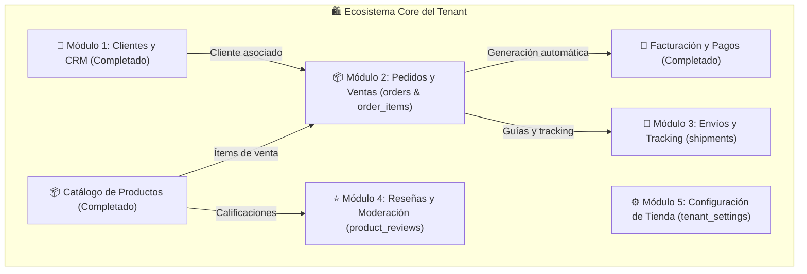

# 📋 Plan Maestro de Desarrollo por Fases: Módulos Satélite y Core del Tenant
## OwoMarket - Arquitectura Hexagonal y DDD

Este documento define la planificación detallada, arquitectura y desglose por fases de los nuevos módulos a desarrollar para el Tenant basados en las migraciones existentes en el sistema.

---

## 🗺️ Mapa General de Módulos a Desarrollar

---

# 👥 MÓDULO 1: Clientes y CRM (`src/Customer/`) ✅ COMPLETADO
**Tablas:** `customers`, `addresses`

### 🎯 Objetivos:
- Directorio de clientes con datos demográficos, contacto, RUT/RFC y preferencias de marketing.
- Libreta de múltiples direcciones (despacho, facturación, casa, oficina) por cliente.
- Consulta de métricas por cliente: Total clientes, activos, suscritos y nuevos este mes.

---

### 📌 Desglose por Fases - Módulo Clientes:

#### 🔹 Fase 1: Dominio Core de Clientes y Direcciones (`src/Customer/Domain/`) ✅
- [x] Entidad `Customer` (Aggregate Root) con métodos de ciclo de vida (`updateProfile`, `toggleActive`, `setMarketingPreference`).
- [x] Entidad `CustomerAddress` vinculada al cliente (`is_default`, tipo de dirección).
- [x] Value Objects inmutables: `CustomerId`, `CustomerEmail`, `CustomerPhone`, `CustomerName`, `BirthDate`, `Gender`, `AddressId`, `AddressType`.
- [x] Excepciones de dominio: `CustomerNotFoundException`, `DuplicateCustomerEmailException`, `CustomerAddressNotFoundException`.
- [x] Tests unitarios de dominio.
- ➔ `commit: feat(customer): implement customer domain entities and value objects`

#### 🔹 Fase 2: Capa de Aplicación, DTOs y Casos de Uso (`src/Customer/Application/`) ✅
- [x] Contratos de repositorio: `CustomerRepositoryInterface`.
- [x] DTOs de entrada y salida: `CreateCustomerData`, `UpdateCustomerData`, `FilterCustomersCriteria`, `CustomerAddressInputData`, `PaginatedCustomerResult`, `CustomerMetricsData`.
- [x] Casos de uso:
  - `CreateCustomerUseCase`
  - `ConsultCustomerByIdUseCase`
  - `FilterCustomersUseCase` (búsqueda por nombre, email, teléfono, estado, marketing, género y paginación)
  - `UpdateCustomerUseCase`
  - `DeleteCustomerUseCase` (soft deletes)
  - `AddCustomerAddressUseCase`, `DeleteCustomerAddressUseCase` & `SetDefaultCustomerAddressUseCase`
  - `GetCustomerMetricsUseCase` (total clientes, activos, marketing, nuevos este mes)
- [x] Tests unitarios de aplicación con Mockery.
- ➔ `commit: feat(customer): implement customer application use cases and dtos`

#### 🔹 Fase 3: Infraestructura, Modelos Eloquent y Repositorios (`src/Customer/Infrastructure/`) ✅
- [x] Modelos Eloquent en `src/Customer/Infrastructure/Eloquent/Models/`: `Customer.php` y `Address.php`.
- [x] Repositorio `EloquentCustomerRepository.php` con transacciones seguras, sincronización de direcciones y filtros dinámicos.
- [x] `CustomerServiceProvider.php` registrado en `bootstrap/providers.php`.
- [x] Tests de integración de repositorios.
- ➔ `commit: feat(customer): implement eloquent customer repositories and service provider`

#### 🔹 Fase 4: Endpoints API REST y FormRequests (`src/Customer/Infrastructure/Http/`) ✅
- [x] FormRequests: `CreateCustomerFormRequest`, `UpdateCustomerFormRequest`, `FilterCustomersFormRequest`, `AddCustomerAddressFormRequest`.
- [x] Controladores API:
  - `GET  /api-tenant/customer/metrics`
  - `GET  /api-tenant/customer/{id}`
  - `POST /api-tenant/customer/create`
  - `PUT  /api-tenant/customer/{id}`
  - `DELETE /api-tenant/customer/{id}`
  - `POST /api-tenant/customer/filter`
  - `POST /api-tenant/customer/{id}/address`
  - `DELETE /api-tenant/customer/{id}/address/{address_id}`
  - `POST /api-tenant/customer/{id}/address/{address_id}/default`
- [x] Rutas registradas en `src/Customer/Infrastructure/Http/Routes/apiTenant.php`.
- [x] Tests de Feature API Tenant.
- ➔ `commit: feat(customer): implement customer api controllers, routes and feature tests`

#### 🔹 Fase 5: Servicios Frontend y Definición de Tipos TypeScript (`resources/js/`) ✅
- [x] Tipos: `Customer.d.ts`, `FormCustomer.d.ts`, `ErrorsFormCustomer.d.ts`.
- [x] Servicio Axios `CustomerServices.ts` con todos los métodos tipados.
- ➔ `commit: feat(customer): implement frontend customer types and customer axios service`

#### 🔹 Fase 6: Vistas del Dashboard en React Flowbite (`resources/js/pages/tenant/modules/customer/`) ✅
- [x] `CustomerIndexPage.tsx`: Tarjetas KPI (Total Clientes, Activos, Suscritos a Marketing, Nuevos Este Mes), barra de búsqueda, tabla reactiva con modales de creación rápida, edición y eliminación.
- [x] `ShowCustomerDetailPage.tsx`: Ficha 360° del cliente con libreta de direcciones interactiva, acciones para definir predeterminada y modal para agregar nuevas direcciones.
- [x] Controladores Inertia Web y rutas en `routes/tenant.php` (`/customer/backoffice/...`).
- [x] Integración en Sidebar y Navbar móvil.
- ➔ `commit: feat(customer): implement customer dashboard views, 360 detail page and navigation links`

#### 🔹 Fase 7: Testing Integral y QA del Módulo de Clientes ✅
- [x] Pruebas unitarias, de integración, Feature y E2E completas (`CustomerLifecycleEndToEndTest.php`).
- [x] `npm run types` y `vendor/bin/pint`.
- ➔ `commit: test(customer): customer module full test suite and quality assurance`

---

# 📦 MÓDULO 2: Gestión de Pedidos y Ventas (`src/Order/`)
**Tablas:** `orders`, `order_items`

### 🎯 Objetivos:
- Gestión completa del flujo de ventas y pedidos: `pending` ➔ `confirmed` ➔ `processing` ➔ `shipped` ➔ `delivered` ➔ `cancelled` / `refunded`.
- Emisión manual de órdenes en Backoffice (ventas telefónicas, cotizaciones) y recepción de compras online.
- Cálculo matemático exacto integrando Impuestos (Tax), Envíos (Shipping) y Cupones (Coupon).
- **Puente con Facturación:** Generación instantánea de Factura (`Invoice`) con 1 clic al confirmar el pago.

---

### 📌 Desglose por Fases - Módulo Pedidos:

#### 🔹 Fase 1: Dominio Core de Pedidos e Ítems (`src/Order/Domain/`)
- [ ] Entidad `Order` (Aggregate Root) con métodos de máquina de estados (`confirm`, `markAsPaid`, `startProcessing`, `markAsShipped`, `markAsDelivered`, `cancel`).
- [ ] Entidad `OrderItem` con cálculo inmutable de subtotales, descuentos y tasas impositivas.
- [ ] Value Objects: `OrderId`, `OrderNumber` (ej. `ORD-2026-0001`), `OrderStatus`, `PaymentStatus`, `ShippingMethod`.
- [ ] Eventos de Dominio: `OrderCreatedDomainEvent`, `OrderPaidDomainEvent`, `OrderCancelledDomainEvent`.
- [ ] Tests unitarios de dominio.
- ➔ `commit: feat(order): implement order domain aggregate, items and state transitions`

#### 🔹 Fase 2: Capa de Aplicación y Casos de Uso (`src/Order/Application/`)
- [ ] Contrato `OrderRepositoryInterface`.
- [ ] Casos de uso:
  - `CreateManualOrderUseCase`
  - `ConsultOrderByIdUseCase`
  - `FilterOrdersUseCase` (por estado, cliente, rango de fechas, montos, método de pago)
  - `UpdateOrderStatusUseCase`
  - `CancelOrderUseCase`
  - `GenerateInvoiceFromOrderUseCase` (invoca caso de uso del módulo Billing)
  - `GetOrderMetricsUseCase` (Ventas totales, pedidos pendientes, completados)
- [ ] Tests unitarios de aplicación.
- ➔ `commit: feat(order): implement order application use cases and business rules`

#### 🔹 Fase 3: Infraestructura, Eloquent y Repositorios (`src/Order/Infrastructure/`)
- [ ] Modelos Eloquent en `src/Order/Infrastructure/Eloquent/Models/`: `Order.php`, `OrderItem.php`.
- [ ] Repositorio `EloquentOrderRepository.php` transaccional con generación de correlativos atómicos.
- [ ] `OrderServiceProvider.php` registrado en `bootstrap/providers.php`.
- [ ] Tests de integración.
- ➔ `commit: feat(order): implement order eloquent models, repository and bindings`

#### 🔹 Fase 4: Endpoints API REST y FormRequests (`src/Order/Infrastructure/Http/`)
- [ ] FormRequests: `CreateManualOrderFormRequest`, `UpdateOrderStatusFormRequest`, `FilterOrdersFormRequest`.
- [ ] Controladores API:
  - `GET  /api-tenant/order/{id}`
  - `POST /api-tenant/order/create`
  - `POST /api-tenant/order/{id}/status`
  - `POST /api-tenant/order/{id}/cancel`
  - `POST /api-tenant/order/{id}/generate-invoice`
  - `POST /api-tenant/order/filter`
  - `GET  /api-tenant/order/metrics`
- [ ] Tests de Feature API Tenant.
- ➔ `commit: feat(order): implement order api controllers, routes and feature tests`

#### 🔹 Fase 5: Servicios Frontend y Definición de Tipos TypeScript (`resources/js/`)
- [ ] Tipos: `Order.d.ts`, `OrderItem.d.ts`, `FormOrder.d.ts`, `OrderMetrics.d.ts`.
- [ ] Servicio Axios `OrderServices.ts`.
- ➔ `commit: feat(order): implement frontend order types and services`

#### 🔹 Fase 6: Vistas del Dashboard en React Flowbite (`resources/js/Pages/tenant/modules/order/`)
- [ ] `OrderIndexPage.tsx`: Métricas KPI, pipeline de estados con filtros por pestaña (Todas, Pendientes, En Proceso, Enviadas, Entregadas), tabla interactiva.
- [ ] `CreateOrderPage.tsx` / Modal: Selector dinámico de cliente (con autocompletado), selector de productos con cálculo en vivo de totales.
- [ ] `ShowOrderDetailPage.tsx`: Vista 360° del pedido con historial de estados, datos de entrega, desglose de ítems y botón directo para **"Generar Factura / Comprobante Fiscal"**.
- [ ] Rutas Web Inertia e integración en Sidebar y Navbar.
- ➔ `commit: feat(order): implement tenant order management dashboard and detail views`

#### 🔹 Fase 7: Testing Integral y QA del Módulo de Pedidos
- [ ] Prueba End-to-End: Creación de orden ➔ Procesamiento de pago ➔ Facturación automática ➔ Despacho.
- [ ] Suite completa: `php artisan test`, `npm run types` y `vendor/bin/pint`.
- ➔ `commit: test(order): complete order module test suite and quality assurance`

---

# 🚚 MÓDULO 3: Envíos Físicos y Guías de Despacho (`src/Shipment/`)
**Tablas:** `shipments`

### 🎯 Objetivos:
- Crear envíos para órdenes en estado de preparación.
- Asignar número de seguimiento (`tracking_number`), empresa de transporte (`carrier`) y costo real.
- Actualizar automáticamente la orden asociada a `shipped` o `delivered`.

---

### 📌 Desglose por Fases - Módulo Envíos:
- [ ] **Fase 1**: Entidad `Shipment`, Value Objects y excepciones.
- [ ] **Fase 2**: Casos de uso (`CreateShipmentUseCase`, `UpdateTrackingUseCase`, `ConsultShipmentByOrderUseCase`).
- [ ] **Fase 3**: Modelo Eloquent `Shipment.php`, Repositorio y Service Provider.
- [ ] **Fase 4**: Controladores API (`POST /api-tenant/shipment/create`, `PUT /api-tenant/shipment/{id}/tracking`) y tests.
- [ ] **Fase 5**: Tipos TypeScript y `ShipmentServices.ts`.
- [ ] **Fase 6**: Modal/Pestaña de envíos en la vista de detalle del pedido (`ShowOrderDetailPage.tsx`).
- [ ] **Fase 7**: Testing integral y QA.
- ➔ `commit: feat(shipment): implement physical shipments, tracking and fulfillment module`

---

# ⭐ MÓDULO 4: Reseñas y Calificaciones de Productos (`src/Review/`)
**Tablas:** `product_reviews`

### 🎯 Objetivos:
- Moderar reseñas de productos: Aprobar, rechazar o eliminar comentarios de compradores.
- Calcular y actualizar el rating promedio de estrellas (1 a 5) en el catálogo de productos.

---

### 📌 Desglose por Fases - Módulo Reseñas:
- [ ] **Fase 1**: Entidad `ProductReview`, Value Objects (`Rating`, `ReviewStatus`).
- [ ] **Fase 2**: Casos de uso (`ListProductReviewsUseCase`, `ModerateReviewUseCase`, `DeleteReviewUseCase`).
- [ ] **Fase 3**: Modelo Eloquent `ProductReview.php`, Repositorio y Service Provider.
- [ ] **Fase 4**: Controladores API (`POST /api-tenant/review/filter`, `PUT /api-tenant/review/{id}/status`) y tests.
- [ ] **Fase 5**: Tipos TypeScript y `ReviewServices.ts`.
- [ ] **Fase 6**: Vista `ReviewIndexPage.tsx` con filtros por producto y estado de moderación.
- [ ] **Fase 7**: Testing integral y QA.
- ➔ `commit: feat(review): implement product reviews moderation and ratings module`

---

# ⚙️ MÓDULO 5: Configuración General de la Tienda (`src/TenantSettings/`)
**Tablas:** `tenant_settings`

### 🎯 Objetivos:
- Gestión de parámetros globales del comercio: Moneda por defecto, logotipo, banners, redes sociales, horarios de atención y meta tags SEO.

---

### 📌 Desglose por Fases - Módulo Configuración:
- [ ] **Fase 1**: Entidad `TenantSettings`, Value Objects.
- [ ] **Fase 2**: Casos de uso (`ConsultTenantSettingsUseCase`, `UpdateTenantSettingsUseCase`).
- [ ] **Fase 3**: Modelo Eloquent `TenantSetting.php`, Repositorio y Service Provider.
- [ ] **Fase 4**: Controladores API (`GET /api-tenant/settings`, `PUT /api-tenant/settings`) y tests.
- [ ] **Fase 5**: Tipos TypeScript y `TenantSettingsServices.ts`.
- [ ] **Fase 6**: Vista `TenantSettingsPage.tsx` organizada por pestañas (General, Moneda, Redes, SEO).
- [ ] **Fase 7**: Testing integral y QA.
- ➔ `commit: feat(settings): implement tenant store general settings module`

---

## 🚦 Orden Recomendado de Ejecución

1. 🥇 **Módulo 1: Clientes y CRM (`src/Customer/`)** ➔ *Base esencial para vincular compradores a pedidos y facturas.*
2. 🥈 **Módulo 2: Pedidos y Ventas (`src/Order/`)** ➔ *El corazón del comercio que integra Catálogo + Clientes + Impuestos + Envíos + Facturación.*
3. 🥉 **Módulo 3: Envíos y Tracking (`src/Shipment/`)** ➔ *Fulfillment directo de pedidos.*
4. 🏅 **Módulo 4: Reseñas (`src/Review/`)** ➔ *Social proof y satisfacción del cliente.*
5. 🎖️ **Módulo 5: Configuración General (`src/TenantSettings/`)** ➔ *Personalización final de la tienda.*
