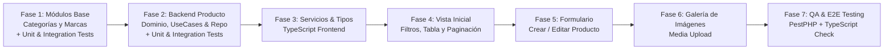

# 📋 Plan de Desarrollo por Fases con Pruebas Unitarias e Integración
## Módulo de Productos (Tenant) - OwoMarket

Este documento establece la **hoja de ruta integral y detallada** para el desarrollo del **Módulo de Productos** y sus módulos satélites en el entorno **Tenant**, incluyendo la estrategia completa de **Pruebas Unitarias (Unit Tests)** y **Pruebas de Integración (Integration / Feature Tests)** con **PestPHP**.

---

## 🗺️ Visión General de Fases y Estrategia de Testing



---

## 🧪 Estrategia de Testing en Arquitectura Hexagonal

| Nivel de Prueba | Ubicación | Enfoque y Aislamiento |
| :--- | :--- | :--- |
| **Pruebas Unitarias de Dominio** | `tests/Unit/{Modulo}/Domain/` | PHP puro. Valida invariantes en Value Objects, Entities y cálculo de reglas de negocio sin framework ni BD. |
| **Pruebas Unitarias de Casos de Uso** | `tests/Unit/{Modulo}/Application/` | Valida el flujo del UseCase simulando (*mocking*) contratos de repositorios y eventos con `Mockery` (ejecución en milisegundos). |
| **Pruebas de Integración de Repositorios** | `tests/Integration/{Modulo}/` | Valida que los repositorios Eloquent guarden, actualicen, eliminen y filtren correctamente en la base de datos real del Tenant. |
| **Pruebas de Integración de API (Feature)** | `tests/Feature/Tenant/{Modulo}/` | Peticiones HTTP a endpoints de `/api-tenant/...`, validación de `FormRequest`, códigos de estado HTTP y estructura estándar `ApiResponse`. |

---

## 📌 FASE 1: Módulos Base Satélites (Categorías, Marcas, Atributos, Cupones, Impuestos y Envíos)

> **Objetivo:** Disponer de la clasificación por Categorías, Marcas y servicios satélites para alimentar selectores y filtros del catálogo.

### 1.1 Módulo de Categorías (`src/Category/`)
- [x] **Dominio (`Domain/`):**
  - Entidad `Category` (id, name, slug, description, image, parent_id, is_active, position).
  - Value Objects: `CategoryId`, `CategoryName`, `CategorySlug`, `CategoryStatus`.
- [x] **Aplicación (`Application/`):**
  - `CategoryRepositoryInterface`.
  - Casos de uso: `FilterCategoriesUseCase`, `CreateCategoryUseCase`, `EditCategoryUseCase`, `ConsultCategoryByUuidUseCase`, `DeleteCategoryUseCase`, `ListCategoriesTreeUseCase`.
- [x] **Infraestructura (`Infrastructure/`):**
  - `CategoryRepository` (consultas Eloquent con jerarquía padre/hijo en `Infrastructure/Eloquent/Models/Category.php`).
  - Controladores HTTP, FormRequests y Rutas (`/api-tenant/category/*`).
  - Registro en `CategoryServiceProvider`.
- [x] **Frontend Categorías:**
  - `resources/js/Services/CategoryServices.ts` y tipos TypeScript en `resources/js/types/models/Category.d.ts`.

#### 🧪 Pruebas de la Fase 1.1 (Categorías):
* [x] **Unitarias Dominio:** `tests/Unit/Category/Domain/CategoryDomainTest.php`
  * Validación de slug automático y normalización de nombres.
  * Inmutabilidad de la entidad `Category`.
* [x] **Unitarias Casos de Uso:** `tests/Unit/Category/Application/CategoryUseCasesTest.php`
  * Creación exitosa mockeando `CategoryRepositoryInterface`.
  * Fallo controlado al intentar registrar un slug duplicado.
* [x] **Integración Repositorio:** `tests/Integration/Category/CategoryRepositoryTest.php`
  * Persistencia en BD tenant, consulta con subcategorías anidadas (`parent_id`) y soft delete.
* [x] **Integración HTTP API:** `tests/Feature/Tenant/CategoryApiTest.php`
  * `POST /api-tenant/category/create` -> 201 con `ApiResponse::success()`.
  * `POST /api-tenant/category/filter` -> 200 con paginación `ApiResponse::Pagination()`.
  * Validación de errores 422 ante campos obligatorios faltantes.

---

### 1.2 Módulo de Marcas (`src/Brand/`)
- [x] **Dominio (`Domain/`):** Entidad `Brand` y Value Objects (`BrandName`, `BrandSlug`, `BrandId`).
- [x] **Aplicación (`Application/`):** `BrandRepositoryInterface` y Casos de uso (`FilterBrandsUseCase`, `CreateBrandUseCase`, `EditBrandUseCase`, `ConsultBrandByIdUseCase`, `DeleteBrandUseCase`, `ListAllActiveBrandsUseCase`).
- [x] **Infraestructura (`Infrastructure/`):** `BrandRepository`, Controladores y Rutas API Tenant (`/api-tenant/brand/*`).
- [x] **Frontend Marcas:** `resources/js/Services/BrandServices.ts` y tipos TypeScript `Brand.d.ts`.

#### 🧪 Pruebas de la Fase 1.2 (Marcas):
* [x] **Unitarias Dominio & UseCase:** `tests/Unit/Brand/Domain/BrandDomainTest.php` y `tests/Unit/Brand/Application/BrandUseCasesTest.php`
  * Validación de reglas de negocio y orquestación con mock de repositorio.
* [x] **Integración Repositorio & API:** `tests/Integration/Brand/BrandRepositoryTest.php` y `tests/Feature/Tenant/BrandApiTest.php`
  * Creación, edición, listado con filtro de búsqueda por nombre y borrado lógico en BD tenant.

---

### 1.3 Módulo de Atributos y Valores (`src/Attribute/`)
- [x] **Dominio & Aplicación:** Entidad `ProductAttribute`, `ProductAttributeValue`, Value Objects y Casos de Uso.
- [x] **Infraestructura & Tests:** Repositorio, Controladores `/api-tenant/attribute/*`, `AttributeRepositoryTest.php` y `AttributeApiTest.php`.

---

### 1.4 Módulo de Cupones y Descuentos (`src/Coupon/`)
- [x] **Dominio & Aplicación:** Entidad `Coupon`, Value Objects (`CouponCode`, `CouponType`, etc.), Casos de Uso y Validación.
- [x] **Infraestructura & Tests:** Repositorio, Controladores `/api-tenant/coupon/*`, `CouponRepositoryTest.php` y `CouponApiTest.php`.

---

### 1.5 Módulo de Impuestos y Envíos (`src/Tax/` & `src/Shipping/`)
- [x] **Dominio & Aplicación:** Tasas de Impuestos (IVA) y Zonas/Tarifas de Envíos con cálculo de checkout.
- [x] **Infraestructura & Tests:** Repositorios, Controladores `/api-tenant/tax/*` y `/api-tenant/shipping/*`, Tests de Integración y Feature API.

---

## 📌 FASE 2: Backend del Módulo de Productos (Dominio, Casos de Uso y Persistencia)

> **Objetivo:** Implementar la lógica central de negocio, casos de uso completos, consultas de filtrado multicriterio y persistencia de productos.

### 2.1 Dominio Puro (`src/Product/Domain/`)
- [x] Expandir Entidad `Product`:
  - Propiedades: `id`, `name`, `slug`, `sku`, `price`, `compare_price`, `cost_price`, `quantity`, `min_quantity`, `max_quantity`, `track_quantity`, `is_visible`, `is_featured`, `description`, `short_description`, `barcode`, `weight`, `height`, `width`, `length`, `is_digital`, `digital_product_url`, `category_id`, `brand_id`, `published_at`, `seo`, `metadata`, `images`, `variants`.
  - Métodos de negocio: `changePrice()`, `updateStock()`, `incrementStock()`, `decrementStock()`, `toggleVisibility()`, `assignCategory()`, `assignBrand()`, `setImages()`, `setVariants()`, `toArray()`.
- [x] Value Objects de Producto:
  - `ProductId`, `ProductName`, `ProductSlug`, `ProductSku`, `ProductPrice`, `ProductStock`, `ProductDimensions`, `ProductStatus`, `ProductDescription`.
- [x] Entidades secundarias: `ProductVariant`, `ProductImage`.
- [x] Excepciones de dominio: `ProductNotFoundException`, `ProductSkuAlreadyExistsException`, `ProductSlugAlreadyExistsException`.

### 2.2 Casos de Uso (`src/Product/Application/`)
- [x] Contrato `ProductRepositoryInterface`:
  - `save(Product $product): Product`
  - `findById(ProductId $id): ?Product`
  - `findBySlug(ProductSlug $slug): ?Product`
  - `findBySku(ProductSku $sku): ?Product`
  - `update(Product $product): Product`
  - `delete(ProductId $id): void`
  - `filter(ProductFilterCriteria $criteria): PaginatedProductsResult`
  - `toggleVisibility(ProductId $id, bool $isVisible): void`
  - `updateStock(ProductId $id, int $quantity): void`
- [x] Implementar Casos de Uso:
  - `CreateProductUseCase`
  - `EditProductUseCase`
  - `ConsultProductByIdUseCase`
  - `ConsultProductBySlugUseCase`
  - `FilterProductsUseCase`
  - `DeleteProductUseCase`
  - `ToggleProductVisibilityUseCase`
  - `UpdateProductStockUseCase`

### 2.3 Capa de Infraestructura (`src/Product/Infrastructure/`)
- [x] Implementar `ProductRepository` con Eloquent aplicando filtros dinámicos, eager loading de relaciones y paginación con `ApiResponse::Pagination()`.
- [x] Modelos Eloquent en `src/Product/Infrastructure/Eloquent/Models/`:
  - `Product.php`, `ProductVariant.php`, `ProductImage.php`, `ProductReview.php`.
- [x] Controladores HTTP en `Http/Controller/`:
  - `FilterProductsPOSTController.php`
  - `CreateProductPOSTController.php`
  - `EditProductPUTController.php`
  - `ConsultProductGETController.php`
  - `DeleteProductDELETEController.php`
  - `ToggleProductVisibilityPATCHController.php`
  - `UpdateProductStockPATCHController.php`
- [x] FormRequests con validaciones estrictas (`CreateProductFormRequest`, `EditProductFormRequest`, `ToggleProductVisibilityFormRequest`, `UpdateProductStockFormRequest`).
- [x] Registrar rutas en `apiTenant.php` bajo `/api-tenant/product/*`.

#### 🧪 Pruebas de la Fase 2 (Backend de Productos):
* [x] **Unitarias Dominio:** `tests/Unit/Product/Domain/ProductDomainTest.php`
  * Validación de creación con todos los campos requeridos y opcionales.
  * Invariantes: el precio no puede ser negativo, el stock mínimo no puede ser mayor al stock máximo.
  * Métodos de negocio: `updateStock()`, `toggleVisibility()`.
* [x] **Unitarias Casos de Uso:** `tests/Unit/Product/Application/ProductUseCasesTest.php`
  * Verificación de creación, edición, consulta, borrado, filtro, cambio de visibilidad y stock con mock de repositorio.
* [x] **Integración Repositorio:** `tests/Integration/Product/ProductRepositoryTest.php`
  * Guardado real en la base de datos del Tenant con relaciones a Categoría y Marca.
  * Filtrado por texto (Nombre y SKU), por categoría (`category_id`) y por estado (`is_visible`).
  * Paginación correcta (página 1, página 2, total de registros).
* [x] **Integración HTTP API (Endpoints Tenant):** `tests/Feature/Tenant/ProductApiTest.php`
  * `POST /api-tenant/product/filter` -> Retorna 200 con estructura `{ status: 'success', data: [...], pagination: {...} }`.
  * `POST /api-tenant/product/create` -> Retorna 201 al enviar payload válido.
  * `POST /api-tenant/product/create` -> Retorna 422 al omitir campos obligatorios.
  * `PUT /api-tenant/product/{id}` -> Retorna 200 con datos actualizados.
  * `PATCH /api-tenant/product/{id}/toggle-visibility` -> Retorna 200 y actualiza el estado.
  * `PATCH /api-tenant/product/{id}/stock` -> Retorna 200 y actualiza inventario.
  * `DELETE /api-tenant/product/{id}` -> Retorna 200 y ejecuta soft delete.

---

## 📌 FASE 3: Servicios Frontend y Definición de Tipos TypeScript

> **Objetivo:** Establecer los contratos de tipado estricto y la capa de comunicación HTTP en el frontend, garantizando el cumplimiento de `reglas.md`.

### 3.1 Tipos TypeScript (`resources/js/types/`)
- [x] `resources/js/types/models/Product.d.ts` (modelo de datos del producto para el cliente).
- [x] `resources/js/types/models/ProductVariant.d.ts` (modelo de variantes).
- [x] `resources/js/types/models/ProductImage.d.ts` (modelo de galería de imágenes).
- [x] `resources/js/types/FormProduct.d.ts` (estructura del formulario de creación y edición).
- [x] `resources/js/types/ErrorsFormProduct.d.ts` (mapeo de errores de validación por campo).

### 3.2 Servicio Centralizado (`resources/js/Services/ProductServices.ts`)
- [x] Crear [`ProductServices.ts`](file:///c:/laragon/www/owomarket/resources/js/Services/ProductServices.ts) con métodos tipados:
  ```typescript
  filtrar(params): Promise<ApiResponse<Product[]>>
  consultById(id): Promise<ApiResponse<Product>>
  create(data: FormProduct): Promise<ApiResponse<Product, ErrorsFormProduct>>
  update(id: string, data: FormProduct): Promise<ApiResponse<Product, ErrorsFormProduct>>
  delete(id: string): Promise<ApiResponse<null>>
  toggleVisibility(id: string, isVisible?: boolean): Promise<ApiResponse<null>>
  updateStock(id: string, quantity: number): Promise<ApiResponse<null>>
  ```

---

## 📌 FASE 4: Frontend UI - Vista Inicial del Módulo de Productos y Navegación

> **Objetivo:** Construir la vista principal con filtros avanzados, tabla reactiva, navegación en Sidebar y modales interactivos.

### 4.1 Navegación en el Sidebar y Navbar Móvil
- [x] Actualización de `SidebarDashboardComponent.tsx` y `NavBarMovilDashboardComponent.tsx`.
- [x] Submenú **Catálogo**: Productos, Categorías, Marcas, Atributos, Cupones.
- [x] Submenú **Configuración**: Impuestos, Envíos.
- [x] Rutas y Controladores Web Inertia para todos los módulos satélites en `routes/tenant.php`.

### 4.2 Vista Principal ([`ProductIndexPage.tsx`](file:///c:/laragon/www/owomarket/resources/js/Pages/tenant/modules/product/ProductIndexPage.tsx))
- [x] Header con Breadcrumb (`Inicio > Catálogo > Productos`) y botón `+ Nuevo Producto`.
- [x] Filtros reactivos: Búsqueda por texto (Nombre/SKU/Slug), selectores dinámicos de Categoría y Marca, selectores de Estado e Inventario.
- [x] Tabla Flowbite:
  - Miniatura de imagen o placeholder.
  - Nombre, Slug y Badge de Destacado.
  - SKU en formato monospace.
  - Categoría y Marca con badges.
  - Precio formateado con precio comparativo tachado.
  - Stock interactivo con badges de alerta por cantidad.
  - Switch interactivo para activar/desactivar visibilidad al instante.
  - Acciones: Vista Rápida (`HiEye`), Editar (`HiPencil`) y Eliminar (`HiTrash`).
- [x] Paginación Flowbite y selector de filas por página (10, 25, 50).
- [x] Modales interactivos:
  - Modal de confirmación para eliminación lógica.
  - Modal de ajuste rápido de existencias en inventario.
  - Modal de detalles y vista previa del producto con ficha técnica y variantes.

---

## 📌 FASE 5: Frontend UI - Formulario de Creación y Edición

> **Objetivo:** Implementar la interfaz de captura y edición de productos, con soporte para validaciones en vivo, auto-generación de slug y gestión de estados.

### 5.1 Vista Formulario ([`FormProductPage.tsx`](file:///c:/laragon/www/owomarket/resources/js/Pages/tenant/modules/product/FormProductPage.tsx))
- [x] Botón `← Regresar` que redirige al catálogo.
- [x] **Sección 1: Campos Obligatorios:** Nombre con auto-generador de slug en tiempo real y modo manual, SKU normalizado, Precio de venta.
- [x] **Sección 2: Clasificación y Visibilidad:** Selectores dinámicos de Categoría y Marca, Toggles (`Visible en Tienda`, `Producto Destacado`, `Rastrear Inventario`), Precios comparativo y de costo.
- [x] **Sección 3: Inventario y Descripciones:** Cantidad en stock, Cantidad mínima, Código de barras (EAN/UPC), Descripción corta y Descripción completa.
- [x] **Sección 4: Galería de Imágenes:** Agregar URLs de imágenes, selección de imagen de portada (`is_default`) y eliminación individual.
- [x] **Sección 5: Constructor de Variantes:** Añadir múltiples combinaciones con SKU, precio y stock individual por variante.
- [x] **Sección 6: Dimensiones y Logística:** Peso (`weight`), Altura (`height`), Ancho (`width`), Largo (`length`).
- [x] **Modo Edición (`record_uuid` presente):**
  - Carga reactiva de datos existentes con `ProductServices.consultById`.
  - Títulos y botones adaptados (*Guardar Cambios* vs *Crear Producto*).
- [x] **Validación y Errores:**
  - Renderizado de `HelperText` con mensajes específicos por campo ante respuestas `422` del backend.

---

## 📌 FASE 6: Galería de Imágenes y Media Upload

> **Objetivo:** Permitir al comerciante adjuntar múltiples imágenes a sus productos, seleccionar la foto de portada y ordenar la galería.

- [x] **Backend Media:**
  - Endpoint para subida de imágenes con almacenamiento en `storage/app/tenants/{tenant_id}/products/` vía `ProductMediaStorageInterface` y `LaravelProductMediaStorageService`.
  - Asignación de imagen `is_default` y eliminación física de fotos con `DeleteProductImageDELETEController`.
- [x] **Frontend Media Component:**
  - Dropzone interactivo `ProductImageDropzone.tsx` con drag & drop y selector múltiple.
  - Miniaturas con opción de marcar como "Principal" y botón para eliminar foto en vivo y del storage.

#### 🧪 Pruebas de la Fase 6 (Media Upload):
* [x] **Integración HTTP API:** `tests/Feature/Tenant/ProductMediaApiTest.php`
  * Subida de imágenes válidas (JPEG/PNG/WebP).
  * Rechazo de formatos no permitidos o archivos mayores al límite.
  * Asignación correcta de imagen por defecto y borrado físico del disco.

---

## 📌 FASE 7: Testing Integral, Verificación y Control de Calidad

> **Objetivo:** Ejecutar la suite completa de pruebas automatizadas y asegurar la calidad del código.

- [x] **Suite de Pruebas Backend (PestPHP):**
  ```bash
  php artisan test
  # 166 tests pasados con éxito (665 aserciones)
  ```
- [x] **Verificación de Tipos Frontend (TypeScript):**
  ```bash
  npm run types
  # 0 errores de compilación TypeScript
  ```
- [x] **Linter y Formateo de Código:**
  ```bash
  vendor/bin/pint
  # 100% formateado según estándares del proyecto
  ```
- [x] **Prueba de Flujo Completo en Navegador y Endpoints:**
  - Creación de producto -> Subida física de imágenes con Dropzone -> Verificación en tabla -> Filtrado por categoría/nombre -> Edición -> Toggle de visibilidad -> Eliminación.

---

## 🏁 Checklist de Ejecución y Protocolo de Commits

> ⚠️ **Regla Obligatoria de Commits:** Cada hito o fase implementada debe ejecutar sus pruebas (`php artisan test` / `npm run types`). Si y solo si los tests pasan al 100%, se creará el commit correspondiente antes de avanzar al siguiente hito.

- [x] **Fase 1: Módulos Base (Categorías, Marcas, Atributos, Cupones, Impuestos y Envíos)**
  - [x] Implementación de Categorías + Tests ➔ `commit: 57daaf6`
  - [x] Implementación de Marcas + Tests ➔ `commit: dc6565f`
  - [x] Implementación de Atributos + Tests ➔ `commit: e45291c`
  - [x] Implementación de Cupones + Tests ➔ `commit: 6662795`
  - [x] Implementación de Impuestos y Envíos + Tests ➔ `commit: e4a0981`
  - [x] Reorganización de Modelos Eloquent a Infrastructure ➔ `commit: 935b8a7`
- [x] **Fase 2: Backend de Productos (Dominio, Casos de Uso, Repositorio, Endpoints y Tests)**
  - [x] Entidades Product, ProductVariant, ProductImage + VOs + 8 Casos de Uso + Eloquent Repo + Controladores API + Tests ➔ `commit: 778280e`
- [x] **Fase 3: Servicios Frontend y Tipos TypeScript**
  - [x] ProductServices + Models `.d.ts` + Form types + `npm run types` ➔ `commit: 778280e`
- [x] **Fase 4: Vista Inicial de Productos y Navegación del Tenant**
  - [x] Sidebar/Navbar con Catálogo y Configuración + ProductIndexPage reactivo con Filtros, Paginación y Modales ➔ `commit: 0041663`
- [x] **Fase 5: Formulario de Productos (Crear / Editar)**
  - [x] FormProductPage reactivo con auto-slug, variantes, galería, validaciones y modo edición ➔ `commit: f74a43e`
- [x] **Fase 6: Galería de Imágenes (Media Upload)**
  - [x] Upload API + Dropzone UI + Storage Service + Tests ➔ `commit: 5d5d0e3`
- [x] **Fase 7: Testing Integral & QA**
  - [x] Suite completa de Pest (166 tests) + Pint + TypeScript Check ➔ `commit: test(product): full tenant test suite and code styling`
