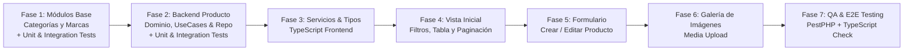

# 📋 Plan de Desarrollo por Fases con Pruebas Unitarias e Integración
## Módulo de Productos (Tenant) - OwoMarket

Este documento establece la **hoja de ruta integral y detallada** para el desarrollo del **Módulo de Productos** y sus módulos satélites en el entorno **Tenant**, incluyendo la estrategia completa de **Pruebas Unitarias (Unit Tests)** y **Pruebas de Integración (Integration / Feature Tests)** con **PestPHP**.

---

## 🗺️ Visión General de Fases y Estrategia de Testing



---

## 🧪 Estrategia de Testing en Arquitectura Hexagonal

| Nivel de Prueba | Ubicación | Enfoque y Aislamiento |
| :--- | :--- | :--- |
| **Pruebas Unitarias de Dominio** | `tests/Unit/{Modulo}/Domain/` | PHP puro. Valida invariantes en Value Objects, Entities y cálculo de reglas de negocio sin framework ni BD. |
| **Pruebas Unitarias de Casos de Uso** | `tests/Unit/{Modulo}/Application/` | Valida el flujo del UseCase simulando (*mocking*) contratos de repositorios y eventos con `Mockery` (ejecución en milisegundos). |
| **Pruebas de Integración de Repositorios** | `tests/Integration/{Modulo}/` | Valida que los repositorios Eloquent guarden, actualicen, eliminen y filtren correctamente en la base de datos real del Tenant. |
| **Pruebas de Integración de API (Feature)** | `tests/Feature/Tenant/{Modulo}/` | Peticiones HTTP a endpoints de `/api-tenant/...`, validación de `FormRequest`, códigos de estado HTTP y estructura estándar `ApiResponse`. |

---

## 📌 FASE 1: Módulos Base Satélites (Categorías y Marcas)

> **Objetivo:** Disponer de la clasificación por Categorías y Marcas para alimentar selectores y filtros del catálogo.

### 1.1 Módulo de Categorías (`src/Category/`)
- [ ] **Dominio (`Domain/`):**
  - Entidad `Category` (id, name, slug, description, image, parent_id, is_active, position).
  - Value Objects: `CategoryId`, `CategoryName`, `CategorySlug`, `CategoryStatus`.
- [ ] **Aplicación (`Application/`):**
  - `CategoryRepositoryInterface`.
  - Casos de uso: `FilterCategoriesUseCase`, `CreateCategoryUseCase`, `EditCategoryUseCase`, `ConsultCategoryByUuidUseCase`, `DeleteCategoryUseCase`.
- [ ] **Infraestructura (`Infrastructure/`):**
  - `CategoryRepository` (consultas Eloquent con jerarquía padre/hijo).
  - Controladores HTTP, FormRequests y Rutas (`/api-tenant/category/*`).
  - Registro en `CategoryServiceProvider`.
- [ ] **Frontend Categorías:**
  - `resources/js/Services/CategoryServices.ts` y tipos TypeScript en `resources/js/types/models/Category.d.ts`.

#### 🧪 Pruebas de la Fase 1.1 (Categorías):
* [ ] **Unitarias Dominio:** `tests/Unit/Category/Domain/CategoryValueObjectsTest.php`
  * Validación de slug automático y normalización de nombres.
  * Inmutabilidad de la entidad `Category`.
* [ ] **Unitarias Casos de Uso:** `tests/Unit/Category/Application/CreateCategoryUseCaseTest.php`
  * Creación exitosa mockeando `CategoryRepositoryInterface`.
  * Fallo controlado al intentar registrar un slug duplicado.
* [ ] **Integración Repositorio:** `tests/Integration/Category/CategoryRepositoryTest.php`
  * Persistencia en BD tenant, consulta con subcategorías anidadas (`parent_id`) y soft delete.
* [ ] **Integración HTTP API:** `tests/Feature/Tenant/CategoryApiTest.php`
  * `POST /api-tenant/category/create` -> 200 con `ApiResponse::success()`.
  * `POST /api-tenant/category/filter` -> 200 con paginación `ApiResponse::Pagination()`.
  * Validación de errores 422 ante campos obligatorios faltantes.

---

### 1.2 Módulo de Marcas (`src/Brand/`)
- [ ] **Dominio (`Domain/`):** Entidad `Brand` y Value Objects (`BrandName`, `BrandSlug`, `BrandStatus`).
- [ ] **Aplicación (`Application/`):** `BrandRepositoryInterface` y Casos de uso (`FilterBrandsUseCase`, `CreateBrandUseCase`, `EditBrandUseCase`, `ConsultBrandByUuidUseCase`, `DeleteBrandUseCase`).
- [ ] **Infraestructura (`Infrastructure/`):** `BrandRepository`, Controladores y Rutas API Tenant.
- [ ] **Frontend Marcas:** `resources/js/Services/BrandServices.ts` y tipos TypeScript.

#### 🧪 Pruebas de la Fase 1.2 (Marcas):
* [ ] **Unitarias Dominio & UseCase:** `tests/Unit/Brand/Application/CreateBrandUseCaseTest.php`
  * Validación de reglas de negocio y orquestación con mock de repositorio.
* [ ] **Integración Repositorio & API:** `tests/Feature/Tenant/BrandApiTest.php`
  * Creación, edición, listado con filtro de búsqueda por nombre y borrado lógico en BD tenant.

---

## 📌 FASE 2: Backend del Módulo de Productos (Dominio, Casos de Uso y Persistencia)

> **Objetivo:** Implementar la lógica central de negocio, casos de uso completos, consultas de filtrado multicriterio y persistencia de productos.

### 2.1 Dominio Puro (`src/Product/Domain/`)
- [ ] Expandir Entidad `Product`:
  - Propiedades: `id`, `name`, `slug`, `sku`, `price`, `compare_price`, `cost_price`, `quantity`, `min_quantity`, `max_quantity`, `track_quantity`, `is_visible`, `is_featured`, `description`, `short_description`, `barcode`, `weight`, `height`, `width`, `length`, `is_digital`, `digital_product_url`, `category_id`, `brand_id`, `published_at`, `seo`, `metadata`.
  - Métodos de negocio: `changePrice()`, `updateStock()`, `toggleVisibility()`, `assignCategory()`, `assignBrand()`.
- [ ] Value Objects de Producto:
  - `StockQuantity`, `ProductPrice`, `ProductDimensions`, `ProductDescription`.

### 2.2 Casos de Uso (`src/Product/Application/`)
- [ ] Actualizar Contrato `ProductRepositoryInterface`:
  - `create(Product $product): Product`
  - `edit(Product $product): Product`
  - `consultByUuid(Uuid $id): ?Product`
  - `delete(Uuid $id): void`
  - `filter(ProductFilterCriteria $criteria): PaginatedProductResult`
  - `toggleVisibility(Uuid $id, bool $isVisible): void`
- [ ] Implementar Casos de Uso:
  - `CreateProductUseCase` (corregir inyección de `UuidGenerator` y mapeo completo).
  - `EditProductByUuidUseCase` (actualización y control de unicidad de SKU/Slug).
  - `ConsultProductByUuidUseCase` (consulta por ID con entidades asociadas).
  - `FilterProductsUseCase` (búsqueda por texto, categoría, marca, rango de precio, rango de fechas, visibilidad, destacado y paginación).
  - `DeleteProductByUuidUseCase` (borrado lógico `SoftDeletes`).
  - `ToggleProductVisibilityUseCase` (cambio de estado rápido).

### 2.3 Capa de Infraestructura (`src/Product/Infrastructure/`)
- [ ] Implementar `ProductRepository` con Eloquent aplicando filtros dinámicos y paginación con `ApiResponse::Pagination()`.
- [ ] Controladores HTTP en `Http/Controller/`:
  - `FilterProductsPOSTController.php`
  - `CreateProductPOSTController.php`
  - `EditProductByUuidPUTController.php`
  - `ConsultProductByUuidGETController.php`
  - `DeleteProductByUuidDELETEController.php`
  - `ToggleProductVisibilityPATCHController.php`
- [ ] FormRequests y DTOs con validaciones estrictas (`CreateProductFormRequest`, `EditProductFormRequest`).
- [ ] Registrar rutas en `apiTenant.php` y `tenant.php`.

#### 🧪 Pruebas de la Fase 2 (Backend de Productos):
* [ ] **Unitarias Dominio:** `tests/Unit/Product/Domain/ProductEntityTest.php`
  * Validación de creación con todos los campos requeridos y opcionales.
  * Invariantes: el precio no puede ser negativo, el stock mínimo no puede ser mayor al stock máximo.
  * Métodos de negocio: `updateStock()`, `toggleVisibility()`.
* [ ] **Unitarias Casos de Uso:**
  * `tests/Unit/Product/Application/CreateProductUseCaseTest.php`: Verifica que el UseCase genere el UUID, asigne los Value Objects y persista vía contrato mockeado.
  * `tests/Unit/Product/Application/EditProductUseCaseTest.php`: Verifica actualización de campos y manejo de excepción `ProductNotFoundException`.
  * `tests/Unit/Product/Application/FilterProductsUseCaseTest.php`: Verifica el paso correcto de filtros y ordenamiento hacia el repositorio.
* [ ] **Integración Repositorio:** `tests/Integration/Product/ProductRepositoryTest.php`
  * Guardado real en la base de datos del Tenant con relaciones a Categoría y Marca.
  * Filtrado por texto (Nombre y SKU), por categoría (`category_id`) y por estado (`is_visible`).
  * Paginación correcta (página 1, página 2, total de registros).
* [ ] **Integración HTTP API (Endpoints Tenant):** `tests/Feature/Tenant/ProductApiTest.php`
  * `POST /api-tenant/product/filter` -> Retorna 200 con estructura `{ status: 'success', data: [...], pagination: {...} }`.
  * `POST /api-tenant/product/create` -> Retorna 200 al enviar payload válido.
  * `POST /api-tenant/product/create` -> Retorna 422 al omitir campos obligatorios (Nombre, Slug, SKU, Precio).
  * `PUT /api-tenant/product/{uuid}` -> Retorna 200 con datos actualizados.
  * `PATCH /api-tenant/product/{uuid}/toggle-visibility` -> Retorna 200 y actualiza el estado.
  * `DELETE /api-tenant/product/{uuid}` -> Retorna 200 y ejecuta soft delete.

---

## 📌 FASE 3: Servicios Frontend y Definición de Tipos TypeScript

> **Objetivo:** Establecer los contratos de tipado estricto y la capa de comunicación HTTP en el frontend, garantizando el cumplimiento de `reglas.md`.

### 3.1 Tipos TypeScript (`resources/js/types/`)
- [ ] `resources/js/types/models/Product.d.ts` (modelo de datos del producto para el cliente).
- [ ] `resources/js/types/FormProduct.d.ts` (estructura del formulario de creación y edición).
- [ ] `resources/js/types/ErrorsFormProduct.d.ts` (mapeo de errores de validación por campo).
- [ ] `resources/js/types/Response/ResponseProduct.d.ts`.

### 3.2 Servicio Centralizado (`resources/js/Services/ProductServices.ts`)
- [ ] Crear [`ProductServices.ts`](file:///c:/laragon/www/owomarket/resources/js/Services/ProductServices.ts) con métodos tipados:
  ```typescript
  filtrar(criteria, page, prePage): Promise<ApiResponse<Product[]>>
  consultByUuid(uuid): Promise<ApiResponse<Product>>
  create(data: FormProduct): Promise<ApiResponse<Product>>
  edit(uuid: string, data: FormProduct): Promise<ApiResponse<Product>>
  delete(uuid: string): Promise<ApiResponse<void>>
  toggleVisibility(uuid: string, isVisible: boolean): Promise<ApiResponse<void>>
  ```

---

## 📌 FASE 4: Frontend UI - Vista Inicial del Módulo de Productos

> **Objetivo:** Construir la vista principal con filtros avanzados, tabla reactiva, tarjetas móviles, paginación y feedback visual.

### 4.1 Componente de Filtros (`resources/js/components/filters/FiltersModuleProductIndex.tsx`)
- [ ] Input de búsqueda con `useDebounce` (Nombre / SKU / Slug).
- [ ] Select de Categoría (cargado dinámicamente con `CategoryServices`).
- [ ] Select de Marca (cargado dinámicamente con `BrandServices`).
- [ ] Selector de Estado (`Todos`, `Visibles`, `Ocultos`).
- [ ] Selector de Producto Destacado (`Todos`, `Destacados`).
- [ ] Rango de fechas con `Datepicker` (*Fecha Desde* y *Fecha Hasta*).

### 4.2 Vista Principal ([`ProductIndexPage.tsx`](file:///c:/laragon/www/owomarket/resources/js/pages/tenant/modules/product/ProductIndexPage.tsx))
- [ ] Header con Breadcrumb (`Home > Products`) y botón `+ Create`.
- [ ] Tabla Desktop ([`TableComponent.tsx`](file:///c:/laragon/www/owomarket/resources/js/components/ui/TableComponent.tsx)):
  - Miniatura de imagen.
  - Nombre y Slug.
  - SKU.
  - Categoría y Marca con `Badge`.
  - Precio formateado con moneda (`Currency`).
  - Stock/Cantidad con alerta de color según nivel de existencias.
  - Switch interactivo para activar/desactivar visibilidad al instante.
  - Acciones: Botón Editar (`LuPencil`) y Botón Eliminar (`LuTrash2`).
- [ ] Vista Móvil Responsive: Tarjetas Flowbite con datos esenciales y switches accesibles.
- [ ] Paginación: Integrar [`PaginationNavigationCustom.tsx`](file:///c:/laragon/www/owomarket/resources/js/components/ui/PaginationNavigationCustom.tsx).
- [ ] Modales y Feedback:
  - [`ModalAlertConfirmation.tsx`](file:///c:/laragon/www/owomarket/resources/js/components/ui/ModalAlertConfirmation.tsx) para confirmación de eliminación.
  - [`HeaderToasts.tsx`](file:///c:/laragon/www/owomarket/resources/js/components/HeaderToasts.tsx) para notificaciones de operaciones.
  - [`LoaderSpinner.tsx`](file:///c:/laragon/www/owomarket/resources/js/components/LoaderSpinner.tsx) para estados de carga.

---

## 📌 FASE 5: Frontend UI - Formulario de Creación y Edición

> **Objetivo:** Implementar la interfaz de captura y edición de productos, con soporte para validaciones en vivo, auto-generación de slug y gestión de estados.

### 5.1 Vista Formulario ([`FormProductPage.tsx`](file:///c:/laragon/www/owomarket/resources/js/pages/tenant/modules/product/FormProductPage.tsx))
- [ ] Botón `← Back` que preserva el estado o redirige a la vista inicial.
- [ ] **Sección 1: Campos Obligatorios:** Nombre (auto-genera slug en tiempo real), Slug, SKU, Precio.
- [ ] **Sección 2: Clasificación y Visibilidad:** Selectores dinámicos de Categoría y Marca, Toggles (`Is Visible`, `Is Featured`, `Track Quantity`), Descripción y Descripción corta.
- [ ] **Sección 3: Inventario y Precios:** Cost Price, Compare Price, Cantidad en stock, Min/Max Quantity, Barcode.
- [ ] **Sección 4: Dimensiones y Logística:** Peso (`weight`), Altura (`height`), Ancho (`width`), Largo (`length`).
- [ ] **Modo Edición (`record_id` presente):**
  - Carga reactiva de datos existentes con `ProductServices.consultByUuid`.
  - Títulos y botones adaptados (*Actualizar Producto* vs *Crear Producto*).
- [ ] **Validación y Errores:**
  - Renderizado de `HelperText` con mensajes específicos por campo provenientes de la respuesta de error del backend (`ApiResponse.errors`).
  - Modales de confirmación al guardar o cancelar.

---

## 📌 FASE 6: Galería de Imágenes y Media Upload

> **Objetivo:** Permitir al comerciante adjuntar múltiples imágenes a sus productos, seleccionar la foto de portada y ordenar la galería.

- [ ] **Backend Media:**
  - Endpoint para subida de imágenes con almacenamiento en `storage/app/tenants/{tenant_id}/products/`.
  - Asignación de imagen `is_default` y eliminación individual de fotos.
- [ ] **Frontend Media Component:**
  - Dropzone / Selector de archivos múltiples de Flowbite.
  - Miniaturas con opción de marcar como "Principal" y botón para eliminar foto.

#### 🧪 Pruebas de la Fase 6 (Media Upload):
* [ ] **Integración HTTP API:** `tests/Feature/Tenant/ProductMediaApiTest.php`
  * Subida de imágenes válidas (JPEG/PNG/WebP).
  * Rechazo de formatos no permitidos o archivos mayores al límite.
  * Asignación correcta de imagen por defecto.

---

## 📌 FASE 7: Testing Integral, Verificación y Control de Calidad

> **Objetivo:** Ejecutar la suite completa de pruebas automatizadas y asegurar la calidad del código.

- [ ] **Suite de Pruebas Backend (PestPHP):**
  ```bash
  # Ejecutar todas las pruebas unitarias y de integración del tenant
  php artisan test --filter=Tenant
  # o con script composer
  composer test
  ```
- [ ] **Verificación de Tipos Frontend (TypeScript):**
  ```bash
  npm run types
  ```
- [ ] **Linter y Formateo de Código:**
  ```bash
  npm run lint
  vendor/bin/pint
  ```
- [ ] **Prueba de Flujo Completo en Navegador:**
  - Creación de producto -> Verificación en tabla -> Filtrado por categoría/nombre -> Edición -> Toggle de visibilidad -> Eliminación.

---

## 🏁 Checklist de Ejecución y Protocolo de Commits

> ⚠️ **Regla Obligatoria de Commits:** Cada hito o fase implementada debe ejecutar sus pruebas (`php artisan test` / `npm run types`). Si y solo si los tests pasan al 100%, se creará el commit correspondiente antes de avanzar al siguiente hito.

- [ ] **Fase 1: Módulos Base (Categorías y Marcas)**
  - [ ] Implementación de Categorías + Tests Unitarios/Integración ➔ `commit: feat(category): ...`
  - [ ] Implementación de Marcas + Tests Unitarios/Integración ➔ `commit: feat(brand): ...`
- [ ] **Fase 2: Backend de Productos**
  - [ ] Entidad Product + Value Objects + Tests ➔ `commit: feat(product): expand product domain entity and VOs`
  - [ ] UseCases + Repositorio Eloquent + API Routes + Tests ➔ `commit: feat(product): implement product CRUD, filter and repository`
- [ ] **Fase 3: Servicios Frontend y Tipos TypeScript**
  - [ ] ProductServices + Types + `npm run types` ➔ `commit: feat(product): add frontend types and ProductServices`
- [ ] **Fase 4: Vista Inicial de Productos**
  - [ ] Filtros + Tabla + Paginación + Toasts ➔ `commit: feat(product): implement ProductIndexPage with filters and table`
- [ ] **Fase 5: Formulario de Productos (Crear / Editar)**
  - [ ] Formulario + Carga Reactiva + Validaciones ➔ `commit: feat(product): implement FormProductPage with live validations`
- [ ] **Fase 6: Galería de Imágenes (Media Upload)**
  - [ ] Upload API + Dropzone UI + Tests ➔ `commit: feat(product): implement product media gallery and upload`
- [ ] **Fase 7: Testing Integral & QA**
  - [ ] Suite completa de Pest + Pint + Linter ➔ `commit: test(product): full tenant test suite and code styling`

