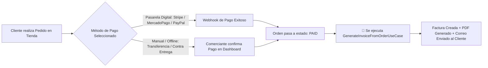

# 🔑 Puntos Clave y Consideraciones Operativas para la Facturación en Producción

Este documento complementa a [`PLANIFICACION_FACTURACION.md`](file:///c:/laragon/www/owomarket/PLANIFICACION_FACTURACION.md) y detalla qué necesita exactamente el Tenant para poner a operar y facturar su negocio en el mundo real.

---

## 1. 🎯 ¿Qué resuelve el Módulo de Facturación Planificado?

Una vez implementado, el comerciante (**Tenant**) tiene resuelto al 100% el circuito comercial y contable interno:

- **Identidad Fiscal y Marca:** Razón Social, Identificación Tributaria (RUT / RFC / NIF / CIF / RUC), dirección fiscal, teléfono y logo corporativo para encabezados de factura.
- **Correlatividad y Series:** Emisión automática y secuencial sin saltos (ej: `FAC-2026-000001`, `FAC-2026-000002`).
- **Desglose Contable:** Separación transparente entre subtotal neto, monto de impuestos (IVA/Tax) y descuentos aplicados.
- **Entrega Inmediata al Cliente:** Generación de PDF profesional con diseño de documento fiscal y envío automático por correo electrónico tras la compra.
- **Control y Auditoría:** Historial completo en el Dashboard del comerciante, filtros avanzados, reimpresión, reenvío y anulación controlada.

---

## 2. ⚡ El "Detonante" de la Facturación: Métodos de Pago y Checkout

Una factura no se emite de la nada; requiere una **orden en estado `paid` (pagada)**. Para que los clientes finales puedan comprar y activar la emisión de facturas, la tienda debe habilitar métodos de pago:



### Opciones de Métodos de Pago:
1. **Métodos Manuales / Offline (Disponibles de inmediato):**
   - **Transferencia Bancaria Directa:** El cliente transfiere y sube comprobante; el comerciante valida en el panel y marca el pedido como "Pagado". Al marcarse pagado, el sistema emite la factura automáticamente.
   - **Pago Contra Entrega (Cash on Delivery):** La factura se genera al momento de entregar y cobrar el producto.
2. **Pasarelas Digitales Automatizadas:**
   - **Integraciones con Stripe, PayPal, MercadoPago o Webpay:** Al completarse la transacción con tarjeta, la pasarela envía un *Webhook* que actualiza la orden a `paid` y dispara la facturación en milisegundos sin intervención humana.

---

## 3. 🏛️ Facturación Comercial vs. Facturación Electrónica Tributaria Oficial

Es fundamental distinguir el tipo de comprobante que exige la legislación del país donde opera el Tenant:

### A. Facturación Comercial Estándar (Lo incluido en la planificación base)
- **Alcance:** Facturas comerciales, recibos de compra y comprobantes de pago en PDF.
- **Validez:** Estándar internacional para eCommerce, venta B2C directa y servicios globales.
- **Estado:** Cubierto al 100% con la arquitectura y base de datos planificadas.

### B. Facturación Electrónica Oficial con Timbrado Fiscal (Por país)
Si el Tenant opera en un país con **validación fiscal obligatoria previa o timbrado con la entidad tributaria**:
- **Chile (SII):** Requiere firma digital y XML DTE (Boleta/Factura Electrónica).
- **México (SAT):** Requiere timbrado CFDI v4.0 mediante un PAC (Proveedor Autorizado de Certificación).
- **Perú (SUNAT):** Requiere envío de XML con estándar UBL 2.1 y firma electrónica.
- **Colombia (DIAN):** Requiere validación previa y generación de CUFE/Código QR.
- **España (TicketBAI / VeriFactu):** Requiere encadenamiento de facturas y envío a Hacienda.

#### 💡 ¿Cómo lo soporta nuestra Arquitectura Hexagonal?
Nuestra entidad `Invoice` y la base de datos ya incluyen los campos preparados (`metadata`, `pdf_path`, `tax_id`, `issuer_snapshot`). Si en el futuro requieres timbrado oficial en un país específico, **no hay que rehacer la base de datos ni los casos de uso**; simplemente se implementa un adaptador en Infraestructura:

```text
src/Billing/Infrastructure/Services/
├── DomPdfInvoiceGeneratorService.php          # Generador de PDF estándar
└── ElectronicBilling/
    ├── DteChileBillingProvider.php            # (Opcional) Conector API SII / OpenFactura
    ├── SatMexicoBillingProvider.php           # (Opcional) Conector PAC / Facturama
    └── SunatPeruBillingProvider.php           # (Opcional) Conector SUNAT / Nubefact
```

---

## 4. ✅ Checklist para Poner a Operar la Facturación del Tenant

Para que un comerciante comience a vender y emitir facturas en su tienda, debe completar este flujo:

- [ ] **Paso 1: Configurar Perfil Fiscal en Dashboard Tenant (`/tenant/billing/settings`)**
  - Razón Social / Nombre Comercial.
  - RUT / RFC / NIF / CIF de la empresa.
  - Dirección fiscal completa y correo de facturación.
  - Prefijo deseado (ej. `FAC-` o `INV-`) y correlativo inicial.
  - Subir logo corporativo para las facturas.
- [ ] **Paso 2: Configurar Catálogo e Impuestos**
  - Cargar productos con sus precios base e indicar la tasa de impuesto (IVA) aplicable.
- [ ] **Paso 3: Habilitar al menos un Método de Pago**
  - Activar datos de cuenta para transferencias manuales o configurar credenciales de pasarela digital.
- [ ] **Paso 4: Realizar una Compra de Prueba (Test Flow)**
  - Agregar un producto al carrito, completar checkout y confirmar el pago.
  - Verificar que la factura se visualice en `/tenant/billing`.
  - Descargar el PDF generado y confirmar que el cliente recibió el correo con el adjunto.
