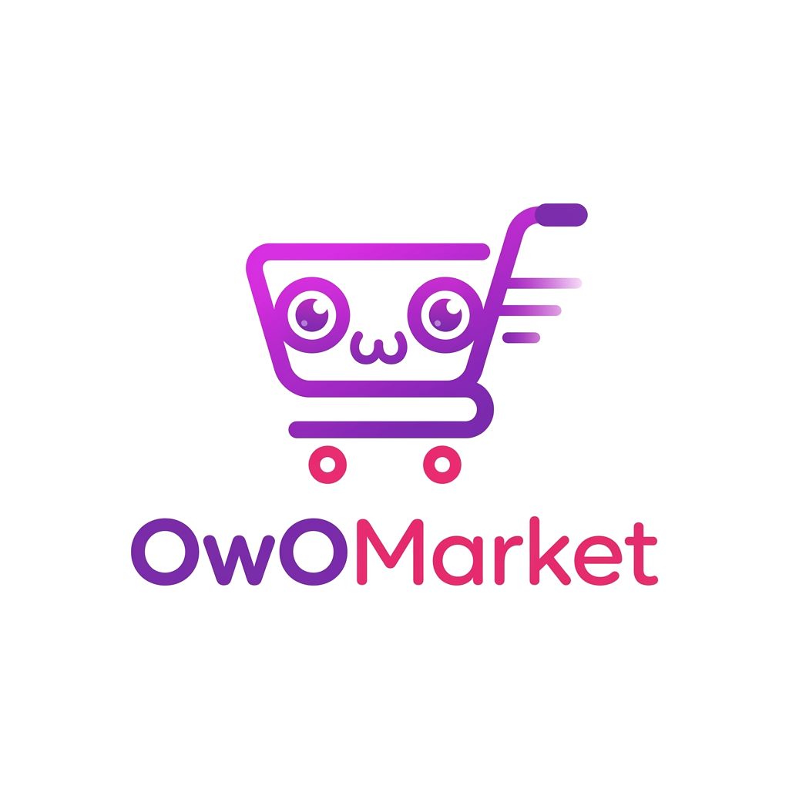

<p align="center"></p>

## Objetivo personal del proyecto
Este proyecto nace de la necesidad de contar con un portafolio profesional que refleje mis capacidades como desarrollador fullstack. Debido a que los proyectos desarrollados para clientes y empresas suelen estar sujetos a acuerdos de confidencialidad que impiden mostrarlos públicamente, he decidido crear mi propio marketplace. Esta plataforma me permitirá demostrar de manera tangible mis habilidades en Laravel, React y arquitectura multi-tenant, así como mi capacidad para diseñar y ejecutar soluciones completas desde cero, manteniendo altos estándares de calidad y buenas prácticas de desarrollo.

## Objetivo del Proyecto
El marketplace tiene como objetivo principal proporcionar una solución integral para propietarios de múltiples negocios, ofreciendo herramientas avanzadas de gestión y automatización. La plataforma permitirá centralizar la administración de diferentes comercios desde un solo panel de control, además de brindarles la capacidad de crear y personalizar tiendas web independientes para cada uno de sus negocios, facilitando así la venta de sus productos y servicios en línea de manera eficiente y escalable.

## Stack Tecnologico Backend
- Laravel 12
- Laravel tenancy

## Stack Tecnologico Frontend
- Vite 7.0
- React 19
- Typescript 5.9
- Tailwindcss 4.0
- Flowbite React 4.0

## Requerimientos
- php 8.5
- composer 2.9.5
- nodejs 22.19
- npm 10.2.3
- mysql 8.0

## Configuración para poder instalarlo de forma directa

> Asegúrate de cumplir con todos los requisitos mencionados anteriormente antes de iniciar el proceso de instalación.

### Backend

1. **Copiar el archivo de configuración y ajustar variables de entorno**

   Copia el archivo `.env.example` a `.env` y configura tus variables antes de continuar (ver el paso 4 para más detalles sobre las variables necesarias):
   ```shell
   cp .env.example .env
   ```

2. **Instalar dependencias de PHP**
   ```shell
   composer install
   ```

3. **Generar clave de la aplicación**
   ```shell
   php artisan key:generate
   ```

4. **Crear enlace simbólico para el almacenamiento**
   ```shell
   php artisan storage:link
   ```

5. **Configurar variables de entorno (.env)**

   Asegúrate de que las siguientes variables en tu archivo `.env` estén configuradas correctamente:

   **Conexión a la base de datos central:**
   ```env
   DB_CONNECTION=mysql
   DB_HOST=127.0.0.1
   DB_PORT=3306
   DB_DATABASE=nombre_bd_central
   DB_USERNAME=tu_usuario
   DB_PASSWORD=tu_contraseña

   CENTRAL_DB_HOST=127.0.0.1
   CENTRAL_DB_PORT=3306
   CENTRAL_DB_DATABASE=nombre_bd_central
   CENTRAL_DB_USERNAME=tu_usuario
   CENTRAL_DB_PASSWORD=tu_contraseña
   ```

   **Configuraciones adicionales del proyecto:**
   ```env
   VITE_APP_CENTRAL_DOMAIN=localhost
   USER_PASSWORD_DEV=password_desarrollo
   DEFAULT_USER_TENANT_OWNER_PASSWORD_DEV=password_desarrollo_tenant
   INTERNAL_API_SECRET=clave_secreta_api
   TIME_ZONE_SISTEMA=America/Mexico_City
   ```

6. **Crear la base de datos**

   Crea una base de datos MySQL con el nombre que especificaste en `DB_DATABASE` y `CENTRAL_DB_DATABASE`.

7. **Ejecutar migraciones**

   Este comando creará las tablas necesarias en la base de datos central:
   ```shell
   php artisan migrate
   ```

8. **Poblar la base de datos con datos iniciales**

   Este comando creará el usuario root y otros datos necesarios para el funcionamiento del sistema:
   ```shell
   php artisan db:seed
   ```

9. **Configurar dominios centrales**

   En el archivo `config/tenancy.php`, agrega los dominios que utilizará la aplicación:
   ```php
   'central_domains' => [
       'tu-dominio.com',
       '127.0.0.1',
       'localhost',
   ],
   ```

### Frontend

1. **Instalar dependencias de Node.js**
   ```shell
   npm install
   ```

2. **Compilar assets para producción**
   ```shell
   npm run build
   ```

3. **Para desarrollo (opcional)**

   Si estás en entorno de desarrollo, puedes usar:
   ```shell
   npm run dev
   ```

### Verificación de la instalación

Una vez completados todos los pasos, podrás acceder a la aplicación a través de tu navegador en la URL configurada y utilizar las credenciales del usuario root creado durante el seeding.

## Instalación con Docker (docker-compose)

Si prefieres no instalar PHP, Node.js y MySQL directamente en tu máquina local, el proyecto cuenta con archivos `docker-compose.yml` y `Dockerfile` listos para levantar todo el entorno.

### Requisitos previos para Docker:
- [Docker Desktop](https://www.docker.com/products/docker-desktop) instalado y en ejecución.

### Pasos:

1. **Copiar el archivo de configuración**:
   ```shell
   cp .env.example .env
   ```

2. **Levantar los contenedores**:
   Este comando construirá la imagen del backend (instalando Composer y dependencias de NPM), levantará Nginx, MySQL y phpMyAdmin.
   ```shell
   docker-compose up -d --build
   ```

3. **Generar la clave de la aplicación**:
   ```shell
   docker-compose exec app php artisan key:generate
   ```

4. **Ejecutar las migraciones y seeders**:
   ```shell
   docker-compose exec app php artisan migrate --seed
   ```

5. **Crear enlace simbólico de Storage**:
   ```shell
   docker-compose exec app php artisan storage:link
   ```

Una vez que los contenedores estén corriendo, podrás acceder a la aplicación en `http://localhost:3001` (según la configuración de Nginx). Además, puedes acceder a phpMyAdmin en `http://localhost:3003`. Puedes detener el entorno en cualquier momento ejecutando `docker-compose down`.
