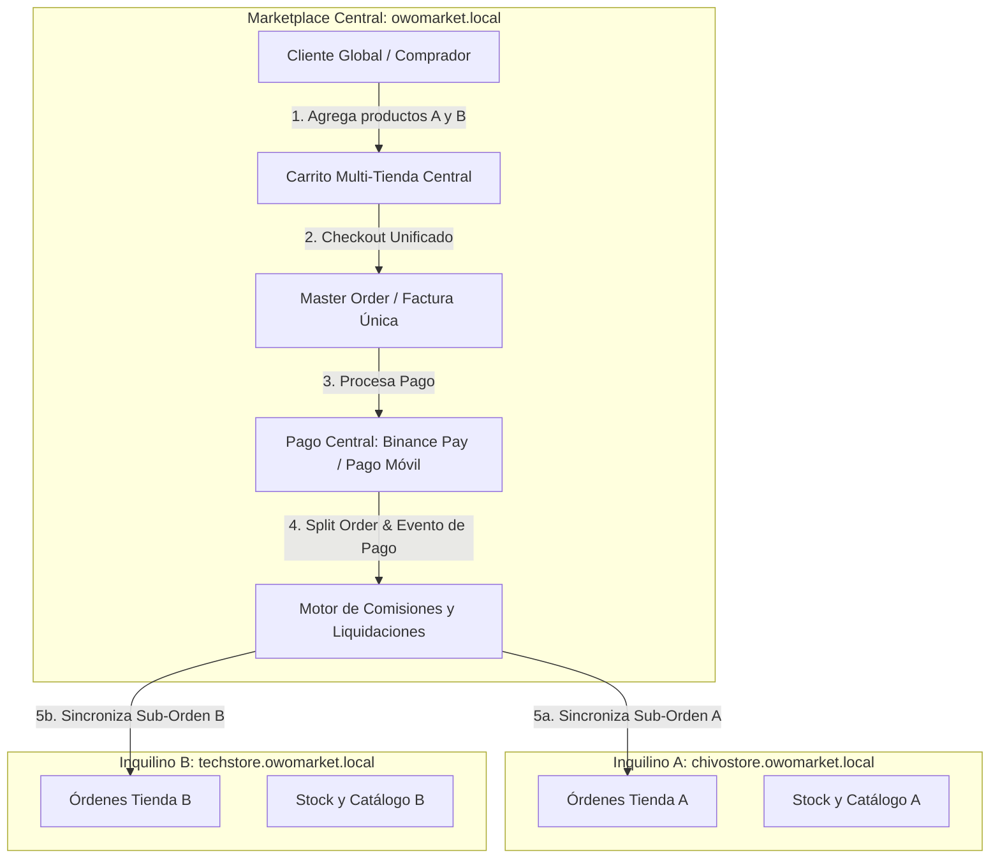

# 🌐 Arquitectura Maestra: Flujo de Compra Global, Marketplace Central, SSO y Monetización

Este documento establece el diseño arquitectónico detallado para responder al flujo de compra del cliente, la gestión de sesiones multi-tenant (SSO), el marketplace multi-tienda con carrito unificado (Split Orders), pasarelas de pago (Pago Móvil y Binance Pay) y el motor de comisiones/suscripciones de **OwOMarket**.

---

## 1. 🏗️ Visión General y Respuestas a los Desafíos Planteados

---

## 2. 🔐 Pilar 1: Gestión de Sesiones y Autenticación Universal (SSO)

### El Reto
En un entorno multitenant con subdominios (`chivostore.owomarket.local`) o dominios personalizados (`mitienda.com`), las cookies de sesión del navegador no se comparten de forma transparente por restricciones de seguridad (Same-Origin Policy). Forzar al comprador a crear una cuenta separada en cada tienda genera **alta fricción y abandono del carrito**.

### 💡 Solución Recomendada: "OwO Pass" (Universal Customer SSO + Seamless Guest Checkout)

1. **Modelo de Identidad Central (`central_customers`)**:
   - Los clientes residen en la base de datos central (`id`, `name`, `email`, `phone`, `password_hash`, `document_id`, `default_address`).
2. **Flujo de Inicio de Sesión / Checkout en Tiendas de Inquilinos**:
   - **Opción A (Compra Rápida como Invitado)**: El cliente introduce su correo y datos de entrega en el checkout de la tienda. El backend tenant registra la orden y asocia el cliente en la base central automáticamente si el correo ya existía, o crea el perfil central en segundo plano.
   - **Opción B (Login con Cuenta OwOMarket)**:
     - El cliente pulsa el botón **"Iniciar sesión con OwOMarket"** en la tienda del inquilino.
     - Se redirige temporalmente a `owomarket.local/auth/sso?return_url=chivostore.owomarket.local/checkout&token=...`
     - Al autenticarse en la central, se genera un **Token Firmado de Un Solo Uso (One-Time SSO Token)** con expiración de 2 minutos.
     - El navegador regresa a la tienda del inquilino, donde el middleware valida la firma criptográfica y autentica al cliente en la sesión del tenant con todos sus datos precargados (nombre, teléfono, direcciones guardadas).

---

## 3. 🛒 Pilar 2: Marketplace Central y Split Orders (Carrito Multi-Tienda)

### Flujo de Compra en el Dominio Central

1. **Carrito Multi-Tienda (`central_carts`)**:
   - El cliente navega por el marketplace central y agrega un producto de *ChivoStore* ($40) y otro de *TechStore* ($60).
   - El carrito agrupa los items por `tenant_id` pero presenta al cliente un total consolidado ($100 + costos de envío calculados).
2. **Creación de la Orden Maestra (`central_master_orders`)**:
   - Se genera una única orden para el cliente: `MasterOrder #OWO-89201`.
   - Se desglosa internamente en **Sub-Órdenes**:
     - `SubOrder 1 (ChivoStore)`: $40 - Comisión OwOMarket (ej. 5% = $2) -> Neto para tienda: $38.
     - `SubOrder 2 (TechStore)`: $60 - Comisión OwOMarket (ej. 5% = $3) -> Neto para tienda: $57.
3. **Facturación y Despacho**:
   - Al cliente se le muestra un comprobante / factura consolidada central.
   - Cada tienda recibe en su backoffice su respectiva sub-orden con su lista de productos para preparar el despacho.

---

## 4. 💳 Pilar 3: Pasarelas de Pago de Prueba (Pago Móvil y Binance Pay)

### A. Binance Pay (Criptomonedas / USDT)
- **Modo de Integración**:
  - Generación de código QR dinámico de Binance Pay (o enlace de pago Binance App).
  - Mediante Webhook (`POST /api/webhooks/binance-pay`), Binance confirma la recepción del pago en USDT.
  - Al confirmarse el webhook, la orden maestra pasa a estado `PAID` y se despachan las sub-órdenes a cada inquilino de forma instantánea.

### B. Pago Móvil (Venezuela / Bolívares)
- **Modo de Integración**:
  - El cliente ve los datos bancarios oficiales de la plataforma (Banco, Teléfono, Cédula/RIF, Tasa de Cambio BCV oficial).
  - El cliente realiza la transferencia y completa el formulario con:
    - Banco emisor
    - Teléfono emisor
    - Número de referencia (últimos 4 a 6 dígitos)
    - Captura del comprobante (opcional)
    - Monto transferido
  - **Validación**:
    - **Fase 1 (Conciliación Manual Asistida)**: El administrador central o el inquilino ve el pago pendiente en backoffice y presiona *"Confirmar Pago"* tras verificar en el banco.
    - **Fase 2 (Conciliación Automática)**: Conexión mediante API bancaria o bot de conciliación por SMS/Webhook.

---

## 5. 💰 Pilar 4: Motor de Comisiones, Billetera y Suscripciones

### Modelo Financiero:
Existen dos escenarios según el lugar donde se cobra:

| Escenario | Dónde se cobra | Flujo de Dinero | Comisión Plataforma | Liquidación |
| :--- | :--- | :--- | :--- | :--- |
| **Venta en Marketplace Central** | En la pasarela central de OwOMarket | OwOMarket recibe el 100% | OwOMarket retiene su comisión (ej. 5%) | OwOMarket transfiere el 95% restante al inquilino en su ciclo de liquidación. |
| **Venta en Tienda Propia del Tenant** | En la cuenta bancaria / pasarela del inquilino | El inquilino recibe el 100% | Se registra una deuda de comisión a favor de OwOMarket | Se descuenta de las ventas centrales o se factura mensualmente en su estado de cuenta. |

### Suscripciones y Descuentos en Comisiones:
- **Plan Básico**: $0/mes, comisión del 7% por venta.
- **Plan Emprendedor Pro**: $19/mes, comisión reducida al 3% por venta + dominio personalizado + reportes avanzados.
- **Plan Empresa**: $49/mes, comisión del 1% por venta + soporte prioritario + integración API ERP.

---

## 6. 🗺️ Roadmap de Implementación Recomendado

### Fase 1: Autenticación Centralizada de Clientes y Sincronización
- [ ] Creación de tablas centrales de clientes (`central_customers`, `central_customer_addresses`).
- [ ] Implementación del mecanismo SSO tokenizado para inicio de sesión universal en subdominios de inquilinos.
- [ ] Soporte de checkout sin fricción con sincronización automática de perfiles.

### Fase 2: Pasarelas de Pago de Prueba (Pago Móvil y Binance Pay)
- [ ] Adaptador de Pago Móvil con formulario de reporte de referencia bancaria y panel de validación de pagos.
- [ ] Adaptador de Binance Pay con generación de QR y webhook de confirmación.

### Fase 3: Marketplace Central y Split Orders Multi-Tienda
- [ ] Carrito multi-tienda central con desglose por tenant.
- [ ] Caso de uso de `CreateMasterOrderUseCase` y división en sub-órdenes hacia cada tenant.
- [ ] Eventos y jobs asíncronos para actualizar el stock y registrar la orden en la base de datos de cada inquilino.

### Fase 4: Motor de Comisiones, Billetera de Inquilinos y Suscripciones
- [ ] Registro de comisiones por orden (`platform_commissions`).
- [ ] Balance y liquidaciones de inquilinos (`tenant_wallets` / `tenant_payouts`).
- [ ] Módulo de suscripciones mensuales y planes con reducción de tasas.
