# 🛍️ Plan Maestro: Storefront E-Commerce Público del Inquilino (Tienda Web del Cliente)
## OwoMarket - Experiencia de Compra Integral

Este documento define la planificación técnica, arquitectura de componentes, flujo de datos y fases de implementación para la **Tienda Pública del Inquilino** (Storefront), permitiendo que los compradores finales accedan al subdominio del inquilino (ej. `tienda.localhost`), naveguen el catálogo, seleccionen variantes, agreguen al carrito con cupones, califiquen productos y completen pedidos.

---

## ❓ ¿Es necesario desarrollar el Plan Maestro 2.0 para habilitar la tienda pública?

> [!NOTE]
> **NO, no es necesario desarrollar el Plan Maestro 2.0.**
> 
> El inquilino **ya cuenta con el 100% de los motores comerciales backend requeridos**, completamente desarrollados y probados:
> - ✅ **Catálogo & Variantes** (`src/Product/`)
> - ✅ **Categorías, Marcas & Atributos** (`src/Category/`, `src/Brand/`, `src/Attribute/`)
> - ✅ **Cupones de Descuento** (`src/Coupon/`)
> - ✅ **Clientes & Direcciones** (`src/Customer/`)
> - ✅ **Pedidos & Ventas** (`src/Order/`)
> - ✅ **Facturación & Fiscal** (`src/Billing/`)
> - ✅ **Zonas & Tarifas de Envío** (`src/Shipping/`, `src/Shipment/`)
> - ✅ **Cálculo de Impuestos** (`src/Tax/`)
> - ✅ **Reseñas & Puntuación con Estrellas** (`src/Review/`)
> - ✅ **Configuración de Marca, Logo, Banner & SEO** (`src/TenantSettings/`)
>
> Los módulos del Plan Maestro 2.0 (Analítica avanzada, Kardex contable, Roles de empleados) son **herramientas internas de gestión para el dueño de la tienda**. Lo que se requiere ahora es la **Capa de Presentación y Experiencia del Comprador (Storefront)** para conectar todos los motores existentes en una tienda visual moderna, reactiva y de alto rendimiento.

---

## 🗺️ Mapa de Navegación y Flujo de Compra del Storefront

```mermaid
flowchart TD
    subgraph StorefrontExperience ["🛍️ Flujo de Compra del Comprador en la Tienda del Inquilino"]
        HOME["🏠 1. Home Page de la Tienda (ViewHomePageTenantGETController)\n(Banner Hero, Logo, Categorías, Destacados, Ofertas)"]
        CATALOG["🔍 2. Catálogo & Filtros Facetados (ViewCatalogTenantGETController)\n(Búsqueda, Categoría, Marca, Precio, Ordenamiento)"]
        DETAIL["📦 3. Detalle de Producto & Reseñas (ViewProductDetailTenantGETController)\n(Galería, Selector Variantes, Stock en vivo, Reseñas 1-5★)"]
        DRAWER["🛒 4. Mini-Cart Drawer\n(Carrito lateral deslizante con acceso rápido)"]
        CART["🛍️ 5. Página de Carrito & Cupones (ViewCartTenantGETController)\n(Cantidades, Totales, Validación de Cupón de Descuento)"]
        CHECKOUT["💳 6. Checkout Multitrayecto (ViewCheckoutTenantGETController)\n(Datos cliente, Dirección, Tarifa de envío, Impuestos, Paso Login para Pago)"]
        SUCCESS["🎉 7. Confirmación de Pedido (ViewOrderConfirmationTenantGETController)\n(Página de éxito, Resumen de orden, Consulta de tracking)"]
        REVIEW["⭐ 8. Formulario de Calificación\n(Publicación de reseña con estrellas sobre el producto)"]
    end

    HOME -->|Explorar catálogo| CATALOG
    HOME -->|Clic en producto| DETAIL
    CATALOG -->|Seleccionar producto| DETAIL
    DETAIL -->|Añadir al carrito| DRAWER
    DRAWER -->|Ver carrito completo| CART
    DRAWER -->|Comprar ahora| CHECKOUT
    CART -->|Proceder al pago| CHECKOUT
    CHECKOUT -->|Orden confirmada| SUCCESS
    DETAIL -->|Opinar sobre producto| REVIEW
    SUCCESS -->|Volver a la tienda| HOME
```

---

## 🏛️ Estructura de Controladores y Rutas (`src/Marketplace/`)

- **Archivo de Rutas:** [src/Marketplace/Infrastructure/Http/Routes/tenant.php](file:///c:/laragon/www/owomarket/src/Marketplace/Infrastructure/Http/Routes/tenant.php)
  - `GET  /` ➔ `ViewHomePageTenantGETController::class` (Home de la tienda)
  - `GET  /catalog` ➔ `ViewCatalogTenantGETController::class` (Catálogo con búsqueda y filtros)
  - `GET  /product/{slug}` ➔ `ViewProductDetailTenantGETController::class` (Detalle de producto y variantes)
  - `GET  /cart` ➔ `ViewCartTenantGETController::class` (Página de carrito y cupones)
  - `GET  /checkout` ➔ `ViewCheckoutTenantGETController::class` (Paso a paso de checkout)
  - `GET  /order/{id}/confirmation` ➔ `ViewOrderConfirmationTenantGETController::class` (Éxito y tracking)

---

## 📌 Desglose por Fases de Implementación:

### 🔹 Fase 1: Layout Global del Storefront, Navbar, Footer y Estado del Carrito ✅
- [x] **Tipos TypeScript**: [resources/js/types/models/Cart.d.ts](file:///c:/laragon/www/owomarket/resources/js/types/models/Cart.d.ts) (`CartItem`, `CartItemAttribute`, `AppliedCoupon`, `CartState`).
- [x] **Contexto React**: [resources/js/contexts/CartContext.tsx](file:///c:/laragon/www/owomarket/resources/js/contexts/CartContext.tsx) con persistencia en `localStorage`, cálculo reactivo de subtotales, cupones, adición de variantes y conteo de ítems.
- [x] **Mini-Cart Drawer**: [resources/js/components/ui/storefront/MiniCartDrawer.tsx](file:///c:/laragon/www/owomarket/resources/js/components/ui/storefront/MiniCartDrawer.tsx) con selector de cantidad, eliminación, estado vacío amigable y botones de acción rápida.
- [x] **Navbar de Tienda**: [resources/js/components/ui/storefront/StorefrontNavbar.tsx](file:///c:/laragon/www/owomarket/resources/js/components/ui/storefront/StorefrontNavbar.tsx) con buscador en tiempo real, branding dinámico del tenant, menú de categorías y contador animado de carrito.
- [x] **Footer de Tienda**: [resources/js/components/ui/storefront/StorefrontFooter.tsx](file:///c:/laragon/www/owomarket/resources/js/components/ui/storefront/StorefrontFooter.tsx) con enlaces rápidos, datos de contacto, sellos de seguridad y botón flotante de WhatsApp.
- [x] **Layout Base**: [resources/js/components/layouts/StorefrontLayout.tsx](file:///c:/laragon/www/owomarket/resources/js/components/layouts/StorefrontLayout.tsx) envolviendo toda la experiencia pública del comprador.
- ➔ `commit: feat(storefront): implement storefront layout, navbar, footer and cart context`

---

### 🔹 Fase 2: Home Page de la Tienda Pública (`/`) ✅
- [x] **Controlador Inertia**: [ViewHomePageTenantGETController.php](file:///c:/laragon/www/owomarket/src/Marketplace/Infrastructure/Http/Controller/ViewHomePageTenantGETController.php) con consultas transaccionales de configuración del comercio (`TenantSettings`), categorías activas, productos destacados y novedades con cálculo de calificación promedio en estrellas (`ProductReview`).
- [x] **Card de Producto Interactiva**: [resources/js/components/ui/storefront/ProductCard.tsx](file:///c:/laragon/www/owomarket/resources/js/components/ui/storefront/ProductCard.tsx) con zoom en hover, badges de descuento y disponibilidad, visualizador de estrellas, precios y botón "Añadir al Carrito" directo a `CartContext`.
- [x] **Vista Home Page**: [resources/js/pages/marketplace/home/TenantStorefrontHomePage.tsx](file:///c:/laragon/www/owomarket/resources/js/pages/marketplace/home/TenantStorefrontHomePage.tsx):
  - Banner Hero principal configurable con degradados, imagen de portada y botones de acción rápida.
  - Grid de Categorías destacadas con iconos e imágenes.
  - Sección de **"Productos Destacados"** y **"Novedades"** con grids responsivos.
  - Banner promocional de Cupones de Descuento.
- ➔ `commit: feat(storefront): implement dynamic tenant storefront home page`

---

### 🔹 Fase 3: Catálogo, Búsqueda Avanzada y Filtros Facetados (`/catalog`)
- **Controlador Inertia**: `ViewCatalogTenantGETController.php`.
- **Vista**: [resources/js/pages/marketplace/catalog/TenantCatalogPage.tsx](file:///c:/laragon/www/owomarket/resources/js/pages/marketplace/catalog/TenantCatalogPage.tsx):
  - Buscador reactivo con autocompletado y debounce.
  - **Filtros Facetados Laterales**:
    - Categorías (con conteo de productos).
    - Marcas comerciales activas.
    - Rango de precio con slider/inputs interactivos.
    - Filtro de "Solo en oferta" y "Con stock disponible".
  - **Ordenamiento**: Más recientes, Menor precio, Mayor precio, Mejor calificados.
  - Selector de vista en Cuadrícula (Grid) o Lista con paginación integrada.
- ➔ `commit: feat(storefront): implement tenant catalog with faceted filters and search`

---

### 🔹 Fase 4: Detalle de Producto, Variantes y Sistema de Reseñas (`/product/{slug}`)
- **Controlador Inertia**: `ViewProductDetailTenantGETController.php`.
- **Vista**: [resources/js/pages/marketplace/product/TenantProductDetailPage.tsx](file:///c:/laragon/www/owomarket/resources/js/pages/marketplace/product/TenantProductDetailPage.tsx):
  - Galería de imágenes interactiva con zoom y miniaturas.
  - Información principal: Marca, Título, SKU, Precio base y badge de ahorro.
  - **Selector de Variantes**: Tallas, Colores y Atributos con actualización instantánea de precio, imagen y stock disponible.
  - Selector de cantidad (+/-) con control de stock máximo y botón "Agregar al Carrito".
  - Pestaña de Especificaciones y Atributos del producto.
  - **Módulo de Reseñas y Calificaciones**:
    - Score global promedio (ej. 4.8 / 5.0) y desglose de estrellas (1 a 5).
    - **Reseñas Anónimas y Verificadas**:
      - Cualquier usuario puede enviar una reseña con estrellas de forma anónima o como invitado sin obligatoriedad de cuenta previa.
      - En el escaparate del inquilino y en el dominio principal se muestran y destacan las reseñas de usuarios con cuenta registrada / comprador verificado.
    - Listado de opiniones aprobadas con fecha, badge de usuario verificado y respuesta oficial de la tienda.
    - **Formulario interactivo para Calificar**: Selector de 1 a 5 estrellas interactivas, nombre, correo y comentario (conecta con `ReviewServices.createReview`).
- ➔ `commit: feat(storefront): implement product detail page with variants selector and reviews system`

---

### 🔹 Fase 5: Página de Carrito de Compras y Validación de Cupones (`/cart`)
- **Controlador Inertia**: `ViewCartTenantGETController.php`.
- **Vista**: [resources/js/pages/marketplace/cart/TenantCartPage.tsx](file:///c:/laragon/www/owomarket/resources/js/pages/marketplace/cart/TenantCartPage.tsx):
  - Tabla de productos en el carrito con imagen, variante elegida, precio unitario, control de cantidad y eliminación.
  - **Caja de Aplicación de Cupones**: Input para código de cupón con validación en vivo vía API (`/api-tenant/coupon`), aplicando descuento porcentual o monto fijo con feedback inmediato.
  - Resumen financiero: Subtotal, Descuento por Cupón, Impuestos estimados y Total final.
  - Botón "Continuar Comprando" y "Proceder al Checkout".
- ➔ `commit: feat(storefront): implement shopping cart page with dynamic coupon discounts`

---

### 🔹 Fase 6: Checkout Completo, Control de Autenticación en Pago y Confirmación (`/checkout`)
- **Controlador Inertia**: `ViewCheckoutTenantGETController.php` y `ViewOrderConfirmationTenantGETController.php`.
- **Vista**: [resources/js/pages/marketplace/checkout/TenantCheckoutPage.tsx](file:///c:/laragon/www/owomarket/resources/js/pages/marketplace/checkout/TenantCheckoutPage.tsx):
  - **Paso 1: Datos del Comprador y Contacto**: Nombre, Email, Teléfono, RUT/DNI (permite ingreso libre como invitado para cotizar).
  - **Paso 2: Dirección de Entrega y Cotización de Envío**: Selección de Región/Comuna con cálculo automático de tarifas según zona (`ShippingZones`).
  - **Paso 3: Bloqueo de Seguridad y Login Obligatorio para Pago**:
    - El comprador puede completar los pasos 1 y 2 libremente para simular el costo total con envío e impuestos.
    - Al avanzar al **Paso de Pago / Pasarela**, si el usuario no tiene sesión iniciada, se despliega un **Modal / Paso de Login o Registro Rápido** para que inicie sesión con su cuenta de cliente antes de procesar el pago y emitir la orden.
    - *En las pruebas automatizadas (Tests Feature/E2E), se realiza la autenticación correspondiente para validar el ciclo de orden.*
  - **Paso 4: Selección de Método de Pago y Creación Atómica del Pedido**: Transferencia Bancaria Directa o Pasarela, invocando `POST /api-tenant/order/create` con el cliente autenticado.
- **Vista**: [resources/js/pages/marketplace/checkout/TenantOrderConfirmationPage.tsx](file:///c:/laragon/www/owomarket/resources/js/pages/marketplace/checkout/TenantOrderConfirmationPage.tsx):
  - Pantalla de éxito con número de orden, resumen detallado de productos, instrucciones de pago/despacho y enlace para seguimiento de tracking.
- ➔ `commit: feat(storefront): implement complete checkout flow and order confirmation`

---

### 🔹 Fase 7: Testing Integral E2E del Storefront, QA y Validación Final
- **Prueba End-to-End**: `tests/Feature/Tenant/TenantStorefrontCustomerLifecycleEndToEndTest.php`:
  - Simula la experiencia completa de un comprador:
    1. Acceso a la home del subdominio del inquilino (`ViewHomePageTenantGETController`).
    2. Búsqueda y filtrado de productos en el catálogo (`ViewCatalogTenantGETController`).
    3. Selección de producto y variante específica (`ViewProductDetailTenantGETController`).
    4. Adición al carrito y aplicación de cupón de descuento (`ViewCartTenantGETController`).
    5. Finalización de checkout con autenticación de cliente, cálculo de envío e impuestos.
    6. Verificación de creación del pedido en base de datos tenant y descuento de stock.
    7. Publicación de reseña con calificación por estrellas.
- **Suite completa**: Ejecución de `php artisan test` (360+ tests pasando al 100%) y `npm run types`.
- ➔ `commit: test(storefront): complete tenant storefront end-to-end test suite and quality assurance`

---

## 📊 Matriz de Fases y Tareas:

| Fase | Alcance | Estado | Commit |
| :--- | :--- | :---: | :--- |
| **Fase 1** | Layout Storefront, Navbar dinámico, Footer, CartContext y Mini-Cart Drawer | ✅ Completado | `feat(storefront): implement storefront layout, navbar, footer and cart context` |
| **Fase 2** | Home Page (`/`) con Hero Banner, Categorías, Novedades y Cards de Producto | ✅ Completado | `feat(storefront): implement dynamic tenant storefront home page` |
| **Fase 3** | Catálogo (`/catalog`), Búsqueda en vivo, Filtros facetados y Ordenamiento | ⏳ Pendiente | `feat(storefront): implement tenant catalog with faceted filters and search` |
| **Fase 4** | Detalle de Producto (`/product/{slug}`), Variantes y Sistema de Reseñas 1-5★ | ⏳ Pendiente | `feat(storefront): implement product detail page with variants selector and reviews system` |
| **Fase 5** | Carrito de Compras (`/cart`) con aplicación de Cupones de Descuento | ⏳ Pendiente | `feat(storefront): implement shopping cart page with dynamic coupon discounts` |
| **Fase 6** | Checkout (`/checkout`), Cálculo de Envíos, Creación de Pedido y Confirmación | ⏳ Pendiente | `feat(storefront): implement complete checkout flow and order confirmation` |
| **Fase 7** | Testing Integral E2E, QA, Laravel Pint y Suite Completa | ⏳ Pendiente | `test(storefront): complete tenant storefront end-to-end test suite and quality assurance` |
