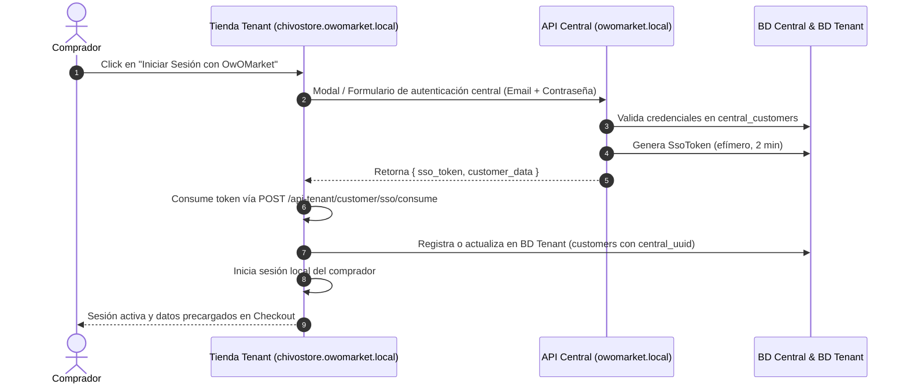

# 📋 Plan Maestro: Módulo Central de Clientes y Autenticación SSO Multidominio ("OwO Pass")

## 1. 🎯 Objetivo
Implementar la infraestructura central de clientes y el mecanismo de **Single Sign-On (SSO) Multidominio** que permite a los compradores registrarse una sola vez en el ecosistema **OwOMarket**, y navegar o comprar en cualquier tienda de inquilinos (`*.owomarket.local` o dominios personalizados) sin fricción de autenticación ni duplicidad de cuentas.

---

## 2. 🗄️ Base de Datos y Migraciones

### A. Migraciones Base de Datos Central (`database/migrations/`)
1. **`central_customers`**:
   - `id` (UUID, Primary Key)
   - `name` (string)
   - `email` (string, Unique, Index)
   - `phone` (string, Nullable)
   - `password` (string - hash seguro Bcrypt/Argon2)
   - `document_id` (string, Nullable - Cédula / DNI / RIF)
   - `avatar` (string, Nullable)
   - `is_active` (boolean, default true)
   - `email_verified_at` (timestamp, Nullable)
   - `metadata` (JSON, Nullable)
   - `timestamps()`, `softDeletes()`
2. **`central_customer_addresses`**:
   - `id` (UUID, Primary Key)
   - `customer_id` (UUID, FK a `central_customers`)
   - `label` (string, ej. "Casa", "Oficina")
   - `address` (string)
   - `city` (string)
   - `state` (string, Nullable)
   - `zip_code` (string, Nullable)
   - `country` (string, default "VE")
   - `is_default` (boolean, default false)
   - `timestamps()`
3. **`central_sso_tokens`**:
   - `id` (UUID, Primary Key)
   - `customer_id` (UUID, FK a `central_customers`)
   - `token` (string, 64 chars, Unique, Index)
   - `target_domain` (string, ej. "chivostore.owomarket.local")
   - `expires_at` (timestamp - validez de 2 a 5 minutos)
   - `used_at` (timestamp, Nullable)
   - `created_at` (timestamp)

### B. Migración Base de Datos Tenant (`database/migrations/tenant/`)
- Añadir columna `central_uuid` (UUID nullable, indexado) en la tabla `customers` de la base del inquilino para asociar compras locales al ID maestro central.

---

## 3. 🏛️ Arquitectura Hexagonal DDD (`src/CentralCustomer/`)

```
src/CentralCustomer/
├── Domain/
│   ├── Entities/
│   │   ├── CentralCustomer.php
│   │   └── CentralCustomerAddress.php
│   ├── Repositories/
│   │   └── CentralCustomerRepositoryInterface.php
│   └── Exceptions/
│       ├── CentralCustomerNotFoundException.php
│       ├── InvalidCredentialsException.php
│       └── InvalidOrExpiredSsoTokenException.php
├── Application/
│   ├── DTOs/
│   │   ├── RegisterCustomerDTO.php
│   │   ├── LoginCustomerDTO.php
│   │   ├── CustomerProfileDTO.php
│   │   └── SsoTokenDTO.php
│   └── UseCases/
│       ├── RegisterCentralCustomerUseCase.php
│       ├── AuthenticateCentralCustomerUseCase.php
│       ├── GenerateCustomerSsoTokenUseCase.php
│       ├── ValidateAndConsumeSsoTokenUseCase.php
│       ├── GetCentralCustomerProfileUseCase.php
│       └── SyncTenantCustomerFromCentralUseCase.php
└── Infrastructure/
    ├── Eloquent/
    │   ├── Models/
    │   │   ├── CentralCustomer.php (connection = 'central')
    │   │   ├── CentralCustomerAddress.php (connection = 'central')
    │   │   └── CentralCustomerSsoToken.php (connection = 'central')
    │   └── Repositories/
    │       └── EloquentCentralCustomerRepository.php
    └── Http/
        ├── Controller/
        │   ├── RegisterCentralCustomerPOSTController.php
        │   ├── LoginCentralCustomerPOSTController.php
        │   ├── GenerateSsoTokenPOSTController.php
        │   ├── ConsumeSsoTokenPOSTController.php
        │   ├── GetCustomerProfileGETController.php
        │   └── CustomerLogoutPOSTController.php
        └── Routes/
            ├── apiCentral.php
            └── apiTenant.php
```

---

## 4. 🔄 Flujo Operativo del SSO ("OwO Pass")



---

## 5. 🎨 Componentes Frontend (Flowbite React + Inertia)

1. **Contexto de Autenticación de Cliente (`CustomerAuthContext.tsx`)**:
   - Mantiene el estado global del cliente (`customer`, `isAuthenticated`, `login`, `register`, `logout`, `savedAddresses`).
   - Escucha cambios de sesión y guarda direcciones en local para autocompletar checkout.
2. **Modal "OwO Pass" (`CustomerAuthModal.tsx`)**:
   - Pestaña de **Iniciar Sesión** y **Crear Cuenta**.
   - Mensaje de bienvenida: *"Una sola cuenta para todas las tiendas de OwOMarket"*.
   - Validación reactiva y alertas de error claras.
3. **Integración en Storefront**:
   - [StorefrontNavbar.tsx](file:///c:/laragon/www/owomarket/resources/js/components/ui/storefront/StorefrontNavbar.tsx): Botón "Iniciar Sesión" / Dropdown de Perfil con historial de pedidos.
   - [TenantCheckoutPage.tsx](file:///c:/laragon/www/owomarket/resources/js/pages/marketplace/checkout/TenantCheckoutPage.tsx): Botón "Autocompletar con mi cuenta OwOMarket".

---

## 6. 🧪 Plan de Pruebas y Validación (TDD)

1. **Pruebas Automatizadas Backend (`tests/Feature/CentralCustomer/`)**:
   - Registro exitoso de cliente central con email único.
   - Login con contraseña correcta vs contraseña errónea.
   - Generación de token SSO válido para un subdominio.
   - Consumo de token SSO en la base de datos del tenant (creando el cliente local con `central_uuid`).
   - Rechazo de token expirado o ya usado.
2. **Validaciones Globales**:
   - `php artisan test` (100% pasando).
   - `npm run types` (0 errores de TypeScript).
3. **Commits y Push**:
   - Commits con Conventional Commits y push a `origin/moduleProduct`.
