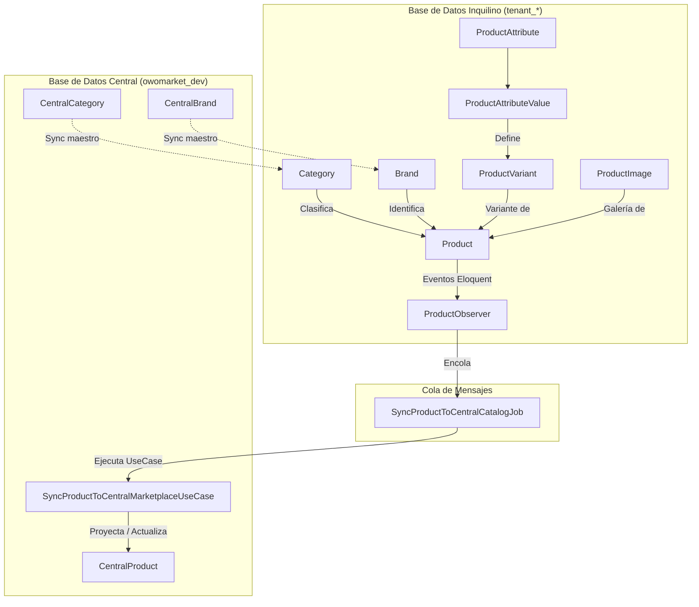
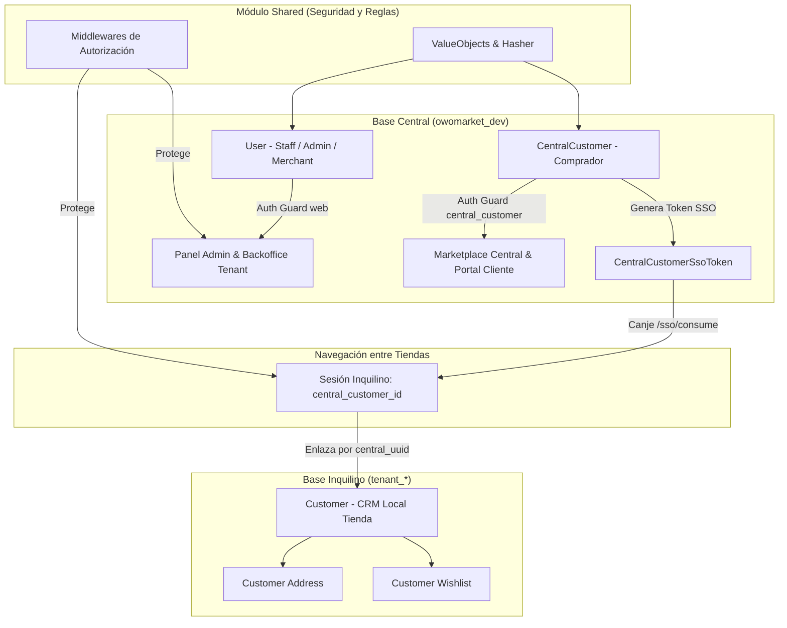
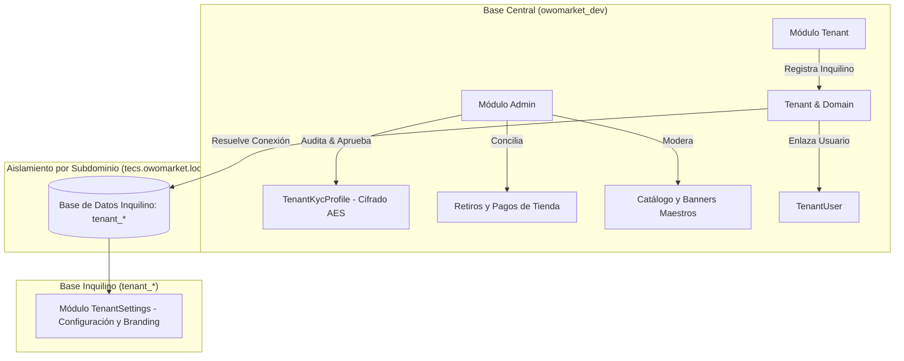
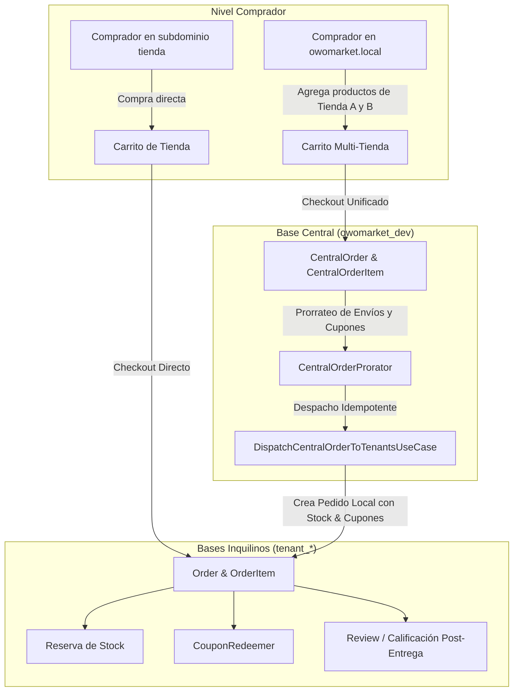
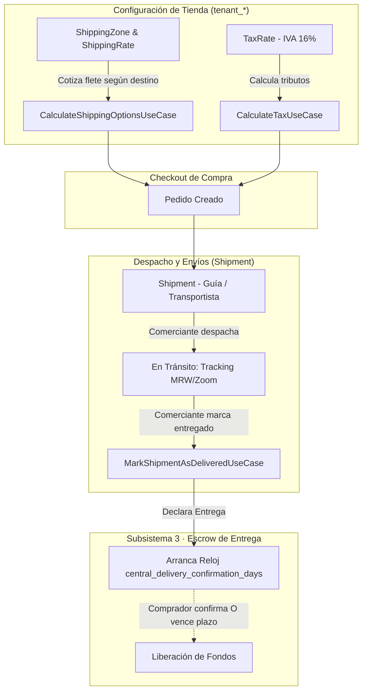
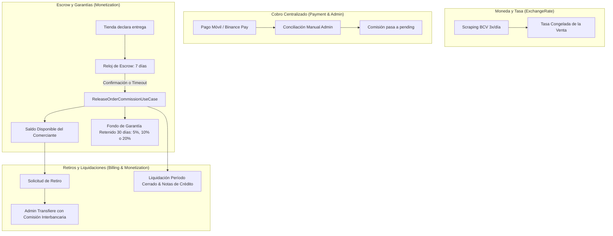
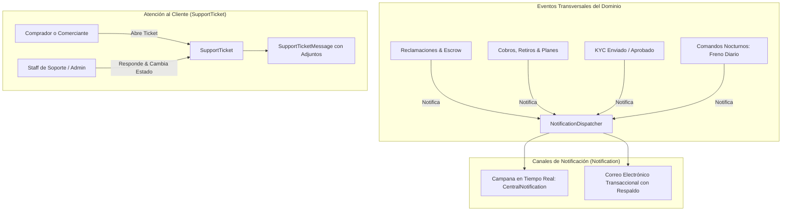

# Arquitectura y Referencia de Módulos (`src/`)

> **13/09/2026** · Registro arquitectónico y funcional de los 26 bounded contexts ubicados en `src/`.
> Este documento detalla qué hace cada módulo, su estructura hexagonal, sus modelos, casos de uso, tablas de base de datos y cómo interactúan entre sí dentro de la arquitectura multi-inquilino de OwoMarket.

---

## Índice General de Bloques

| Bloque | Área Funcional | Módulos | Estado |
| :---: | :--- | :--- | :---: |
| **1** | **Catálogo y Productos** | `Product`, `Category`, `Brand`, `Attribute` | ✅ **Documentado** |
| **2** | **Identidad y Clientes** | `Authentication`, `User`, `Customer`, `CentralCustomer`, `Shared` | ✅ **Documentado** |
| **3** | **Multi-Tenancy y Administración** | `Tenant`, `TenantSettings`, `Admin` | ✅ **Documentado** |
| **4** | **Ventas, Carrito y Pedidos** | `Marketplace`, `CentralMarketplace`, `Order`, `Coupon`, `Review` | ✅ **Documentado** |
| **5** | **Logística e Impuestos** | `Shipping`, `Shipment`, `Tax` | ✅ **Documentado** |
| **6** | **Finanzas, Pagos y Monetización** | `Payment`, `Billing`, `Monetization`, `ExchangeRate` | ✅ **Documentado** |
| **7** | **Soporte y Comunicación** | `SupportTicket`, `Notification` | ✅ **Documentado** |

---

## Patrones Transversales en `src/`

Cada módulo en `src/` implementa **Arquitectura Hexagonal (Puertos y Adaptadores)**:

```
src/{Modulo}/
├── Domain/                 # Núcleo puro de negocio: sin dependencias de Laravel o infraestructura
│   ├── Entities/           # Clases PHP con reglas de negocio e invariantes
│   ├── Exceptions/         # Excepciones semánticas del dominio
│   └── ValueObjects/       # Objetos de valor inmutables
├── Application/            # Casos de uso y orquestación
│   ├── Contracts/          # Interfaces (Puertos de salida: Repositorios, Servicios externos)
│   ├── DTOs/               # Data Transfer Objects para entrada/salida tipada
│   └── UseCase/            # Casos de uso de acción única (execute)
└── Infrastructure/         # Adaptadores y frameworks (Laravel, DB, HTTP)
    ├── Eloquent/           # Modelos de BD, Repositorios implementados, Observers
    ├── Http/               # Controladores HTTP de acción única, Requests de validación, Rutas
    ├── Jobs/               # Trabajos asíncronos en cola
    └── Services/           # Implementaciones de servicios de infraestructura
```

### Reglas de Datos y Tenancy
- **Base de Datos Central (`owomarket_dev`)**: Administra datos de plataforma y proyecciones globales (modelos con prefijo `Central*` como `CentralProduct`, `CentralCategory`, etc.).
- **Base de Datos de Inquilino (`tenant_*`)**: Cada tienda opera en su propia base de datos aislada para catálogo propio, transacciones locales y clientes.

---

# BLOQUE 1 · Catálogo y Productos

El Bloque 1 comprende los cuatro módulos que gestionan la oferta comercial de las tiendas: productos, su taxonomía (categorías), marcas y atributos configurables para variantes.



---

## 1.1 · Módulo `Product` (`src/Product/`)

### Propósito del Módulo
Es el núcleo de inventario de cada tienda. Gestiona el ciclo de vida completo de los productos (simples y con variantes), control de stock, precios, imágenes y su proyección asíncrona hacia el catálogo unificado del marketplace central.

### Bases de Datos y Modelos
* **Base Tenant (`tenant_*`)**:
  * [`Product`](file:///c:/laragon/www/owomarket/src/Product/Infrastructure/Eloquent/Models/Product.php): Producto de la tienda (`sku`, `price`, `compare_price`, `cost_price`, `quantity`, `is_visible`, `is_published_central`, `warranty_days`).
  * [`ProductVariant`](file:///c:/laragon/www/owomarket/src/Product/Infrastructure/Eloquent/Models/ProductVariant.php): Variaciones de un producto con SKU, precio y stock propios.
  * [`ProductImage`](file:///c:/laragon/www/owomarket/src/Product/Infrastructure/Eloquent/Models/ProductImage.php): Imágenes asociadas al producto y sus variantes.
* **Base Central (`owomarket_dev`)**:
  * [`CentralProduct`](file:///c:/laragon/www/owomarket/src/Product/Infrastructure/Eloquent/Models/CentralProduct.php): Proyección desnormalizada del producto para búsquedas y compra multi-tienda. Incluye snapshot de tienda, categorías, marcas, especificaciones y variantes en JSON, además de controles de moderación (`is_blocked_by_admin`, `is_featured`).

### Casos de Uso (`Application/UseCase`)
* [`CreateProductUseCase`](file:///c:/laragon/www/owomarket/src/Product/Application/UseCase/CreateProductUseCase.php): Creación atómica de producto con sus variantes, atributos asignados e imágenes.
* [`EditProductUseCase`](file:///c:/laragon/www/owomarket/src/Product/Application/UseCase/EditProductUseCase.php): Edición integral con sincronización de variantes y stock.
* [`ConsultProductByIdUseCase`](file:///c:/laragon/www/owomarket/src/Product/Application/UseCase/ConsultProductByIdUseCase.php) / [`ConsultProductByUuidUseCase`](file:///c:/laragon/www/owomarket/src/Product/Application/UseCase/ConsultProductByUuidUseCase.php) / [`ConsultProductBySlugUseCase`](file:///c:/laragon/www/owomarket/src/Product/Application/UseCase/ConsultProductBySlugUseCase.php): Consultas con carga de relaciones.
* [`FilterProductsUseCase`](file:///c:/laragon/www/owomarket/src/Product/Application/UseCase/FilterProductsUseCase.php): Búsqueda, ordenamiento y paginación en el backoffice de la tienda.
* [`ToggleProductVisibilityUseCase`](file:///c:/laragon/www/owomarket/src/Product/Application/UseCase/ToggleProductVisibilityUseCase.php): Alternar visibilidad dentro del escaparate del inquilino.
* [`ToggleProductMarketplacePublicationUseCase`](file:///c:/laragon/www/owomarket/src/Product/Application/UseCase/ToggleProductMarketplacePublicationUseCase.php): Publicar o retirar el producto del marketplace central.
* [`UpdateProductStockUseCase`](file:///c:/laragon/www/owomarket/src/Product/Application/UseCase/UpdateProductStockUseCase.php): Ajuste directo de stock.
* [`UploadProductImageUseCase`](file:///c:/laragon/www/owomarket/src/Product/Application/UseCase/UploadProductImageUseCase.php) / [`DeleteProductImageUseCase`](file:///c:/laragon/www/owomarket/src/Product/Application/UseCase/DeleteProductImageUseCase.php): Gestión de archivos multimedia en disco.
* [`DeleteProductUseCase`](file:///c:/laragon/www/owomarket/src/Product/Application/UseCase/DeleteProductUseCase.php): Borrado del producto.
* [`SyncProductToCentralMarketplaceUseCase`](file:///c:/laragon/www/owomarket/src/Product/Application/UseCase/SyncProductToCentralMarketplaceUseCase.php): Proyecta el producto en `central_products`. Preserva metadatos exclusivos centrales (`moderation_history`, `custom_commission_rate`).

### Pipeline Asíncrono de Sincronización
1. Toda alteración en el modelo dispara [`ProductObserver`](file:///c:/laragon/www/owomarket/src/Product/Infrastructure/Eloquent/Observers/ProductObserver.php) en los eventos `saved`, `deleted` y `restored`.
2. El Observer despacha [`SyncProductToCentralCatalogJob`](file:///c:/laragon/www/owomarket/src/Product/Infrastructure/Jobs/SyncProductToCentralCatalogJob.php) a la cola con 5 reintentos con retroceso exponencial (`[10, 30, 120, 300, 900]` segundos), encapsulando el `tenant_id` explícitamente para mantener el contexto en el worker.
3. El Job invoca `SyncProductToCentralMarketplaceUseCase` protegiendo la transacción de compra de cualquier fallo de red o base de datos.

### Puntos de Entrada HTTP (`Infrastructure/Http/Controller`)
* `GET /products` -> [`ViewProductIndexGETController`](file:///c:/laragon/www/owomarket/src/Product/Infrastructure/Http/Controller/ViewProductIndexGETController.php)
* `POST /products/filter` -> [`FilterProductsPOSTController`](file:///c:/laragon/www/owomarket/src/Product/Infrastructure/Http/Controller/FilterProductsPOSTController.php)
* `POST /products` -> [`CreateProductPOSTController`](file:///c:/laragon/www/owomarket/src/Product/Infrastructure/Http/Controller/CreateProductPOSTController.php)
* `PUT /products/{id}` -> [`EditProductPUTController`](file:///c:/laragon/www/owomarket/src/Product/Infrastructure/Http/Controller/EditProductPUTController.php)
* `PATCH /products/{id}/visibility` -> [`ToggleProductVisibilityPATCHController`](file:///c:/laragon/www/owomarket/src/Product/Infrastructure/Http/Controller/ToggleProductVisibilityPATCHController.php)
* `POST /products/{id}/marketplace-publication` -> [`ToggleProductMarketplacePublicationPOSTController`](file:///c:/laragon/www/owomarket/src/Product/Infrastructure/Http/Controller/ToggleProductMarketplacePublicationPOSTController.php)
* `PATCH /products/{id}/stock` -> [`UpdateProductStockPATCHController`](file:///c:/laragon/www/owomarket/src/Product/Infrastructure/Http/Controller/UpdateProductStockPATCHController.php)
* `POST /products/{id}/images` -> [`UploadProductImagePOSTController`](file:///c:/laragon/www/owomarket/src/Product/Infrastructure/Http/Controller/UploadProductImagePOSTController.php)
* `DELETE /products/{id}/images/{imageId}` -> [`DeleteProductImageDELETEController`](file:///c:/laragon/www/owomarket/src/Product/Infrastructure/Http/Controller/DeleteProductImageDELETEController.php)

---

## 1.2 · Módulo `Category` (`src/Category/`)

### Propósito del Módulo
Administra la estructura taxonómica de categorías en la tienda, permitiendo jerarquías en árbol (padre/hijo), ordenamiento por posición, slugs para SEO e importación/sincronización con el catálogo maestro central de la plataforma.

### Bases de Datos y Modelos
* **Base Tenant (`tenant_*`)**:
  * [`Category`](file:///c:/laragon/www/owomarket/src/Category/Infrastructure/Eloquent/Models/Category.php): Categoría de la tienda con soporte para jerarquía recursiva (`parent_id`), `central_uuid` (enlace al maestro central), `name`, `slug`, `image`, `position` y `is_active`.
* **Base Central (`owomarket_dev`)**:
  * [`CentralCategory`](file:///c:/laragon/www/owomarket/src/Category/Infrastructure/Eloquent/Models/CentralCategory.php): Catálogo maestro de categorías gestionado por los superadministradores.

### Casos de Uso (`Application/UseCase`)
* [`CreateCategoryUseCase`](file:///c:/laragon/www/owomarket/src/Category/Application/UseCase/CreateCategoryUseCase.php): Creación de categoría validando unicidad de slug.
* [`EditCategoryUseCase`](file:///c:/laragon/www/owomarket/src/Category/Application/UseCase/EditCategoryUseCase.php): Modificación de datos, icono y jerarquía.
* [`ConsultCategoryByIdUseCase`](file:///c:/laragon/www/owomarket/src/Category/Application/UseCase/ConsultCategoryByIdUseCase.php): Detalle de una categoría con sus subcategorías.
* [`ListCategoriesTreeUseCase`](file:///c:/laragon/www/owomarket/src/Category/Application/UseCase/ListCategoriesTreeUseCase.php): Construcción del árbol jerárquico anidado para menús y selectores.
* [`FilterCategoriesUseCase`](file:///c:/laragon/www/owomarket/src/Category/Application/UseCase/FilterCategoriesUseCase.php): Búsqueda, ordenamiento y paginación en el backoffice de la tienda.
* [`DeleteCategoryUseCase`](file:///c:/laragon/www/owomarket/src/Category/Application/UseCase/DeleteCategoryUseCase.php): Eliminación segura verificando si tiene productos asociados.
* [`SyncCentralCategoriesUseCase`](file:///c:/laragon/www/owomarket/src/Category/Application/UseCase/SyncCentralCategoriesUseCase.php): Mecanismo de sincronización en 2 pasadas desde `central_categories` hacia el tenant. Implementa reconciliación de 3 niveles:
  1. Coincidencia por `central_uuid`.
  2. Coincidencia por `slug`.
  3. Coincidencia por `LOWER(TRIM(name))`.
  En la segunda pasada enlaza los `parent_id` manteniendo la jerarquía idéntica a la central.

### Puntos de Entrada HTTP (`Infrastructure/Http/Controller`)
* `GET /categories` -> [`ViewCategoryIndexGETController`](file:///c:/laragon/www/owomarket/src/Category/Infrastructure/Http/Controller/ViewCategoryIndexGETController.php)
* `GET /categories/tree` -> [`ListCategoriesTreeGETController`](file:///c:/laragon/www/owomarket/src/Category/Infrastructure/Http/Controller/ListCategoriesTreeGETController.php)
* `POST /categories/filter` -> [`FilterCategoriesPOSTController`](file:///c:/laragon/www/owomarket/src/Category/Infrastructure/Http/Controller/FilterCategoriesPOSTController.php)
* `POST /categories` -> [`CreateCategoryPOSTController`](file:///c:/laragon/www/owomarket/src/Category/Infrastructure/Http/Controller/CreateCategoryPOSTController.php)
* `GET /categories/{id}` -> [`ConsultCategoryGETController`](file:///c:/laragon/www/owomarket/src/Category/Infrastructure/Http/Controller/ConsultCategoryGETController.php)
* `PUT /categories/{id}` -> [`EditCategoryPUTController`](file:///c:/laragon/www/owomarket/src/Category/Infrastructure/Http/Controller/EditCategoryPUTController.php)
* `DELETE /categories/{id}` -> [`DeleteCategoryDELETEController`](file:///c:/laragon/www/owomarket/src/Category/Infrastructure/Http/Controller/DeleteCategoryDELETEController.php)
* `POST /categories/sync-central` -> [`SyncCentralCategoriesPOSTController`](file:///c:/laragon/www/owomarket/src/Category/Infrastructure/Http/Controller/SyncCentralCategoriesPOSTController.php)

---

## 1.3 · Módulo `Brand` (`src/Brand/`)

### Propósito del Módulo
Gestiona los fabricantes y marcas comerciales de los productos ofrecidos por la tienda, incluyendo logos, enlaces web y sincronización con el catálogo central de marcas reconocidas.

### Bases de Datos y Modelos
* **Base Tenant (`tenant_*`)**:
  * [`Brand`](file:///c:/laragon/www/owomarket/src/Brand/Infrastructure/Eloquent/Models/Brand.php): Marca en la base de datos de la tienda (`name`, `slug`, `website`, `logo`, `is_active`, `position`, `central_uuid`).
* **Base Central (`owomarket_dev`)**:
  * [`CentralBrand`](file:///c:/laragon/www/owomarket/src/Brand/Infrastructure/Eloquent/Models/CentralBrand.php): Marcas oficiales aprobadas en la plataforma central.

### Casos de Uso (`Application/UseCase`)
* [`CreateBrandUseCase`](file:///c:/laragon/www/owomarket/src/Brand/Application/UseCase/CreateBrandUseCase.php): Registro de nueva marca local.
* [`EditBrandUseCase`](file:///c:/laragon/www/owomarket/src/Brand/Application/UseCase/EditBrandUseCase.php): Actualización de información de marca y logo.
* [`ConsultBrandByIdUseCase`](file:///c:/laragon/www/owomarket/src/Brand/Application/UseCase/ConsultBrandByIdUseCase.php): Obtención del detalle de la marca.
* [`ListAllActiveBrandsUseCase`](file:///c:/laragon/www/owomarket/src/Brand/Application/UseCase/ListAllActiveBrandsUseCase.php): Listado simple de marcas activas para selects en el formulario de producto.
* [`FilterBrandsUseCase`](file:///c:/laragon/www/owomarket/src/Brand/Application/UseCase/FilterBrandsUseCase.php): Paginación y búsqueda de marcas para el panel.
* [`DeleteBrandUseCase`](file:///c:/laragon/www/owomarket/src/Brand/Application/UseCase/DeleteBrandUseCase.php): Borrado controlado.
* [`SyncCentralBrandsUseCase`](file:///c:/laragon/www/owomarket/src/Brand/Application/UseCase/SyncCentralBrandsUseCase.php): Sincroniza las marcas maestras hacia el tenant aplicando la reconciliación por `central_uuid`, `slug` o nombre exacto.

### Puntos de Entrada HTTP (`Infrastructure/Http/Controller`)
* `GET /brands` -> [`ViewBrandIndexGETController`](file:///c:/laragon/www/owomarket/src/Brand/Infrastructure/Http/Controller/ViewBrandIndexGETController.php)
* `GET /brands/active` -> [`ListAllActiveBrandsGETController`](file:///c:/laragon/www/owomarket/src/Brand/Infrastructure/Http/Controller/ListAllActiveBrandsGETController.php)
* `POST /brands/filter` -> [`FilterBrandsPOSTController`](file:///c:/laragon/www/owomarket/src/Brand/Infrastructure/Http/Controller/FilterBrandsPOSTController.php)
* `POST /brands` -> [`CreateBrandPOSTController`](file:///c:/laragon/www/owomarket/src/Brand/Infrastructure/Http/Controller/CreateBrandPOSTController.php)
* `GET /brands/{id}` -> [`ConsultBrandGETController`](file:///c:/laragon/www/owomarket/src/Brand/Infrastructure/Http/Controller/ConsultBrandGETController.php)
* `PUT /brands/{id}` -> [`EditBrandPUTController`](file:///c:/laragon/www/owomarket/src/Brand/Infrastructure/Http/Controller/EditBrandPUTController.php)
* `DELETE /brands/{id}` -> [`DeleteBrandDELETEController`](file:///c:/laragon/www/owomarket/src/Brand/Infrastructure/Http/Controller/DeleteBrandDELETEController.php)
* `POST /brands/sync-central` -> [`SyncCentralBrandsPOSTController`](file:///c:/laragon/www/owomarket/src/Brand/Infrastructure/Http/Controller/SyncCentralBrandsPOSTController.php)

---

## 1.4 · Módulo `Attribute` (`src/Attribute/`)

### Propósito del Módulo
Permite definir atributos dinámicos (como Talla, Color, Capacidad, Material) y sus valores permitidos (ej. "Rojo", "Azul", "XL", "128GB"). Estos atributos son la base sobre la cual el módulo `Product` genera las matrices de variantes con precios y stock específicos.

### Bases de Datos y Modelos
* **Base Tenant (`tenant_*`)**:
  * [`ProductAttribute`](file:///c:/laragon/www/owomarket/src/Attribute/Infrastructure/Eloquent/Models/ProductAttribute.php): Atributo maestro del inquilino (`name`, `slug`, `type`, `is_searchable`, `is_filterable`).
  * [`ProductAttributeValue`](file:///c:/laragon/www/owomarket/src/Attribute/Infrastructure/Eloquent/Models/ProductAttributeValue.php): Valor asignable asociado a un atributo (`attribute_id`, `value`, `color_code`).

### Casos de Uso (`Application/UseCase`)
* [`CreateAttributeUseCase`](file:///c:/laragon/www/owomarket/src/Attribute/Application/UseCase/CreateAttributeUseCase.php): Creación de atributo junto con sus valores iniciales en una sola transacción.
* [`EditAttributeUseCase`](file:///c:/laragon/www/owomarket/src/Attribute/Application/UseCase/EditAttributeUseCase.php): Edición del nombre o tipo de atributo.
* [`CreateAttributeValueUseCase`](file:///c:/laragon/www/owomarket/src/Attribute/Application/UseCase/CreateAttributeValueUseCase.php): Añadir nuevos valores a un atributo existente.
* [`DeleteAttributeValueUseCase`](file:///c:/laragon/www/owomarket/src/Attribute/Application/UseCase/DeleteAttributeValueUseCase.php): Eliminación de un valor puntual.
* [`ConsultAttributeByIdUseCase`](file:///c:/laragon/www/owomarket/src/Attribute/Application/UseCase/ConsultAttributeByIdUseCase.php): Consulta de atributo con todos sus valores relacionados.
* [`ListAttributesWithValuesUseCase`](file:///c:/laragon/www/owomarket/src/Attribute/Application/UseCase/ListAttributesWithValuesUseCase.php): Listado completo estructurado para el generador de variantes en la pantalla de producto.
* [`FilterAttributesUseCase`](file:///c:/laragon/www/owomarket/src/Attribute/Application/UseCase/FilterAttributesUseCase.php): Búsqueda y paginación para el panel de administración.
* [`DeleteAttributeUseCase`](file:///c:/laragon/www/owomarket/src/Attribute/Application/UseCase/DeleteAttributeUseCase.php): Borrado del atributo y sus valores en cascada.

### Puntos de Entrada HTTP (`Infrastructure/Http/Controller`)
* `GET /attributes` -> [`ViewAttributeIndexGETController`](file:///c:/laragon/www/owomarket/src/Attribute/Infrastructure/Http/Controller/ViewAttributeIndexGETController.php)
* `GET /attributes/with-values` -> [`ListAttributesWithValuesGETController`](file:///c:/laragon/www/owomarket/src/Attribute/Infrastructure/Http/Controller/ListAttributesWithValuesGETController.php)
* `POST /attributes/filter` -> [`FilterAttributesPOSTController`](file:///c:/laragon/www/owomarket/src/Attribute/Infrastructure/Http/Controller/FilterAttributesPOSTController.php)
* `POST /attributes` -> [`CreateAttributePOSTController`](file:///c:/laragon/www/owomarket/src/Attribute/Infrastructure/Http/Controller/CreateAttributePOSTController.php)
* `GET /attributes/{id}` -> [`ConsultAttributeGETController`](file:///c:/laragon/www/owomarket/src/Attribute/Infrastructure/Http/Controller/ConsultAttributeGETController.php)
* `PUT /attributes/{id}` -> [`EditAttributePUTController`](file:///c:/laragon/www/owomarket/src/Attribute/Infrastructure/Http/Controller/EditAttributePUTController.php)
* `DELETE /attributes/{id}` -> [`DeleteAttributeDELETEController`](file:///c:/laragon/www/owomarket/src/Attribute/Infrastructure/Http/Controller/DeleteAttributeDELETEController.php)
* `POST /attributes/{id}/values` -> [`CreateAttributeValuePOSTController`](file:///c:/laragon/www/owomarket/src/Attribute/Infrastructure/Http/Controller/CreateAttributeValuePOSTController.php)
* `DELETE /attributes/{id}/values/{valueId}` -> [`DeleteAttributeValueDELETEController`](file:///c:/laragon/www/owomarket/src/Attribute/Infrastructure/Http/Controller/DeleteAttributeValueDELETEController.php)

---

# BLOQUE 2 · Identidad, Usuarios y Clientes

El Bloque 2 cubre los cinco módulos encargados de la autenticación, cuentas de usuario, diferenciación de identidades (administradores vs. comerciantes vs. compradores), sistema de Single Sign-On (**OwO Pass**), y utilidades transversales de seguridad.



---

## 2.1 · Módulo `Authentication` (`src/Authentication/`)

### Propósito del Módulo
Orquesta las operaciones de inicio y cierre de sesión para usuarios internos (administradores y dueños de tienda) tanto a través de sesiones web tradicionales como mediante tokens API de Laravel Sanctum.

### Bases de Datos y Modelos
* **Base Central (`owomarket_dev`)**:
  * [`User`](file:///c:/laragon/www/owomarket/src/Authentication/Infrastructure/Eloquent/Models/User.php): Modelo que implementa `Authenticatable` para el guard `web`.
  * [`AuthUser`](file:///c:/laragon/www/owomarket/src/Authentication/Infrastructure/Eloquent/Models/AuthUser.php): Entidad de autenticación desacoplada.
  * [`PersonalAccessToken`](file:///c:/laragon/www/owomarket/src/Authentication/Infrastructure/Eloquent/Models/PersonalAccessToken.php): Adaptador Eloquent para tokens de API emitidos por Sanctum.

### Casos de Uso (`Application/UseCase`)
* [`LoginWebUserUseCase`](file:///c:/laragon/www/owomarket/src/Authentication/Application/UseCase/LoginWebUserUseCase.php): Autenticación web para administradores centrales (`guard('web')`), validando credenciales y estado activo de la cuenta.
* [`LoginWebTenantUseCase`](file:///c:/laragon/www/owomarket/src/Authentication/Application/UseCase/LoginWebTenantUseCase.php): Autenticación de comerciantes verificando pertenencia y rol en la tienda activa.
* [`LoginApiUserUseCase`](file:///c:/laragon/www/owomarket/src/Authentication/Application/UseCase/LoginApiUserUseCase.php): Emisión de token Bearer Sanctum para clientes API y aplicaciones móviles.
* [`LogoutWebUseCase`](file:///c:/laragon/www/owomarket/src/Authentication/Application/UseCase/LogoutWebUseCase.php): Cierre de sesión web invalidando sesión y regenerando token CSRF.
* [`LogoutApiUserUseCase`](file:///c:/laragon/www/owomarket/src/Authentication/Application/UseCase/LogoutApiUserUseCase.php): Revocación del token actual de Sanctum.
* [`ConsultUserApiByEmailUseCase`](file:///c:/laragon/www/owomarket/src/Authentication/Application/UseCase/ConsultUserApiByEmailUseCase.php) / [`ConsultDataUserByEmailCase`](file:///c:/laragon/www/owomarket/src/Authentication/Application/UseCase/ConsultDataUserByEmailCase.php): Verificación de existencia de usuarios por email.
* [`CrearAuthUserUseCase`](file:///c:/laragon/www/owomarket/src/Authentication/Application/UseCase/CrearAuthUserUseCase.php) / [`EliminarAuthUserByUuidUseCase`](file:///c:/laragon/www/owomarket/src/Authentication/Application/UseCase/EliminarAuthUserByUuidUseCase.php): Gestión administrativa de credenciales.

### Puntos de Entrada HTTP (`Infrastructure/Http/Controller`)
* `GET /login` -> [`LoginTenantScreenGETController`](file:///c:/laragon/www/owomarket/src/Authentication/Infrastructure/Http/Controller/LoginTenantScreenGETController.php)
* `GET /admin/login` -> [`LoginStaffScreenGETController`](file:///c:/laragon/www/owomarket/src/Authentication/Infrastructure/Http/Controller/LoginStaffScreenGETController.php)
* `POST /login` -> [`LoginWebTenantPOSTController`](file:///c:/laragon/www/owomarket/src/Authentication/Infrastructure/Http/Controller/LoginWebTenantPOSTController.php)
* `POST /admin/login` -> [`LoginWebPOSTController`](file:///c:/laragon/www/owomarket/src/Authentication/Infrastructure/Http/Controller/LoginWebPOSTController.php)
* `POST /logout` -> [`LogoutWebPOSTController`](file:///c:/laragon/www/owomarket/src/Authentication/Infrastructure/Http/Controller/LogoutWebPOSTController.php)
* `POST /api/login` -> [`LoginApiPOSTController`](file:///c:/laragon/www/owomarket/src/Authentication/Infrastructure/Http/Controller/LoginApiPOSTController.php)
* `GET /api/logout` -> [`LogoutApiGETController`](file:///c:/laragon/www/owomarket/src/Authentication/Infrastructure/Http/Controller/LogoutApiGETController.php)
* `GET /api/user` -> [`CurrentUserGETController`](file:///c:/laragon/www/owomarket/src/Authentication/Infrastructure/Http/Controller/CurrentUserGETController.php)

---

## 2.2 · Módulo `User` (`src/User/`)

### Propósito del Módulo
Representa a los usuarios con privilegios del sistema: superadministradores, miembros del staff de la plataforma y propietarios de tiendas inquilinas (`tenant_owner`).

### Bases de Datos y Modelos
* **Base Central (`owomarket_dev`)**:
  * [`User`](file:///c:/laragon/www/owomarket/src/User/Infrastructure/Eloquent/Models/User.php): Modelo canónico configurado en `config/auth.php`.
    * **Decisión de Seguridad**: La columna `type` está explícitamente fuera de `$fillable` para evitar vulnerabilidades de asignación masiva donde un usuario pudiera auto-promoverse a `super_admin`. Solo se asigna de forma imperativa.
    * Implementa Spatie `HasRoles` para permisos granulares por rol.
    * Utiliza `NotifiableCentral` para canal de notificaciones y `SoftDeletes`.

### Casos de Uso (`Application/UseCase`)
* [`ConsultUserByEmailUseCase`](file:///c:/laragon/www/owomarket/src/User/Application/UseCase/ConsultUserByEmailUseCase.php): Localización de usuarios por correo electrónico para validaciones de registro y verificación administrativa.

### Puntos de Entrada HTTP (`Infrastructure/Http/Controller`)
* `POST /users/by-email` -> [`ConsultUserByEmailPOSTController`](file:///c:/laragon/www/owomarket/src/User/Infrastructure/Http/Controller/ConsultUserByEmailPOSTController.php)

---

## 2.3 · Módulo `Customer` (`src/Customer/`)

### Propósito del Módulo
Gestiona el directorio local de clientes dentro de la base de datos de cada tienda (CRM del inquilino). Representa el historial comercial que una tienda particular tiene con un comprador (pedidos realizados, direcciones locales, lista de deseos de la tienda y métricas de gasto).

### Bases de Datos y Modelos
* **Base Tenant (`tenant_*`)**:
  * [`Customer`](file:///c:/laragon/www/owomarket/src/Customer/Infrastructure/Eloquent/Models/Customer.php): Registro del cliente en la tienda. Contiene `central_uuid` (clave foránea lógica hacia `central_customers`), nombre, email, teléfono y estado.
  * [`Address`](file:///c:/laragon/www/owomarket/src/Customer/Infrastructure/Eloquent/Models/Address.php): Libreta de direcciones de envío/facturación del cliente en la tienda.
  * [`Wishlist`](file:///c:/laragon/www/owomarket/src/Customer/Infrastructure/Eloquent/Models/Wishlist.php) / [`WishlistItem`](file:///c:/laragon/www/owomarket/src/Customer/Infrastructure/Eloquent/Models/WishlistItem.php): Lista de favoritos del cliente dentro de la tienda.

### Casos de Uso (`Application/UseCases`)
* [`CreateCustomerUseCase`](file:///c:/laragon/www/owomarket/src/Customer/Application/UseCases/CreateCustomerUseCase.php): Creación de ficha de cliente en el backoffice de la tienda o durante checkout como invitado/registrado.
* [`UpdateCustomerUseCase`](file:///c:/laragon/www/owomarket/src/Customer/Application/UseCases/UpdateCustomerUseCase.php): Modificación de datos de contacto.
* [`ConsultCustomerByIdUseCase`](file:///c:/laragon/www/owomarket/src/Customer/Application/UseCases/ConsultCustomerByIdUseCase.php): Consulta detallada de la ficha del cliente con sus pedidos locales.
* [`FilterCustomersUseCase`](file:///c:/laragon/www/owomarket/src/Customer/Application/UseCases/FilterCustomersUseCase.php): Búsqueda y paginación en el listado de clientes del comerciante.
* [`GetCustomerMetricsUseCase`](file:///c:/laragon/www/owomarket/src/Customer/Application/UseCases/GetCustomerMetricsUseCase.php): Cálculo del total gastado (*lifetime value*), cantidad de pedidos y fecha de última compra en esa tienda.
* [`DeleteCustomerUseCase`](file:///c:/laragon/www/owomarket/src/Customer/Application/UseCases/DeleteCustomerUseCase.php): Eliminación controlada.
* [`AddCustomerAddressUseCase`](file:///c:/laragon/www/owomarket/src/Customer/Application/UseCases/AddCustomerAddressUseCase.php) / [`SetDefaultCustomerAddressUseCase`](file:///c:/laragon/www/owomarket/src/Customer/Application/UseCases/SetDefaultCustomerAddressUseCase.php) / [`DeleteCustomerAddressUseCase`](file:///c:/laragon/www/owomarket/src/Customer/Application/UseCases/DeleteCustomerAddressUseCase.php): Gestión de direcciones locales.

### Puntos de Entrada HTTP (`Infrastructure/Http/Controller`)
* `GET /customers` -> [`ViewCustomerIndexGETController`](file:///c:/laragon/www/owomarket/src/Customer/Infrastructure/Http/Controller/ViewCustomerIndexGETController.php)
* `GET /customers/{id}` -> [`ViewCustomerDetailGETController`](file:///c:/laragon/www/owomarket/src/Customer/Infrastructure/Http/Controller/ViewCustomerDetailGETController.php)
* `POST /customers/filter` -> [`FilterCustomersPOSTController`](file:///c:/laragon/www/owomarket/src/Customer/Infrastructure/Http/Controller/FilterCustomersPOSTController.php)
* `POST /customers` -> [`CreateCustomerPOSTController`](file:///c:/laragon/www/owomarket/src/Customer/Infrastructure/Http/Controller/CreateCustomerPOSTController.php)
* `PUT /customers/{id}` -> [`UpdateCustomerPUTController`](file:///c:/laragon/www/owomarket/src/Customer/Infrastructure/Http/Controller/UpdateCustomerPUTController.php)
* `DELETE /customers/{id}` -> [`DeleteCustomerDELETEController`](file:///c:/laragon/www/owomarket/src/Customer/Infrastructure/Http/Controller/DeleteCustomerDELETEController.php)
* `GET /customers/{id}/metrics` -> [`GetCustomerMetricsGETController`](file:///c:/laragon/www/owomarket/src/Customer/Infrastructure/Http/Controller/GetCustomerMetricsGETController.php)
* `POST /customers/{id}/addresses` -> [`AddCustomerAddressPOSTController`](file:///c:/laragon/www/owomarket/src/Customer/Infrastructure/Http/Controller/AddCustomerAddressPOSTController.php)
* `POST /customers/{id}/addresses/{addressId}/default` -> [`SetDefaultCustomerAddressPOSTController`](file:///c:/laragon/www/owomarket/src/Customer/Infrastructure/Http/Controller/SetDefaultCustomerAddressPOSTController.php)
* `DELETE /customers/{id}/addresses/{addressId}` -> [`DeleteCustomerAddressDELETEController`](file:///c:/laragon/www/owomarket/src/Customer/Infrastructure/Http/Controller/DeleteCustomerAddressDELETEController.php)

---

## 2.4 · Módulo `CentralCustomer` (`src/CentralCustomer/`)

### Propósito del Módulo
Gestiona la identidad global de los compradores en la plataforma (**OwO Pass**). Es uno de los contextos más extensos del sistema: gobierna el SSO de un clic entre escaparates, el portal unificado del comprador, la libreta central de direcciones, la confirmación de entregas (liberación de Escrow), el subsistema de garantías y reclamaciones (returns), reseñas globales y facturas.

### Bases de Datos y Modelos
* **Base Central (`owomarket_dev`)**:
  * [`CentralCustomer`](file:///c:/laragon/www/owomarket/src/CentralCustomer/Infrastructure/Eloquent/Models/CentralCustomer.php): Cuenta única del comprador (`document_id` cédula cifrada, `name`, `email`, `phone`, `password`, `is_active`).
  * [`CentralCustomerAddress`](file:///c:/laragon/www/owomarket/src/CentralCustomer/Infrastructure/Eloquent/Models/CentralCustomerAddress.php): Direcciones globales reutilizables en cualquier tienda.
  * [`CentralCustomerSsoToken`](file:///c:/laragon/www/owomarket/src/CentralCustomer/Infrastructure/Eloquent/Models/CentralCustomerSsoToken.php): Tokens de un solo uso con caducidad para inicio de sesión cruzado (SSO) en subdominios de tiendas.
  * [`CentralCustomerWishlist`](file:///c:/laragon/www/owomarket/src/CentralCustomer/Infrastructure/Eloquent/Models/CentralCustomerWishlist.php): Favoritos multi-tienda del comprador.
  * [`CentralCustomerPasswordReset`](file:///c:/laragon/www/owomarket/src/CentralCustomer/Infrastructure/Eloquent/Models/CentralCustomerPasswordReset.php): PIN de 6 dígitos para recuperación de contraseña sin enlace largo.
  * [`CustomerReturnRequest`](file:///c:/laragon/www/owomarket/src/CentralCustomer/Infrastructure/Eloquent/Models/CustomerReturnRequest.php): Expediente central de reclamación/devolución contra una orden de tienda.

### Casos de Uso Clave (`Application/UseCases`)
1. **Identidad y OwO Pass (SSO)**:
   * [`RegisterCentralCustomerUseCase`](file:///c:/laragon/www/owomarket/src/CentralCustomer/Application/UseCases/RegisterCentralCustomerUseCase.php) / [`AuthenticateCentralCustomerUseCase`](file:///c:/laragon/www/owomarket/src/CentralCustomer/Application/UseCases/AuthenticateCentralCustomerUseCase.php): Registro y login central con guard `auth:central_customer`.
   * [`GenerateCustomerSsoTokenUseCase`](file:///c:/laragon/www/owomarket/src/CentralCustomer/Application/UseCases/GenerateCustomerSsoTokenUseCase.php): Genera token criptográfico firmado temporal.
   * [`ValidateAndConsumeSsoTokenUseCase`](file:///c:/laragon/www/owomarket/src/CentralCustomer/Application/UseCases/ValidateAndConsumeSsoTokenUseCase.php): Valida el token en el subdominio de la tienda, enlaza el `Customer` local y fija `central_customer_id` en la sesión del inquilino.
   * [`SendCentralCustomerPasswordResetPinUseCase`](file:///c:/laragon/www/owomarket/src/CentralCustomer/Application/UseCases/SendCentralCustomerPasswordResetPinUseCase.php) / [`ResetCentralCustomerPasswordWithPinUseCase`](file:///c:/laragon/www/owomarket/src/CentralCustomer/Application/UseCases/ResetCentralCustomerPasswordWithPinUseCase.php): Recuperación con PIN seguro por correo.
2. **Garantías y Reclamaciones**:
   * [`CreateCustomerReturnRequestUseCase`](file:///c:/laragon/www/owomarket/src/CentralCustomer/Application/UseCases/CreateCustomerReturnRequestUseCase.php): Apertura de disputa. Exige cédula (`document_id`) del comprador para validación KYC antes de procesar el reclamo.
   * [`ResolveReturnRequestUseCase`](file:///c:/laragon/www/owomarket/src/CentralCustomer/Application/UseCases/ResolveReturnRequestUseCase.php): Resolución administrativa del expediente.
   * [`AutoResolveStaleReturnsUseCase`](file:///c:/laragon/www/owomarket/src/CentralCustomer/Application/UseCases/AutoResolveStaleReturnsUseCase.php): Ejecutado por comando a las 03:30; si la tienda no responde en el plazo configurado (`central_claim_response_days`), resuelve automáticamente a favor del comprador.
   * [`RemindExpiringClaimsUseCase`](file:///c:/laragon/www/owomarket/src/CentralCustomer/Application/UseCases/RemindExpiringClaimsUseCase.php): Aviso de vencimiento inminente a la tienda (comando a las 02:45).
3. **Escrow y Operaciones**:
   * Confirmación de entrega por el comprador: Desencadena la liberación de los fondos retenidos de la tienda.
   * [`GetCustomerOrderTrackingUseCase`](file:///c:/laragon/www/owomarket/src/CentralCustomer/Application/UseCases/GetCustomerOrderTrackingUseCase.php): Línea de tiempo unificada del pedido.
   * [`DownloadCustomerInvoicePdfUseCase`](file:///c:/laragon/www/owomarket/src/CentralCustomer/Application/UseCases/DownloadCustomerInvoicePdfUseCase.php): Descarga directa del PDF de factura.

### Puntos de Entrada HTTP Destacados (`Infrastructure/Http/Controller`)
* `POST /customer/login` -> [`LoginCentralCustomerPOSTController`](file:///c:/laragon/www/owomarket/src/CentralCustomer/Infrastructure/Http/Controller/LoginCentralCustomerPOSTController.php)
* `POST /customer/register` -> [`RegisterCentralCustomerPOSTController`](file:///c:/laragon/www/owomarket/src/CentralCustomer/Infrastructure/Http/Controller/RegisterCentralCustomerPOSTController.php)
* `POST /customer/sso/generate` -> [`GenerateSsoTokenPOSTController`](file:///c:/laragon/www/owomarket/src/CentralCustomer/Infrastructure/Http/Controller/GenerateSsoTokenPOSTController.php)
* `POST /sso/consume` -> [`ConsumeSsoTokenPOSTController`](file:///c:/laragon/www/owomarket/src/CentralCustomer/Infrastructure/Http/Controller/ConsumeSsoTokenPOSTController.php)
* `POST /customer/orders/{id}/confirm-delivery` -> [`ConfirmOrderDeliveryPOSTController`](file:///c:/laragon/www/owomarket/src/CentralCustomer/Infrastructure/Http/Controller/ConfirmOrderDeliveryPOSTController.php)
* `POST /customer/orders/{id}/return` -> [`CreateCustomerReturnPOSTController`](file:///c:/laragon/www/owomarket/src/CentralCustomer/Infrastructure/Http/Controller/CreateCustomerReturnPOSTController.php)
* `GET /customer/orders/{id}/tracking` -> [`GetCustomerOrderTrackingGETController`](file:///c:/laragon/www/owomarket/src/CentralCustomer/Infrastructure/Http/Controller/GetCustomerOrderTrackingGETController.php)
* `GET /customer/invoices/{id}/pdf` -> [`DownloadCustomerInvoicePdfGETController`](file:///c:/laragon/www/owomarket/src/CentralCustomer/Infrastructure/Http/Controller/DownloadCustomerInvoicePdfGETController.php)

---

## 2.5 · Módulo `Shared` (`src/Shared/`)

### Propósito del Módulo
Provee componentes compartidos para toda la aplicación: Objetos de Valor (Value Objects) de dominio inmutables, validadores y generadores criptográficos de contraseñas, y los Middlewares críticos de autorización que protegen todas las superficies del sistema.

### Objetos de Valor Clave (`Domain/ValueObjects`)
* [`Currency`](file:///c:/laragon/www/owomarket/src/Shared/Domain/ValueObjects/Currency.php): Motor multidivisa con conocimiento estricto de tasas BCV, redondeo financiero y conversiones seguras USD/VES.
* [`UserType`](file:///c:/laragon/www/owomarket/src/Shared/Domain/ValueObjects/UserType.php): Enumeración tipada de roles (`super_admin`, `admin`, `staff`, `tenant_owner`).
* [`UserStatus`](file:///c:/laragon/www/owomarket/src/Shared/Domain/ValueObjects/UserStatus.php): Estados de cuenta (`active`, `inactive`, `suspended`).
* [`Timezone`](file:///c:/laragon/www/owomarket/src/Shared/Domain/ValueObjects/Timezone.php): Normalización de zonas horarias para Venezuela (`America/Caracas`).
* [`Password`](file:///c:/laragon/www/owomarket/src/Shared/Domain/ValueObjects/Password.php), [`PhoneNumber`](file:///c:/laragon/www/owomarket/src/Shared/Domain/ValueObjects/PhoneNumber.php), [`PinVerification`](file:///c:/laragon/www/owomarket/src/Shared/Domain/ValueObjects/PinVerification.php), [`Uuid`](file:///c:/laragon/www/owomarket/src/Shared/Domain/ValueObjects/Uuid.php).

### Seguridad y Criptografía (`Infrastructure/Security`)
* [`StrictPasswordValidator`](file:///c:/laragon/www/owomarket/src/Shared/Infrastructure/Security/StrictPasswordValidator.php): Exige longitud mínima, mayúsculas, números y caracteres especiales.
* [`RandomPasswordGenerator`](file:///c:/laragon/www/owomarket/src/Shared/Infrastructure/Security/RandomPasswordGenerator.php): Generación de contraseñas de alta entropía para altas automáticas.
* [`LaravelPasswordHasher`](file:///c:/laragon/www/owomarket/src/Shared/Infrastructure/Security/LaravelPasswordHasher.php): Hashing seguro con Bcrypt / Argon2id.

### Middlewares de Autorización (`Infrastructure/Http/Middleware`)
* [`EnsureUserIsSuperAdmin`](file:///c:/laragon/www/owomarket/src/Shared/Infrastructure/Http/Middleware/EnsureUserIsSuperAdmin.php): Exclusivo para operaciones maestras de plataforma.
* [`EnsureUserIsTenantOwner`](file:///c:/laragon/www/owomarket/src/Shared/Infrastructure/Http/Middleware/EnsureUserIsTenantOwner.php): Verifica que el usuario autenticado sea dueño legítimo de la tienda actual.
* [`EnsureTenantIsNotSuspended`](file:///c:/laragon/www/owomarket/src/Shared/Infrastructure/Http/Middleware/EnsureTenantIsNotSuspended.php): Bloquea el escaparate y acciones del panel si la tienda está suspendida.
* [`EnsureUserHasStaffPermission`](file:///c:/laragon/www/owomarket/src/Shared/Infrastructure/Http/Middleware/EnsureUserHasStaffPermission.php) / [`EnsureTenantUserHasPermission`](file:///c:/laragon/www/owomarket/src/Shared/Infrastructure/Http/Middleware/EnsureTenantUserHasPermission.php): Validación RBAC granular mediante Spatie Permissions.
* [`EnsureRouteUserIsSelf`](file:///c:/laragon/www/owomarket/src/Shared/Infrastructure/Http/Middleware/EnsureRouteUserIsSelf.php): Previene ataques IDOR asegurando que un usuario solo modifique sus propios registros.
* [`InternalServiceMiddleware`](file:///c:/laragon/www/owomarket/src/Shared/Infrastructure/Http/Middleware/InternalServiceMiddleware.php): Token secreto para llamadas internas entre micro-procesos o workers.

---

# BLOQUE 3 · Multi-Tenancy y Administración

El Bloque 3 articula la infraestructura multi-inquilino de OwoMarket: el aislamiento de tiendas por subdominios y bases de datos independientes, la personalización local de cada comercio, y el panel de control maestro (**SuperAdmin**) que supervisa las tiendas, concilia pagos, audita KYC y arbitra reclamaciones.



---

## 3.1 · Módulo `Tenant` (`src/Tenant/`)

### Propósito del Módulo
Gobierna el ciclo de vida completo de cada comercio inquilino: su creación, asignación de subdominios, aprovisionamiento de su base de datos aislada, gestión de gobernanza (activo, inactivo, suspendido), expediente de identidad comercial (**KYC de Comerciante**, subsistema 1 de garantías), billetera del comerciante con solicitudes de retiro, e inicio de sesión cruzado (SSO) del dueño hacia su escaparate.

### Bases de Datos y Modelos
* **Base Central (`owomarket_dev`)**:
  * [`Tenant`](file:///c:/laragon/www/owomarket/src/Tenant/Infrastructure/Eloquent/Models/Tenant.php): Entidad central del inquilino (extiende el modelo base de Stancl Tenancy). Define `id`, `name`, `email`, `status` (`active`, `inactive`, `suspended`), `plan_id` y timestamps.
  * [`Domain`](file:///c:/laragon/www/owomarket/src/Tenant/Infrastructure/Eloquent/Models/Domain.php): Registro de dominios y subdominios asociados (`tecs.owomarket.local`).
  * [`TenantKycProfile`](file:///c:/laragon/www/owomarket/src/Tenant/Infrastructure/Eloquent/Models/TenantKycProfile.php): **Expediente de identidad del comerciante**.
    * **Invariante de Seguridad**: Es el **único** modelo que opera sobre `tenant_kyc_profiles`.
    * Cifra en reposo mediante AES (`$casts = ['cedula' => 'encrypted', 'rif' => 'encrypted']`).
    * Mantiene automáticamente en el hook `saving` los hashes deterministas `cedula_hash` y `rif_hash` para permitir búsquedas y cruces de identidad sin desencriptar toda la base de datos.
    * Controla los estados de validación: `pending`, `approved`, `rejected`.
  * [`TenantOwnerSsoToken`](file:///c:/laragon/www/owomarket/src/Tenant/Infrastructure/Eloquent/Models/TenantOwnerSsoToken.php): Token de acceso rápido y seguro para que el dueño de tienda ingrese desde el portal central a su backoffice local o escaparate.
  * [`TenantUser`](file:///c:/laragon/www/owomarket/src/Tenant/Infrastructure/Eloquent/Models/TenantUser.php): Asociación entre usuarios centrales y tiendas.

### Casos de Uso Clave (`Application/UseCase`)
1. **Ciclo de Vida y Gobernanza**:
   * [`CreateTenantUseCase`](file:///c:/laragon/www/owomarket/src/Tenant/Application/UseCase/CreateTenantUseCase.php): Creación de tienda, asignación de subdominio y migración de su base de datos privada.
   * [`ActiveTenantByUuidUseCase`](file:///c:/laragon/www/owomarket/src/Tenant/Application/UseCase/ActiveTenantByUuidUseCase.php) / [`InactiveTenantByUuidUseCase`](file:///c:/laragon/www/owomarket/src/Tenant/Application/UseCase/InactiveTenantByUuidUseCase.php) / [`SuspendedTenantByUuidUseCase`](file:///c:/laragon/www/owomarket/src/Tenant/Application/UseCase/SuspendedTenantByUuidUseCase.php): Cambio de estado operativo de la tienda.
   * [`UpdateTenantGovernanceStatusUseCase`](file:///c:/laragon/www/owomarket/src/Tenant/Application/UseCase/UpdateTenantGovernanceStatusUseCase.php): Ajuste de estado con validaciones comerciales.
   * [`DeleteTenantByUuidUseCase`](file:///c:/laragon/www/owomarket/src/Tenant/Application/UseCase/DeleteTenantByUuidUseCase.php) / [`ForceDeletedTenantByUuidUseCase`](file:///c:/laragon/www/owomarket/src/Tenant/Application/UseCase/ForceDeletedTenantByUuidUseCase.php): Eliminación lógica y física.
2. **KYC del Comerciante**:
   * [`SubmitTenantKycUseCase`](file:///c:/laragon/www/owomarket/src/Tenant/Application/UseCase/SubmitTenantKycUseCase.php): Envío de recaudos comerciales (cédula, RIF, constancia fiscal, teléfono y dirección). Sin KYC aprobado, la plataforma bloquea la retirada de fondos.
   * [`ApprovedRequestUseCase`](file:///c:/laragon/www/owomarket/src/Tenant/Application/UseCase/ApprovedRequestUseCase.php) / [`RejectedRequestUseCase`](file:///c:/laragon/www/owomarket/src/Tenant/Application/UseCase/RejectedRequestUseCase.php): Transiciones de aprobación/rechazo.
3. **Billetera y Retiros**:
   * [`GetTenantOwnerWalletSummaryUseCase`](file:///c:/laragon/www/owomarket/src/Tenant/Application/UseCase/GetTenantOwnerWalletSummaryUseCase.php): Consulta consolidada de saldo disponible, saldo retenido (fondo de garantía) y saldo adeudado.
   * [`CreateTenantOwnerPayoutRequestUseCase`](file:///c:/laragon/www/owomarket/src/Tenant/Application/UseCase/CreateTenantOwnerPayoutRequestUseCase.php): Solicitud formal de retiro bancario verificando suficiencia de saldo disponible y estado KYC.
4. **Inspección y Soporte**:
   * [`GetTenant360DetailUseCase`](file:///c:/laragon/www/owomarket/src/Tenant/Application/UseCase/GetTenant360DetailUseCase.php): Vista 360° para el administrador con métricas de ventas, catálogo, KYC y deudas.
   * [`AdminImpersonateTenantUseCase`](file:///c:/laragon/www/owomarket/src/Tenant/Application/UseCase/AdminImpersonateTenantUseCase.php): Mecanismo para que el administrador acceda al panel de la tienda en modo soporte.
   * [`GenerateTenantOwnerSsoTokenUseCase`](file:///c:/laragon/www/owomarket/src/Tenant/Application/UseCase/GenerateTenantOwnerSsoTokenUseCase.php) / [`ConsumeTenantOwnerSsoTokenUseCase`](file:///c:/laragon/www/owomarket/src/Tenant/Application/UseCase/ConsumeTenantOwnerSsoTokenUseCase.php): SSO del comerciante.

### Puntos de Entrada HTTP Destacados (`Infrastructure/Http/Controller`)
* `POST /tenant/account` -> [`CreateAccountTenantPOSTController`](file:///c:/laragon/www/owomarket/src/Tenant/Infrastructure/Http/Controller/CreateAccountTenantPOSTController.php)
* `POST /tenant/kyc` -> [`SubmitTenantKycPOSTController`](file:///c:/laragon/www/owomarket/src/Tenant/Infrastructure/Http/Controller/SubmitTenantKycPOSTController.php)
* `GET /tenant/kyc/status` -> [`GetTenantKycStatusGETController`](file:///c:/laragon/www/owomarket/src/Tenant/Infrastructure/Http/Controller/GetTenantKycStatusGETController.php)
* `GET /tenant/wallet` -> [`ViewTenantOwnerWalletGETController`](file:///c:/laragon/www/owomarket/src/Tenant/Infrastructure/Http/Controller/ViewTenantOwnerWalletGETController.php)
* `POST /tenant/wallet/payout-request` -> [`CreateTenantOwnerPayoutRequestPOSTController`](file:///c:/laragon/www/owomarket/src/Tenant/Infrastructure/Http/Controller/CreateTenantOwnerPayoutRequestPOSTController.php)
* `GET /admin/tenants/{id}/360` -> [`ViewAdminTenantDetail360PageGETController`](file:///c:/laragon/www/owomarket/src/Tenant/Infrastructure/Http/Controller/ViewAdminTenantDetail360PageGETController.php)
* `PATCH /admin/tenants/{id}/suspend` -> [`SuspendedTenantByUuidPATCHController`](file:///c:/laragon/www/owomarket/src/Tenant/Infrastructure/Http/Controller/SuspendedTenantByUuidPATCHController.php)

---

## 3.2 · Módulo `TenantSettings` (`src/TenantSettings/`)

### Propósito del Módulo
Maneja el almacén dinámico clave-valor de configuración local para cada tienda. Permite a los comerciantes personalizar la identidad visual de su escaparate, banners, enlaces a redes sociales, moneda y políticas comerciales locales sin tocar código ni migraciones.

### Bases de Datos y Modelos
* **Base Tenant (`tenant_*`)**:
  * [`TenantSetting`](file:///c:/laragon/www/owomarket/src/TenantSettings/Infrastructure/Eloquent/Models/TenantSetting.php): Registro de ajuste por pares (`group`, `key`, `value`, `type`). Agrupados habitualmente en:
    * `general`: Nombre comercial, eslogan, logo, favicon.
    * `appearance`: Colores primarios/secundarios, disposición de banners.
    * `contact`: Teléfono de WhatsApp, correo de atención, dirección física.
    * `social`: Enlaces a Instagram, Facebook, TikTok.

### Casos de Uso (`Application/UseCases`)
* [`GetStoreSettingsUseCase`](file:///c:/laragon/www/owomarket/src/TenantSettings/Application/UseCases/GetStoreSettingsUseCase.php): Obtiene el mapa consolidado de ajustes para el renderizado del escaparate.
* [`UpdateStoreSettingsUseCase`](file:///c:/laragon/www/owomarket/src/TenantSettings/Application/UseCases/UpdateStoreSettingsUseCase.php): Guardado por lotes de parámetros de tienda.
* [`GetSettingByKeyUseCase`](file:///c:/laragon/www/owomarket/src/TenantSettings/Application/UseCases/GetSettingByKeyUseCase.php) / [`SaveSettingUseCase`](file:///c:/laragon/www/owomarket/src/TenantSettings/Application/UseCases/SaveSettingUseCase.php): Lectura y actualización granular.
* [`ListSettingsByGroupUseCase`](file:///c:/laragon/www/owomarket/src/TenantSettings/Application/UseCases/ListSettingsByGroupUseCase.php): Filtro temático de opciones de configuración.
* [`DeleteSettingUseCase`](file:///c:/laragon/www/owomarket/src/TenantSettings/Application/UseCases/DeleteSettingUseCase.php): Restablecimiento a valores por defecto.

### Puntos de Entrada HTTP (`Infrastructure/Http/Controller`)
* `GET /settings` -> [`ViewTenantSettingsIndexGETController`](file:///c:/laragon/www/owomarket/src/TenantSettings/Infrastructure/Http/Controller/ViewTenantSettingsIndexGETController.php)
* `GET /settings/store` -> [`GetStoreSettingsGETController`](file:///c:/laragon/www/owomarket/src/TenantSettings/Infrastructure/Http/Controller/GetStoreSettingsGETController.php)
* `PUT /settings/store` -> [`UpdateStoreSettingsPUTController`](file:///c:/laragon/www/owomarket/src/TenantSettings/Infrastructure/Http/Controller/UpdateStoreSettingsPUTController.php)
* `GET /settings/{key}` -> [`GetSettingByKeyGETController`](file:///c:/laragon/www/owomarket/src/TenantSettings/Infrastructure/Http/Controller/GetSettingByKeyGETController.php)
* `POST /settings` -> [`SaveSettingPOSTController`](file:///c:/laragon/www/owomarket/src/TenantSettings/Infrastructure/Http/Controller/SaveSettingPOSTController.php)
* `DELETE /settings/{key}` -> [`DeleteSettingDELETEController`](file:///c:/laragon/www/owomarket/src/TenantSettings/Infrastructure/Http/Controller/DeleteSettingDELETEController.php)

---

## 3.3 · Módulo `Admin` (`src/Admin/`)

### Propósito del Módulo
Constituye el **centro de mando global (SuperAdmin)** de OwoMarket. Gobierna los flujos transaccionales de alto riesgo, conciliación manual de pagos bancarios (Pago Móvil y Binance Pay), liquidación y aprobación de retiros a comerciantes, auditoría de identidades KYC, moderación de productos publicados en el marketplace, resolución de expedientes de reclamaciones y arbitraje de garantías.

### Áreas Funcionales y Casos de Uso Clave (`Application/UseCase`)
1. **Conciliación de Cobros Centralizados y Escaparates**:
   * [`ConfirmCentralOrderPaymentUseCase`](file:///c:/laragon/www/owomarket/src/Admin/Application/UseCase/ConfirmCentralOrderPaymentUseCase.php): Validación manual de la referencia bancaria en compras multi-tienda. Despacha la orden a las tiendas y activa el estado de la comisión de plataforma.
   * [`ConfirmStorefrontPaymentUseCase`](file:///c:/laragon/www/owomarket/src/Admin/Application/UseCase/ConfirmStorefrontPaymentUseCase.php) / [`ListPendingStorefrontPaymentsUseCase`](file:///c:/laragon/www/owomarket/src/Admin/Application/UseCase/ListPendingStorefrontPaymentsUseCase.php): Conciliación de pagos realizados directamente en escaparates individuales.
2. **Aprobación de Retiros (Payouts)**:
   * [`ListCentralPayoutRequestsUseCase`](file:///c:/laragon/www/owomarket/src/Admin/Application/UseCase/ListCentralPayoutRequestsUseCase.php): Listado de solicitudes de retiro pendientes con verificación de saldo y datos bancarios.
   * [`ApproveCentralPayoutRequestUseCase`](file:///c:/laragon/www/owomarket/src/Admin/Application/UseCase/ApproveCentralPayoutRequestUseCase.php): Aprobación de retiro con deducción de comisión interbancaria y registro contable.
   * [`RejectCentralPayoutRequestUseCase`](file:///c:/laragon/www/owomarket/src/Admin/Application/UseCase/RejectCentralPayoutRequestUseCase.php): Rechazo de retiro con reintegro automático del saldo retenido a la billetera del comerciante.
3. **Expedientes de Reclamaciones y Garantías**:
   * [`ListAdminClaimsUseCase`](file:///c:/laragon/www/owomarket/src/Admin/Application/UseCase/ListAdminClaimsUseCase.php): Panel de arbitraje de disputas comprador-vendedor.
   * [`BuildClaimDossierUseCase`](file:///c:/laragon/www/owomarket/src/Admin/Application/UseCase/BuildClaimDossierUseCase.php): Reúne pruebas, cronología de eventos, datos de ambas partes y genera el expediente en PDF. Contiene los marcadores legales `pendiente-abogado:` para protección de datos personales.
   * [`ResolveCentralOrderDisputeUseCase`](file:///c:/laragon/www/owomarket/src/Admin/Application/UseCase/ResolveCentralOrderDisputeUseCase.php): Dictamen administrativo definitivo sobre una reclamación.
4. **Auditoría KYC y Moderación**:
   * [`ListTenantKycProfilesUseCase`](file:///c:/laragon/www/owomarket/src/Admin/Application/UseCase/ListTenantKycProfilesUseCase.php) / [`ReviewTenantKycUseCase`](file:///c:/laragon/www/owomarket/src/Admin/Application/UseCase/ReviewTenantKycUseCase.php): Revisión humana de documentos de identidad y RIF.
   * [`FindTenantsByIdentityUseCase`](file:///c:/laragon/www/owomarket/src/Admin/Application/UseCase/FindTenantsByIdentityUseCase.php): Detecta tiendas múltiples que comparten la misma cédula o RIF mediante búsqueda ciega por hash determinista.
   * [`ListProductsForModerationUseCase`](file:///c:/laragon/www/owomarket/src/Admin/Application/UseCase/ListProductsForModerationUseCase.php) / [`ModerateCentralProductUseCase`](file:///c:/laragon/www/owomarket/src/Admin/Application/UseCase/ModerateCentralProductUseCase.php): Bloqueo preventivo o promoción de productos en la portada del marketplace central.
5. **Catálogos Maestros, Planes y CMS**:
   * Categorías y marcas maestras: `ListMasterCategoriesUseCase`, `SaveMasterCategoryUseCase`, `ListMasterBrandsUseCase`, `SaveMasterBrandUseCase`.
   * Planes de Suscripción: `ListSubscriptionPlansUseCase`, `SaveSubscriptionPlanUseCase`, `DeleteSubscriptionPlanUseCase`.
   * Banners de Portada: `ListHomeBannersUseCase`, `SaveHomeBannerUseCase`, `DeleteHomeBannerUseCase`.
6. **Equipo y Pistas de Auditoría**:
   * `CreateAdminUseCase`, `FilterAdminsUseCase`, `AssignUserRolesUseCase`, `ListStaffRolesAndPermissionsUseCase`, `SaveStaffRoleUseCase`.
   * [`ListCentralAuditLogsUseCase`](file:///c:/laragon/www/owomarket/src/Admin/Application/UseCase/ListCentralAuditLogsUseCase.php): Consulta del registro histórico de acciones de staff.
   * [`GetAdminDashboardMetricsUseCase`](file:///c:/laragon/www/owomarket/src/Admin/Application/UseCase/GetAdminDashboardMetricsUseCase.php): KPIs consolidados de volumen de ventas, comisiones recaudadas, retenciones y estado de tiendas.

### Puntos de Entrada HTTP Destacados (`Infrastructure/Http/Controller`)
* `GET /admin/dashboard` -> [`ViewDashboardAdminGETController`](file:///c:/laragon/www/owomarket/src/Admin/Infrastructure/Http/Controller/ViewDashboardAdminGETController.php)
* `POST /admin/orders/{id}/confirm-payment` -> [`ConfirmAdminOrderPaymentPOSTController`](file:///c:/laragon/www/owomarket/src/Admin/Infrastructure/Http/Controller/ConfirmAdminOrderPaymentPOSTController.php)
* `GET /admin/payouts` -> [`ViewAdminPayoutsPageGETController`](file:///c:/laragon/www/owomarket/src/Admin/Infrastructure/Http/Controller/ViewAdminPayoutsPageGETController.php)
* `POST /admin/payouts/{id}/approve` -> [`ApproveCentralPayoutPOSTController`](file:///c:/laragon/www/owomarket/src/Admin/Infrastructure/Http/Controller/ApproveCentralPayoutPOSTController.php)
* `POST /admin/payouts/{id}/reject` -> [`RejectCentralPayoutPOSTController`](file:///c:/laragon/www/owomarket/src/Admin/Infrastructure/Http/Controller/RejectCentralPayoutPOSTController.php)
* `GET /admin/claims` -> [`ViewAdminClaimsPageGETController`](file:///c:/laragon/www/owomarket/src/Admin/Infrastructure/Http/Controller/ViewAdminClaimsPageGETController.php)
* `GET /admin/claims/{id}/dossier/pdf` -> [`DownloadAdminClaimDossierPdfGETController`](file:///c:/laragon/www/owomarket/src/Admin/Infrastructure/Http/Controller/DownloadAdminClaimDossierPdfGETController.php)
* `POST /admin/kyc/{id}/review` -> [`ReviewTenantKycPOSTController`](file:///c:/laragon/www/owomarket/src/Admin/Infrastructure/Http/Controller/ReviewTenantKycPOSTController.php)
* `GET /admin/guarantee-rules` -> [`ViewAdminGuaranteeRulesPageGETController`](file:///c:/laragon/www/owomarket/src/Admin/Infrastructure/Http/Controller/ViewAdminGuaranteeRulesPageGETController.php): Pantalla de configuración de los 8 parámetros que gobiernan el dinero y las garantías.
* `GET /admin/audit-logs` -> [`ViewAdminAuditLogsPageGETController`](file:///c:/laragon/www/owomarket/src/Admin/Infrastructure/Http/Controller/ViewAdminAuditLogsPageGETController.php): Pista de auditoría central.

---

# BLOQUE 4 · Ventas, Carrito y Pedidos

El Bloque 4 constituye el motor comercial y de conversión de OwoMarket: gobierna tanto la venta directa en el escaparate individual de cada inquilino como la compra unificada multi-tienda desde el marketplace central, el ciclo de vida del pedido, la aplicación de cupones promocionales y las valoraciones de productos.



---

## 4.1 · Módulo `Marketplace` (`src/Marketplace/`)

### Propósito del Módulo
Controla el escaparate público del inquilino en su propio subdominio (`tecs.owomarket.local`). Permite a los clientes navegar el catálogo exclusivo de la tienda, ver fichas técnicas de productos con selector interactivo de variantes, gestionar el carrito local, ejecutar el checkout directo y consultar sus pedidos históricos en esa tienda.

### Bases de Datos y Modelos
* **Base Tenant (`tenant_*`)**:
  * Utiliza los modelos de catálogo (`Product`, `ProductVariant`, `Category`, `Brand`), pedidos (`Order`) y clientes (`Customer`).
* **Servicios de Aplicación (`Application/Service`)**:
  * `StockReserver`: Reserva y descuento de inventario con bloqueos a nivel de base de datos.
  * `CouponRedeemer`: Validación y consumo del cupón de descuento en el checkout local.

### Casos de Uso Clave (`Application/UseCase`)
* [`ListStorefrontCustomerOrdersUseCase`](file:///c:/laragon/www/owomarket/src/Marketplace/Application/UseCase/ListStorefrontCustomerOrdersUseCase.php): Consulta el historial de pedidos del cliente dentro de la tienda, validando la identidad desde la sesión SSO (`central_customer_id`).

### Puntos de Entrada HTTP Destacados (`Infrastructure/Http/Controller`)
* `GET /` -> [`ViewHomePageTenantGETController`](file:///c:/laragon/www/owomarket/src/Marketplace/Infrastructure/Http/Controller/ViewHomePageTenantGETController.php): Portada de la tienda inquilina.
* `GET /catalog` -> [`ViewCatalogTenantGETController`](file:///c:/laragon/www/owomarket/src/Marketplace/Infrastructure/Http/Controller/ViewCatalogTenantGETController.php): Catálogo local con filtros por precio, categoría, marca y atributos.
* `GET /product/{slug}` -> [`ViewProductDetailTenantGETController`](file:///c:/laragon/www/owomarket/src/Marketplace/Infrastructure/Http/Controller/ViewProductDetailTenantGETController.php): Ficha de producto con galería y selector de variantes.
* `GET /cart` -> [`ViewCartTenantGETController`](file:///c:/laragon/www/owomarket/src/Marketplace/Infrastructure/Http/Controller/ViewCartTenantGETController.php): Carrito local de la tienda.
* `POST /cart/revalidate` -> [`RevalidateStorefrontCartPOSTController`](file:///c:/laragon/www/owomarket/src/Marketplace/Infrastructure/Http/Controller/RevalidateStorefrontCartPOSTController.php): Comprobación de stock en tiempo real antes de pagar.
* `GET /checkout` -> [`ViewCheckoutTenantGETController`](file:///c:/laragon/www/owomarket/src/Marketplace/Infrastructure/Http/Controller/ViewCheckoutTenantGETController.php): Pantalla de checkout con métodos de pago e instrucciones de transferencia.
* `POST /checkout/order` -> [`CreateStorefrontOrderPOSTController`](file:///c:/laragon/www/owomarket/src/Marketplace/Infrastructure/Http/Controller/CreateStorefrontOrderPOSTController.php): Creación del pedido en la tienda local.
* `POST /storefront/orders/{id}/confirm-delivery` -> [`ConfirmStorefrontDeliveryPOSTController`](file:///c:/laragon/www/owomarket/src/Marketplace/Infrastructure/Http/Controller/ConfirmStorefrontDeliveryPOSTController.php): Confirmación de recepción por el comprador en la tienda.
* `POST /storefront/orders/{id}/return` -> [`CreateStorefrontReturnPOSTController`](file:///c:/laragon/www/owomarket/src/Marketplace/Infrastructure/Http/Controller/CreateStorefrontReturnPOSTController.php): Apertura de reclamación desde el escaparate.

---

## 4.2 · Módulo `CentralMarketplace` (`src/CentralMarketplace/`)

### Propósito del Módulo
Es el cerebro del **marketplace central unificado (`owomarket.local`)**. Permite a los compradores armar un carrito con productos de múltiples comercios independientes, consolidar el cobro en una única factura con moneda dual, congelar la tasa BCV del momento y despachar de forma atómica e idempotente los sub-pedidos hacia las bases de datos de cada tienda participante.

### Bases de Datos y Modelos
* **Base Central (`owomarket_dev`)**:
  * [`CentralOrderDispatch`](file:///c:/laragon/www/owomarket/src/CentralMarketplace/Infrastructure/Eloquent/Models/CentralOrderDispatch.php): Tabla de control de despacho con índice único `(central_order_id, tenant_id)` para garantizar idempotencia y evitar órdenes duplicadas en caso de reintentos.

### Casos de Uso Clave (`Application/UseCases`)
* [`CreateUnifiedCentralOrderUseCase`](file:///c:/laragon/www/owomarket/src/CentralMarketplace/Application/UseCases/CreateUnifiedCentralOrderUseCase.php):
  * Valida el carrito multi-tienda contra `central_products`.
  * Congela la tasa BCV activa en la cabecera del pedido (`exchange_rate`).
  * Registra la comisión de plataforma estimada en estado `awaiting_payment`.
  * Genera el número de pedido central unificado (`ORD-YYYYMMDD-XXXXX`).
* [`DispatchCentralOrderToTenantsUseCase`](file:///c:/laragon/www/owomarket/src/CentralMarketplace/Application/UseCases/DispatchCentralOrderToTenantsUseCase.php):
  * **Prorrateo Inteligente**: Invoca a `CentralOrderProrator` para repartir de forma equitativa gastos de envío y descuentos de cupones entre los comercios según su peso relativo en el subtotal.
  * **Aislamiento de Fallos**: Itera sobre cada inquilino dentro de transacciones independientes. Si una tienda falla, queda marcada como `failed` con su causa de error en `central_order_dispatches` sin abortar las órdenes de las demás tiendas.
  * **Idempotencia Absoluta**: Máximo 5 reintentos controlados para evitar saturación.
* [`GetCentralOrderConfirmationUseCase`](file:///c:/laragon/www/owomarket/src/CentralMarketplace/Application/UseCases/GetCentralOrderConfirmationUseCase.php): Datos de confirmación y datos bancarios para completar el pago.

### Puntos de Entrada HTTP Destacados (`Infrastructure/Http/Controller`)
* `POST /api/central/checkout/order` -> [`CreateUnifiedCentralOrderPOSTController`](file:///c:/laragon/www/owomarket/src/CentralMarketplace/Infrastructure/Http/Controller/CreateUnifiedCentralOrderPOSTController.php)
* `POST /api/central/checkout/quote` -> [`QuoteCentralOrderPOSTController`](file:///c:/laragon/www/owomarket/src/CentralMarketplace/Infrastructure/Http/Controller/QuoteCentralOrderPOSTController.php)
* `POST /api/central/cart/revalidate` -> [`RevalidateCentralCartPOSTController`](file:///c:/laragon/www/owomarket/src/CentralMarketplace/Infrastructure/Http/Controller/RevalidateCentralCartPOSTController.php)
* `GET /api/central/orders/{id}/confirmation` -> [`GetCentralOrderConfirmationGETController`](file:///c:/laragon/www/owomarket/src/CentralMarketplace/Infrastructure/Http/Controller/GetCentralOrderConfirmationGETController.php)

---

## 4.3 · Módulo `Order` (`src/Order/`)

### Propósito del Módulo
Representa el ciclo de vida y los estados de los pedidos en ambas capas: tanto la orden global de plataforma como la orden interna de cada tienda. Gestiona la transición de estados (pago pendiente, procesando, enviado, entregado, cancelado), reporte de referencias de pago por el comprador, métricas comerciales y reembolsos.

### Bases de Datos y Modelos
* **Base Central (`owomarket_dev`)**:
  * [`CentralOrder`](file:///c:/laragon/www/owomarket/src/Order/Infrastructure/Eloquent/Models/CentralOrder.php): Cabecera de pedido global (`order_number`, `customer_id`, `subtotal`, `tax_amount`, `shipping_amount`, `discount_amount`, `total_usd`, `total_ves`, `exchange_rate`, `payment_status`, `order_status`).
  * [`CentralOrderItem`](file:///c:/laragon/www/owomarket/src/Order/Infrastructure/Eloquent/Models/CentralOrderItem.php): Líneas de producto del pedido global vinculadas a su respectivo `tenant_id`.
* **Base Tenant (`tenant_*`)**:
  * [`Order`](file:///c:/laragon/www/owomarket/src/Order/Infrastructure/Eloquent/Models/Order.php): Pedido en la base de datos de la tienda (`tenant_order_number`, `customer_id`, `central_order_id`, `status`, `shipping_status`, `payment_status`).
  * [`OrderItem`](file:///c:/laragon/www/owomarket/src/Order/Infrastructure/Eloquent/Models/OrderItem.php): Líneas de productos físicas de la tienda con SKU y variante asignada.

### Casos de Uso Clave (`Application/UseCases`)
* [`CreateOrderUseCase`](file:///c:/laragon/www/owomarket/src/Order/Application/UseCases/CreateOrderUseCase.php): Creación del pedido local de tienda.
* [`UpdateOrderPaymentStatusUseCase`](file:///c:/laragon/www/owomarket/src/Order/Application/UseCases/UpdateOrderPaymentStatusUseCase.php): Actualización de cobro tras la conciliación administrativa.
* [`ReportOrderPaymentReferenceUseCase`](file:///c:/laragon/www/owomarket/src/Order/Application/UseCases/ReportOrderPaymentReferenceUseCase.php): Registro del número de referencia de Pago Móvil o Binance Pay aportado por el comprador.
* [`ShipOrderUseCase`](file:///c:/laragon/www/owomarket/src/Order/Application/UseCases/ShipOrderUseCase.php): Marcado del pedido como despachado por el comerciante, adjuntando número de guía y empresa de encomiendas.
* [`DeliverOrderUseCase`](file:///c:/laragon/www/owomarket/src/Order/Application/UseCases/DeliverOrderUseCase.php): Declaración de entrega por el comerciante (que inicia el contador de confirmación de entrega).
* [`CancelOrderUseCase`](file:///c:/laragon/www/owomarket/src/Order/Application/UseCases/CancelOrderUseCase.php) / [`RefundOrderUseCase`](file:///c:/laragon/www/owomarket/src/Order/Application/UseCases/RefundOrderUseCase.php): Cancelación y reposición de stock.
* [`GetOrderMetricsUseCase`](file:///c:/laragon/www/owomarket/src/Order/Application/UseCases/GetOrderMetricsUseCase.php): Estadísticas de ventas y ticket promedio para el dashboard.

---

## 4.4 · Módulo `Coupon` (`src/Coupon/`)

### Propósito del Módulo
Motor de promociones y descuentos aplicables en el carrito de compras. Permite a los comerciantes crear cupones personalizados, definir vigencias y restringir su uso según montos mínimos o topes máximos.

### Bases de Datos y Modelos
* **Base Tenant (`tenant_*`)**:
  * [`Coupon`](file:///c:/laragon/www/owomarket/src/Coupon/Infrastructure/Eloquent/Models/Coupon.php): Cupón de la tienda (`code`, `name`, `type` [`percent`, `fixed`], `value`, `min_order_amount`, `max_discount_amount`, `usage_limit`, `used_count`, `starts_at`, `expires_at`, `is_active`).

### Casos de Uso (`Application/UseCase`)
* [`ValidateCouponUseCase`](file:///c:/laragon/www/owomarket/src/Coupon/Application/UseCase/ValidateCouponUseCase.php): Validador exhaustivo que verifica:
  1. Si el cupón existe y está activo.
  2. Si la fecha actual está comprendida entre `starts_at` y `expires_at`.
  3. Si no ha superado su límite total de usos (`usage_limit`).
  4. Si el subtotal del pedido alcanza el `min_order_amount`.
  5. Calcula el monto exacto de descuento a descontar en USD y en VES.
* [`CreateCouponUseCase`](file:///c:/laragon/www/owomarket/src/Coupon/Application/UseCase/CreateCouponUseCase.php) / [`EditCouponUseCase`](file:///c:/laragon/www/owomarket/src/Coupon/Application/UseCase/EditCouponUseCase.php): Creación y mantenimiento de cupones desde el backoffice del comerciante.
* [`DeleteCouponUseCase`](file:///c:/laragon/www/owomarket/src/Coupon/Application/UseCase/DeleteCouponUseCase.php): Desactivación o borrado de cupón.
* [`FilterCouponsUseCase`](file:///c:/laragon/www/owomarket/src/Coupon/Application/UseCase/FilterCouponsUseCase.php): Listado con búsqueda y estados.

---

## 4.5 · Módulo `Review` (`src/Review/`)

### Propósito del Módulo
Gestiona la reputación social y testimonios de compradores sobre productos adquiridos. Incluye verificación de compra realizada, calificación en escala de 1 a 5 estrellas, moderación de comentarios y derecho a respuesta del comerciante.

### Bases de Datos y Modelos
* **Base Tenant (`tenant_*`) y Proyección Central**:
  * [`ProductReview`](file:///c:/laragon/www/owomarket/src/Review/Infrastructure/Eloquent/Models/ProductReview.php): Ficha de valoración (`product_id`, `customer_id`, `rating`, `title`, `comment`, `status` [`pending`, `approved`, `rejected`], `is_verified_purchase`, `merchant_reply`, `replied_at`).

### Casos de Uso (`Application/UseCases`)
* [`CreateProductReviewUseCase`](file:///c:/laragon/www/owomarket/src/Review/Application/UseCases/CreateProductReviewUseCase.php): Registro de reseña validando que el comprador haya recibido efectivamente el producto.
* [`GetProductRatingSummaryUseCase`](file:///c:/laragon/www/owomarket/src/Review/Application/UseCases/GetProductRatingSummaryUseCase.php): Calcula el promedio ponderado de estrellas (1 a 5) y la distribución porcentual para mostrar en la ficha del producto.
* [`ModerateReviewUseCase`](file:///c:/laragon/www/owomarket/src/Review/Application/UseCases/ModerateReviewUseCase.php): Aprobación o rechazo de comentarios por moderación antes de hacerlos públicos.
* [`RespondReviewUseCase`](file:///c:/laragon/www/owomarket/src/Review/Application/UseCases/RespondReviewUseCase.php): Permite a la tienda responder públicamente a una opinión de un cliente.
* [`FilterReviewsUseCase`](file:///c:/laragon/www/owomarket/src/Review/Application/UseCases/FilterReviewsUseCase.php) / [`DeleteProductReviewUseCase`](file:///c:/laragon/www/owomarket/src/Review/Application/UseCases/DeleteProductReviewUseCase.php): Gestión en el panel de control.

---

# BLOQUE 5 · Logística e Impuestos

El Bloque 5 cubre la infraestructura operativa que hace posible la entrega física de los productos y la tributación fiscal conforme a la legislación local. Incluye la tarificación por zonas geográficas, el despacho y seguimiento de envíos con empresas de encomienda, el enclave crítico de la entrega con el subsistema de **Escrow de Garantía**, y el cálculo impositivo (IVA).



---

## 5.1 · Módulo `Shipping` (`src/Shipping/`)

### Propósito del Módulo
Permite a cada comercio definir sus zonas de despacho (locales, regionales, nacionales o retiro en punto físico) y las tarifas aplicables (costo plano, envío gratis por monto mínimo, o cálculo según peso/volumen).

### Bases de Datos y Modelos
* **Base Tenant (`tenant_*`)**:
  * [`ShippingZone`](file:///c:/laragon/www/owomarket/src/Shipping/Infrastructure/Eloquent/Models/ShippingZone.php): Zona geográfica de entrega (`name`, `country_code`, `regions` [estados/ciudades], `is_active`).
  * [`ShippingRate`](file:///c:/laragon/www/owomarket/src/Shipping/Infrastructure/Eloquent/Models/ShippingRate.php): Tarifa asignada a la zona (`zone_id`, `name`, `type` [`flat`, `weight_based`, `price_based`], `rate`, `min_order_amount`, `estimated_days`).

### Casos de Uso Clave (`Application/UseCase`)
* [`CalculateShippingOptionsUseCase`](file:///c:/laragon/www/owomarket/src/Shipping/Application/UseCase/CalculateShippingOptionsUseCase.php):
  * Evalúa la dirección de entrega del comprador contra las zonas configuradas por la tienda.
  * Filtra las opciones de envío disponibles y calcula el costo final en USD y convertido a VES según la tasa BCV del pedido.
* [`CreateShippingZoneUseCase`](file:///c:/laragon/www/owomarket/src/Shipping/Application/UseCase/CreateShippingZoneUseCase.php) / [`EditShippingZoneUseCase`](file:///c:/laragon/www/owomarket/src/Shipping/Application/UseCase/EditShippingZoneUseCase.php) / [`DeleteShippingZoneUseCase`](file:///c:/laragon/www/owomarket/src/Shipping/Application/UseCase/DeleteShippingZoneUseCase.php): Mantenimiento del catálogo de zonas de entrega.
* [`CreateShippingRateUseCase`](file:///c:/laragon/www/owomarket/src/Shipping/Application/UseCase/CreateShippingRateUseCase.php) / [`DeleteShippingRateUseCase`](file:///c:/laragon/www/owomarket/src/Shipping/Application/UseCase/DeleteShippingRateUseCase.php): Creación y supresión de tarifas por zona.
* [`FilterShippingZonesUseCase`](file:///c:/laragon/www/owomarket/src/Shipping/Application/UseCase/FilterShippingZonesUseCase.php): Listado estructurado para el backoffice de la tienda.

### Puntos de Entrada HTTP Destacados (`Infrastructure/Http/Controller`)
* `GET /shipping` -> [`ViewShippingIndexGETController`](file:///c:/laragon/www/owomarket/src/Shipping/Infrastructure/Http/Controller/ViewShippingIndexGETController.php)
* `POST /shipping/calculate` -> [`CalculateShippingPOSTController`](file:///c:/laragon/www/owomarket/src/Shipping/Infrastructure/Http/Controller/CalculateShippingPOSTController.php)
* `POST /shipping/zones` -> [`CreateShippingZonePOSTController`](file:///c:/laragon/www/owomarket/src/Shipping/Infrastructure/Http/Controller/CreateShippingZonePOSTController.php)
* `PUT /shipping/zones/{id}` -> [`EditShippingZonePUTController`](file:///c:/laragon/www/owomarket/src/Shipping/Infrastructure/Http/Controller/EditShippingZonePUTController.php)
* `DELETE /shipping/zones/{id}` -> [`DeleteShippingZoneDELETEController`](file:///c:/laragon/www/owomarket/src/Shipping/Infrastructure/Http/Controller/DeleteShippingZoneDELETEController.php)
* `POST /shipping/rates` -> [`CreateShippingRatePOSTController`](file:///c:/laragon/www/owomarket/src/Shipping/Infrastructure/Http/Controller/CreateShippingRatePOSTController.php)
* `DELETE /shipping/rates/{id}` -> [`DeleteShippingRateDELETEController`](file:///c:/laragon/www/owomarket/src/Shipping/Infrastructure/Http/Controller/DeleteShippingRateDELETEController.php)

---

## 5.2 · Módulo `Shipment` (`src/Shipment/`)

### Propósito del Módulo
Administra la paquetería y trazabilidad física del pedido una vez procesado por la tienda. Asigna números de guía y transportistas (ej. MRW, Tealca, Zoom, Domesa o mensajería propia), registra las fechas de despacho y comanda el evento fundamental de la entrega que articula el **Escrow de Garantía (Subsistema 3)**.

### Bases de Datos y Modelos
* **Base Tenant (`tenant_*`)**:
  * [`Shipment`](file:///c:/laragon/www/owomarket/src/Shipment/Infrastructure/Eloquent/Models/Shipment.php): Guía de encomienda (`order_id`, `tracking_number`, `carrier`, `status` [`pending`, `in_transit`, `delivered`, `failed`], `shipped_at`, `delivered_at`, `notes`, `metadata`).

### Casos de Uso Clave (`Application/UseCases`)
* [`CreateShipmentUseCase`](file:///c:/laragon/www/owomarket/src/Shipment/Application/UseCases/CreateShipmentUseCase.php): Creación del paquete de envío con número de seguimiento y empresa de transporte asignada.
* [`UpdateShipmentTrackingUseCase`](file:///c:/laragon/www/owomarket/src/Shipment/Application/UseCases/UpdateShipmentTrackingUseCase.php): Modificación del código de seguimiento o estado logístico.
* [`MarkShipmentAsDeliveredUseCase`](file:///c:/laragon/www/owomarket/src/Shipment/Application/UseCases/MarkShipmentAsDeliveredUseCase.php):
  * **Regla de Negocio Crítica (Subsistema 3)**: El comerciante declara que el paquete llegó al destino.
  * **Cierre de Brecha de Seguridad (Hallazgo SH1)**: Anteriormente, marcar la entrega liberaba directamente el dinero a la billetera de la tienda, lo que permitía a un vendedor declarar una entrega ficticia para cobrar de inmediato.
  * En la arquitectura actual, invoca `DeclareOrderDeliveredUseCase`: **solo arranca el reloj de espera de confirmación de entrega** (`central_delivery_confirmation_days`, 7 días por defecto). El dinero no se mueve hasta que el comprador confirma o expira dicho plazo.
* [`ConsultShipmentByIdUseCase`](file:///c:/laragon/www/owomarket/src/Shipment/Application/UseCases/ConsultShipmentByIdUseCase.php) / [`ConsultShipmentByOrderIdUseCase`](file:///c:/laragon/www/owomarket/src/Shipment/Application/UseCases/ConsultShipmentByOrderIdUseCase.php): Consulta del detalle del flete.
* [`GetShipmentMetricsUseCase`](file:///c:/laragon/www/owomarket/src/Shipment/Application/UseCases/GetShipmentMetricsUseCase.php): Métricas de tiempo promedio de entrega y paquetes en tránsito.

### Puntos de Entrada HTTP Destacados (`Infrastructure/Http/Controller`)
* `POST /shipments` -> [`CreateShipmentPOSTController`](file:///c:/laragon/www/owomarket/src/Shipment/Infrastructure/Http/Controller/CreateShipmentPOSTController.php)
* `POST /shipments/{id}/tracking` -> [`UpdateShipmentTrackingPOSTController`](file:///c:/laragon/www/owomarket/src/Shipment/Infrastructure/Http/Controller/UpdateShipmentTrackingPOSTController.php)
* `POST /shipments/{id}/delivered` -> [`MarkShipmentAsDeliveredPOSTController`](file:///c:/laragon/www/owomarket/src/Shipment/Infrastructure/Http/Controller/MarkShipmentAsDeliveredPOSTController.php)
* `GET /shipments/order/{orderId}` -> [`ConsultShipmentsByOrderGETController`](file:///c:/laragon/www/owomarket/src/Shipment/Infrastructure/Http/Controller/ConsultShipmentsByOrderGETController.php)
* `GET /shipments/{id}` -> [`ConsultShipmentGETController`](file:///c:/laragon/www/owomarket/src/Shipment/Infrastructure/Http/Controller/ConsultShipmentGETController.php)

---

## 5.3 · Módulo `Tax` (`src/Tax/`)

### Propósito del Módulo
Administra la parametrización de alícuotas tributarias aplicables a las transacciones de la tienda conforme al marco fiscal venezolano (ej. IVA general del 16%, exenciones en productos de la cesta básica o tasas especiales).

### Bases de Datos y Modelos
* **Base Tenant (`tenant_*`)**:
  * [`TaxRate`](file:///c:/laragon/www/owomarket/src/Tax/Infrastructure/Eloquent/Models/TaxRate.php): Registro de tarifa de impuesto (`name`, `rate` [ej. 16.00], `is_compound`, `is_active`, `country_code`, `state_code`).

### Casos de Uso Clave (`Application/UseCase`)
* [`CalculateTaxUseCase`](file:///c:/laragon/www/owomarket/src/Tax/Application/UseCase/CalculateTaxUseCase.php):
  * Determina la base imponible y calcula el monto exacto del impuesto por producto y para el total de la orden.
  * Soporta desglose discriminado de impuestos para la emisión formal de la factura.
* [`CreateTaxRateUseCase`](file:///c:/laragon/www/owomarket/src/Tax/Application/UseCase/CreateTaxRateUseCase.php) / [`EditTaxRateUseCase`](file:///c:/laragon/www/owomarket/src/Tax/Application/UseCase/EditTaxRateUseCase.php) / [`DeleteTaxRateUseCase`](file:///c:/laragon/www/owomarket/src/Tax/Application/UseCase/DeleteTaxRateUseCase.php): Creación y modificación de tasas tributarias.
* [`FilterTaxRatesUseCase`](file:///c:/laragon/www/owomarket/src/Tax/Application/UseCase/FilterTaxRatesUseCase.php): Consulta paginada y filtrada para el panel de configuración fiscal del comerciante.

### Puntos de Entrada HTTP Destacados (`Infrastructure/Http/Controller`)
* `GET /taxes` -> [`ViewTaxIndexGETController`](file:///c:/laragon/www/owomarket/src/Tax/Infrastructure/Http/Controller/ViewTaxIndexGETController.php)
* `POST /taxes/calculate` -> [`CalculateTaxPOSTController`](file:///c:/laragon/www/owomarket/src/Tax/Infrastructure/Http/Controller/CalculateTaxPOSTController.php)
* `POST /taxes` -> [`CreateTaxRatePOSTController`](file:///c:/laragon/www/owomarket/src/Tax/Infrastructure/Http/Controller/CreateTaxRatePOSTController.php)
* `PUT /taxes/{id}` -> [`EditTaxRatePUTController`](file:///c:/laragon/www/owomarket/src/Tax/Infrastructure/Http/Controller/EditTaxRatePUTController.php)
* [`DELETE /taxes/{id}` -> `DeleteTaxRateDELETEController`](file:///c:/laragon/www/owomarket/src/Tax/Infrastructure/Http/Controller/DeleteTaxRateDELETEController.php)

---

# BLOQUE 6 · Finanzas, Pagos y Monetización

El Bloque 6 es la columna vertebral financiera de OwoMarket. Gobierna la regla matriz del negocio: **la plataforma cobra todas las ventas de forma centralizada**, concilia los pagos en bolívares a la tasa congelada del BCV, gestiona el escrow de entrega, calcula y retiene el fondo de garantía (30 días según reputación), liquida retiros y factura los planes de suscripción B2B.



---

## 6.1 · Módulo `Payment` (`src/Payment/`)

### Propósito del Módulo
Administra los canales e instrucciones de pago centralizados de la plataforma. Permite al SuperAdmin configurar las cuentas bancarias receptoras de Pago Móvil (banco, teléfono, cédula/RIF) y billeteras de Binance Pay (Pay ID y código QR) donde los compradores transfieren el dinero de sus compras.

### Bases de Datos y Modelos
* **Base Central (`owomarket_dev`)**:
  * [`CentralSetting`](file:///c:/laragon/www/owomarket/src/Payment/Infrastructure/Eloquent/Models/CentralSetting.php): Tabla central de parámetros que almacena de forma segura los datos bancarios y credenciales de recepción de cobros.

### Casos de Uso Clave (`Application/UseCase`)
* [`UpdateCentralPaymentSettingsUseCase`](file:///c:/laragon/www/owomarket/src/Payment/Application/UseCase/UpdateCentralPaymentSettingsUseCase.php): Actualiza las cuentas de recaudación verificando integridad de formatos bancarios venezolanos.

### Puntos de Entrada HTTP Destacados (`Infrastructure/Http/Controller`)
* `GET /admin/settings/payment` -> [`AdminViewCentralPaymentSettingsGETController`](file:///c:/laragon/www/owomarket/src/Payment/Infrastructure/Http/Controller/AdminViewCentralPaymentSettingsGETController.php)
* `PUT /admin/settings/payment` -> [`AdminUpdateCentralPaymentSettingsPUTController`](file:///c:/laragon/www/owomarket/src/Payment/Infrastructure/Http/Controller/AdminUpdateCentralPaymentSettingsPUTController.php)

---

## 6.2 · Módulo `Billing` (`src/Billing/`)

### Propósito del Módulo
Controla la facturación comercial de cada tienda hacia sus clientes locales. Genera facturas fiscales con numeración correlativa, calcula la base imponible y el IVA desglosado, emite notas de crédito por anulaciones y produce el PDF formal descargable y enviable por correo electrónico.

### Bases de Datos y Modelos
* **Base Tenant (`tenant_*`)**:
  * [`BillingProfile`](file:///c:/laragon/www/owomarket/src/Billing/Infrastructure/Eloquent/Models/BillingProfile.php): Perfil fiscal del comercio (`legal_name`, `rif`, `fiscal_address`, `phone`, `invoice_prefix`, `next_invoice_number`).
  * [`Invoice`](file:///c:/laragon/www/owomarket/src/Billing/Infrastructure/Eloquent/Models/Invoice.php): Factura comercial de la tienda (`invoice_number`, `order_id`, `customer_id`, `subtotal`, `tax_amount`, `discount_amount`, `total`, `status` [`issued`, `paid`, `cancelled`]).
  * [`InvoiceItem`](file:///c:/laragon/www/owomarket/src/Billing/Infrastructure/Eloquent/Models/InvoiceItem.php): Desglose de renglones de la factura con descripción, cantidad, precio unitario e impuesto aplicado.

### Casos de Uso Clave (`Application/UseCases`)
* [`CreateDirectInvoiceUseCase`](file:///c:/laragon/www/owomarket/src/Billing/Application/UseCases/CreateDirectInvoiceUseCase.php): Genera la factura formal a partir de un pedido completado, asignando correlativo numérico inmutable.
* [`GenerateInvoicePdfUseCase`](file:///c:/laragon/www/owomarket/src/Billing/Application/UseCases/GenerateInvoicePdfUseCase.php): Renderiza el documento PDF de factura con membrete fiscal.
* [`ResendInvoiceMailUseCase`](file:///c:/laragon/www/owomarket/src/Billing/Application/UseCases/ResendInvoiceMailUseCase.php): Reenvío del documento al comprador por correo.
* [`CancelInvoiceUseCase`](file:///c:/laragon/www/owomarket/src/Billing/Application/UseCases/CancelInvoiceUseCase.php): Anulación de factura con emisión de nota de crédito.
* [`ConsultBillingProfileUseCase`](file:///c:/laragon/www/owomarket/src/Billing/Application/UseCases/ConsultBillingProfileUseCase.php) / [`UpdateBillingProfileUseCase`](file:///c:/laragon/www/owomarket/src/Billing/Application/UseCases/UpdateBillingProfileUseCase.php): Mantenimiento de datos fiscales del comerciante.

---

## 6.3 · Módulo `Monetization` (`src/Monetization/`)

### Propósito del Módulo
Es el núcleo transaccional más complejo de la plataforma: calcula comisiones por venta, administra los tres saldos de la billetera del comerciante (disponible, retenido y deuda), ejecuta el **Escrow de entrega (Subsistema 3)**, retiene el **Fondo de Garantía (Subsistema 4)** por 30 días modulado por la reputación de la tienda, procesa liquidaciones contables y gobierna los planes de suscripción para tiendas.

### Bases de Datos y Modelos
* **Base Central (`owomarket_dev`)**:
  * [`PlatformCommission`](file:///c:/laragon/www/owomarket/src/Monetization/Infrastructure/Eloquent/Models/PlatformCommission.php): Registro financiero de comisión por cada sub-pedido (`central_order_id`, `tenant_id`, `commission_rate`, `commission_amount_usd`, `commission_amount_ves`, `exchange_rate`, `status` [`awaiting_payment`, `pending`, `held`, `released`, `reversed`]).
  * [`OrderDeliveryConfirmation`](file:///c:/laragon/www/owomarket/src/Monetization/Infrastructure/Eloquent/Models/OrderDeliveryConfirmation.php): Registro del estado de confirmación de entrega (fecha de declaración del comerciante, fecha de confirmación del comprador o fecha límite de auto-liberación).
  * [`CommissionSettlement`](file:///c:/laragon/www/owomarket/src/Monetization/Infrastructure/Eloquent/Models/CommissionSettlement.php): Liquidación de período cerrado para conciliación y notas de crédito.
  * [`SubscriptionPlan`](file:///c:/laragon/www/owomarket/src/Monetization/Infrastructure/Eloquent/Models/SubscriptionPlan.php): Planes comerciales B2B (`name`, `price_monthly`, `default_commission_rate`, `product_limit`, `features`).
  * [`TenantSubscription`](file:///c:/laragon/www/owomarket/src/Monetization/Infrastructure/Eloquent/Models/TenantSubscription.php): Suscripción activa de la tienda a un plan.
  * [`TenantPlanChangeRequest`](file:///c:/laragon/www/owomarket/src/Monetization/Infrastructure/Eloquent/Models/TenantPlanChangeRequest.php): Solicitud de cambio o mejora de plan para aprobación administrativa.

### Casos de Uso Clave (`Application/UseCases`)
1. **Cálculo y Ciclo de Comisión**:
   * [`CalculateAndRecordOrderCommissionUseCase`](file:///c:/laragon/www/owomarket/src/Monetization/Application/UseCases/CalculateAndRecordOrderCommissionUseCase.php): Aplica el orden de precedencia de comisiones:
     $$\text{Comisión Personalizada de Tienda} \longrightarrow \text{Comisión del Plan de Suscripción} \longrightarrow \text{8\% Global por Defecto}$$
     Registra la fila con la tasa BCV congelada del pedido en estado `awaiting_payment`.
   * [`ActivateOrderCommissionUseCase`](file:///c:/laragon/www/owomarket/src/Monetization/Application/UseCases/ActivateOrderCommissionUseCase.php): Tras confirmar el cobro bancario, la comisión pasa a `pending`.
2. **Escrow y Liberación de Fondos**:
   * [`DeclareOrderDeliveredUseCase`](file:///c:/laragon/www/owomarket/src/Monetization/Application/UseCases/DeclareOrderDeliveredUseCase.php): La tienda declara la entrega; se inicializa el reloj de confirmación (`central_delivery_confirmation_days`, 7 días).
   * [`ConfirmOrderDeliveryUseCase`](file:///c:/laragon/www/owomarket/src/Monetization/Application/UseCases/ConfirmOrderDeliveryUseCase.php): El comprador confirma recepción satisfactoria y detona la liberación inmediata.
   * [`ReleaseUnconfirmedDeliveriesUseCase`](file:///c:/laragon/www/owomarket/src/Monetization/Application/UseCases/ReleaseUnconfirmedDeliveriesUseCase.php): Comando programado nocturno (03:00) que auto-libera fondos de entregas declaradas cuyo plazo de confirmación haya expirado sin reclamos.
   * [`ReleaseOrderCommissionUseCase`](file:///c:/laragon/www/owomarket/src/Monetization/Application/UseCases/ReleaseOrderCommissionUseCase.php):
     * Acredita el dinero neto al comerciante.
     * Aparta el **Fondo de Garantía**: retiene un porcentaje (5% reputación alta, 10% media, 20% baja) durante 30 días (`central_guarantee_reserve_days`).
   * [`ReverseOrderCommissionUseCase`](file:///c:/laragon/www/owomarket/src/Monetization/Application/UseCases/ReverseOrderCommissionUseCase.php): Reversión financiera cuando el comprador gana una disputa formal.
3. **Liquidaciones y Suscripciones**:
   * [`GenerateTenantCommissionSettlementUseCase`](file:///c:/laragon/www/owomarket/src/Monetization/Application/UseCases/GenerateTenantCommissionSettlementUseCase.php): Generación de liquidaciones periódicas con soporte para filas negativas (notas de crédito).
   * [`SubscribeTenantToPlanUseCase`](file:///c:/laragon/www/owomarket/src/Monetization/Application/UseCases/SubscribeTenantToPlanUseCase.php) / [`ApproveTenantPlanChangeRequestUseCase`](file:///c:/laragon/www/owomarket/src/Monetization/Application/UseCases/ApproveTenantPlanChangeRequestUseCase.php).

---

## 6.4 · Módulo `ExchangeRate` (`src/ExchangeRate/`)

### Propósito del Módulo
Gobernante monetario dual de OwoMarket. Venezuela opera con precios fijados en dólares estadounidenses ($) pero cobrados exclusivamente en bolívares (VES) a la tasa oficial del Banco Central de Venezuela (BCV). Este módulo automatiza la sincronización horaria, el cálculo de conversiones y el congelamiento de tasa por transacción.

### Bases de Datos y Modelos
* **Base Central (`owomarket_dev`)**:
  * [`ExchangeRate`](file:///c:/laragon/www/owomarket/src/ExchangeRate/Infrastructure/Eloquent/Models/ExchangeRate.php): Registro histórico y tasa vigente (`source` [BCV], `rate`, `valid_from`, `is_active`, `metadata`).

### Casos de Uso Clave (`Application/UseCase`)
* [`SyncBcvExchangeRateUseCase`](file:///c:/laragon/www/owomarket/src/ExchangeRate/Application/UseCase/SyncBcvExchangeRateUseCase.php):
  * Scraping automático ejecutado 3 veces al día en días hábiles (09:00, 13:00 y 17:30).
  * Cuenta con mecanismo de tasa de respaldo (*fallback*) y alerta por correo si la tasa supera las 24 horas sin actualizarse por caída del portal bancario.
* [`ConvertCurrencyAmountUseCase`](file:///c:/laragon/www/owomarket/src/ExchangeRate/Application/UseCase/ConvertCurrencyAmountUseCase.php): Conversión matemática de alta precisión entre USD y VES aplicando redondeo financiero reglamentario.
* [`GetActiveExchangeRateUseCase`](file:///c:/laragon/www/owomarket/src/ExchangeRate/Application/UseCase/GetActiveExchangeRateUseCase.php): Obtiene la tasa activa que se congelará en el momento del checkout.
* [`CreateManualExchangeRateUseCase`](file:///c:/laragon/www/owomarket/src/ExchangeRate/Application/UseCase/CreateManualExchangeRateUseCase.php): Permite al administrador fijar una tasa de contingencia si el scraping falla prolongadamente.

---

# BLOQUE 7 · Soporte y Comunicación

El Bloque 7 administra la atención posventa, resolución de incidentes y el sistema omnicanal de notificaciones de OwoMarket. Gobierna los tickets de soporte con hilos de conversación y archivos adjuntos, y el despachador de eventos transversal ([`NotificationDispatcher`](file:///c:/laragon/www/owomarket/src/Notification/Application/Contracts/NotificationDispatcher.php)) que mantiene informados a administradores, comerciantes y compradores mediante campana en tiempo real y correos electrónicos transaccionales.



---

## 7.1 · Módulo `SupportTicket` (`src/SupportTicket/`)

### Propósito del Módulo
Maneja el centro de ayuda y soporte técnico para todas las audiencias. Permite a compradores y comerciantes abrir solicitudes de asistencia clasificadas por categoría y urgencia, adjuntar capturas o comprobantes y mantener un diálogo bidireccional fluido con el equipo de soporte de la plataforma.

### Bases de Datos y Modelos
* **Base Central (`owomarket_dev`)**:
  * [`SupportTicket`](file:///c:/laragon/www/owomarket/src/SupportTicket/Infrastructure/Eloquent/Models/SupportTicket.php): Cabecera de solicitud de soporte (`ticket_number` correlativo, `user_id`, `customer_id`, `tenant_id`, `subject`, `priority` [`low`, `medium`, `high`, `urgent`], `status` [`open`, `in_progress`, `waiting_customer`, `resolved`, `closed`], `category`).
  * [`SupportTicketMessage`](file:///c:/laragon/www/owomarket/src/SupportTicket/Infrastructure/Eloquent/Models/SupportTicketMessage.php): Mensajes individuales dentro del hilo del ticket con identificación polimórfica del remitente (`sender_type`, `sender_id`), cuerpo del texto y array de archivos adjuntos (`attachments`).

### Casos de Uso Clave (`Application/UseCase`)
* [`CreateSupportTicketUseCase`](file:///c:/laragon/www/owomarket/src/SupportTicket/Application/UseCase/CreateSupportTicketUseCase.php): Creación de ticket con asignación de número único correlativo y notificación inicial al staff de soporte.
* [`AddMessageToTicketUseCase`](file:///c:/laragon/www/owomarket/src/SupportTicket/Application/UseCase/AddMessageToTicketUseCase.php): Envío de respuesta en el hilo con subida segura de archivos adjuntos y actualización automática del estado según quién responda (ej. si responde el staff, pasa a `waiting_customer`).
* [`GetSupportTicketDetailUseCase`](file:///c:/laragon/www/owomarket/src/SupportTicket/Application/UseCase/GetSupportTicketDetailUseCase.php): Consulta del expediente completo del ticket con historial cronológico de mensajes.
* [`UpdateTicketStatusUseCase`](file:///c:/laragon/www/owomarket/src/SupportTicket/Application/UseCase/UpdateTicketStatusUseCase.php): Cierre, resolución o escalamiento de prioridad por parte del administrador.
* [`ListUserSupportTicketsUseCase`](file:///c:/laragon/www/owomarket/src/SupportTicket/Application/UseCase/ListUserSupportTicketsUseCase.php) / [`ListAdminSupportTicketsUseCase`](file:///c:/laragon/www/owomarket/src/SupportTicket/Application/UseCase/ListAdminSupportTicketsUseCase.php): Bandeja de entrada filtrable por estado y prioridad para clientes y personal de soporte.

---

## 7.2 · Módulo `Notification` (`src/Notification/`)

### Propósito del Módulo
Es el sistema nervioso de comunicación de OwoMarket. Provee una interfaz unificada ([`NotificationDispatcher`](file:///c:/laragon/www/owomarket/src/Notification/Application/Contracts/NotificationDispatcher.php)) desacoplada del framework que expone **los 11 eventos cruciales del sistema**. Garantiza que todo suceso monetario o con plazos fatales sea anunciado por correo y campana, implementando un diseño a prueba de fallos para que ningún error de mensajería aborte una transacción financiera.

### Principios Arquitectónicos Fundamentales del Módulo
1. **Catálogo Exclusivo por Eventos (11 Métodos)**: Los casos de uso anuncian *qué pasó* enviando solo el identificador, no el modelo Eloquent ni el texto formateado. El módulo decide las audiencias y los canales.
2. **Inmunidad ante Excepciones**: Ninguna llamada a `NotificationDispatcher` propaga excepciones. La emisión se produce dentro de transacciones financieras (como la reversión de comisiones o liquidación de retiros); si el servidor SMTP fallara, el error se captura y registra en log, **impidiendo que se cancele la operación de dinero**.
3. **Mecanismo de Freno en Eventos Periódicos**: Los avisos disparados por comandos nocturnos (reclamaciones próximas a vencer y superación de techo mensual) cuentan con control de frecuencia para evitar saturar las bandejas de entrada.

### Los 11 Eventos del Catálogo Oficial (`NotificationDispatcher`)

| Área | Evento | Audiencia | Canal | Por qué existe |
| :--- | :--- | :--- | :--- | :--- |
| **Garantías** | `claimOpened` | Dueños de Tienda | Campana + Correo | **El más urgente**: el reloj de auto-resolución resolverá a favor del comprador si la tienda guarda silencio. |
| **Garantías** | `claimResolved` | Comprador + Tienda | Campana + Correo | Comunica la resolución dictaminada por el administrador o el reloj. |
| **Garantías** | `deliveryDeclared` | Comprador | Campana + Correo | Invita al comprador a confirmar la entrega para liberar el escrow del vendedor. |
| **Identidad** | `kycSubmitted` | SuperAdmin | Campana | Informa que un nuevo comercio envió sus documentos de identidad para revisión. |
| **Identidad** | `kycReviewed` | Dueños de Tienda | Campana + Correo | Notifica la aprobación o rechazo del KYC. Sin KYC aprobado la tienda no puede cobrar. |
| **Dinero** | `payoutRequested` | SuperAdmin | Campana | Notifica una solicitud de retiro de fondos para su procesamiento bancario. |
| **Dinero** | `payoutResolved` | Dueños de Tienda | Campana + Correo | Avisa la aprobación de la transferencia o los motivos del rechazo con reintegro al saldo. |
| **Suscripción** | `planChangeRequested` | SuperAdmin | Campana | Solicitud de cambio a un plan superior por parte de un inquilino. |
| **Suscripción** | `planChangeResolved` | Dueños de Tienda | Campana + Correo | Informa la resolución del cambio de plan comercial. |
| **Periódico** | `claimAboutToExpire` | Dueños de Tienda | Campana + Correo | **Aviso de gracia con freno**: recuerda que queda un día antes de que el reloj resuelva en contra de la tienda. |
| **Periódico** | `coverageCeilingExceeded` | SuperAdmin | Campana + Correo | **Alarma financiera mensual**: alerta cuando el gasto acumulado en coberturas de garantía sobrepasa el techo fijado en dólares. |

### Casos de Uso Clave (`Application/UseCase`)
* [`ListNotificationsUseCase`](file:///c:/laragon/www/owomarket/src/Notification/Application/UseCase/ListNotificationsUseCase.php): Consulta paginada del centro de notificaciones (campana) para el usuario autenticado.
* [`MarkNotificationReadUseCase`](file:///c:/laragon/www/owomarket/src/Notification/Application/UseCase/MarkNotificationReadUseCase.php): Marcado individual o masivo de avisos leídos.

---

