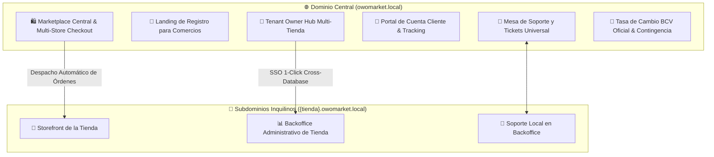

# 🌐 Contexto Global y Arquitectura del Proyecto OwOMarket

*Última actualización: Agosto 2026*

---

## 🏛️ 1. Arquitectura General y Stack Tecnológico

OwOMarket es una plataforma de **Comercio Electrónico Multi-Tienda y Marketplace Unificado** de alto rendimiento diseñada bajo **Arquitectura Hexagonal (DDD)** con separación estricta de dominios central y tiendas inquilinas (*Tenants*).

### 🛠️ Stack Tecnológico
- **Backend**: Laravel 11 / PHP 8.2+ con Arquitectura Hexagonal en `src/`.
- **Multi-Tenancy**: `stancl/tenancy` v3 con bases de datos dinámicas aisladas por inquilino.
- **Frontend**: React 19 + Inertia.js + TypeScript + Tailwind CSS + Flowbite React.
- **Testing**:
  - Backend: Pest / PHPUnit (**456+ tests pasando al 100%**).
  - Frontend: Vitest (**16 unit tests pasando al 100%**) + TypeScript sin errores (`npm run types`).
- **Base de Datos**:
  - **Base de Datos Central** (`owomarket_dev`): Usuarios maestros, tiendas/dominios, tasas de cambio BCV, marketplace central, clientes centrales, pedidos unificados, tokens SSO y tickets de soporte centrales.
  - **Bases de Datos de Inquilinos** (`tenant_{slug}`): Catálogo local, órdenes de tienda, facturación fiscal con PDF, pasarelas de pago, envíos, reseñas, impuestos y configuración de tienda.

---

## 🗺️ 2. Mapa de Módulos y Dominios

---

## 🏢 3. Hub Central del Dueño de Tiendas (Tenant Owner)

Ubicado en `/tenant/owner/backoffice/{user_uuid}/...` con pestañas unificadas de navegación:

1. **📊 Dashboard Ejecutivo Multi-Tienda (`/dashboard`)**:
   - KPIs consolidados de todas las sucursales del dueño.
   - Creación asistida de nuevas tiendas y sucursales.
   - **Botón SSO 1-Click**: Genera un token efímero de 64 caracteres en la base de datos central y abre una nueva pestaña en `http://{tienda}.owomarket.local/auth/sso-consume?token=...`. Al consumirse, sincroniza automáticamente al usuario en la BD de la tienda y lo redirige con sesión iniciada al Dashboard de la tienda.

2. **💳 Billetera & Liquidaciones (`/wallet`)**:
   - Saldo acumulado por ventas en el Marketplace Central en USD y Bs. (a tasa oficial BCV).
   - Formulario de solicitud de liquidación a **Pago Móvil (Bs. BCV)** y **Binance Pay (USDT)**.

3. **📦 Publicador de Catálogo Central (`/catalog`)**:
   - Lista consolidada de productos de todas las sucursales.
   - Switch interactivo para **publicar/despublicar** productos en el Marketplace Central manteniendo el producto activo en la tienda local.

4. **📑 Suscripciones & Facturación B2B (`/billing`)**:
   - Monitoreo de planes activos por sucursal (*Free, Pro, Enterprise*), comisiones y cuotas.

5. **🎫 Centro de Soporte & Reportes (`/support`)**:
   - Reporte de incidencias técnicas con selector de sucursal afectada, nivel de prioridad y **arrastre y soltar (drag & drop) de fotos y videos de evidencia**.

---

## 🎫 4. Módulo Universal de Tickets de Soporte con Fotos y Videos

Ubicado en `src/SupportTicket` y disponible transversalmente para 3 tipos de actores:

| Actor | Ruta de Acceso | Contexto / Funcionalidades |
|---|---|---|
| **Dueño de Tienda** | `/tenant/owner/backoffice/{uuid}/support` | Asocia la tienda afectada, categoría técnica (*Backoffice, Liquidación, Catálogo*), chat interactivo y adjuntos multimedia. |
| **Admin de Tienda Local** | `http://{tienda}/support/backoffice/{uuid}/module` | Integrado en la barra lateral del Backoffice local, asocia automáticamente el `tenant_id` de la tienda. |
| **Cliente Registrado** | `/account/support` | Integrado en el layout de cuenta del cliente para reportar problemas de pedidos o pagos con fotos/videos. |

### 📸 Especificaciones Multimedia:
- **Formatos soportados**: Fotos (`.png`, `.jpg`, `.jpeg`, `.webp`, `.gif`) y Videos (`.mp4`, `.webm`, `.mov`, `.avi`) hasta 50MB.
- **Experiencia de Usuario**: Previsualización reactiva de miniaturas, visor modal con zoom para imágenes y **reproductor de video HTML5 nativo** dentro del hilo conversacional.

---

## 💱 5. Sistema Multi-Moneda y Tasa Oficial BCV

- **Actualización Continua**: Scraper automatizado para extraer la tasa oficial del Banco Central de Venezuela (BCV) junto con registro manual de contingencia.
- **Facturación Fiscal**: Emisión de facturas en USD con desglose automático en Bs. y código QR / datos fiscales del emisor y receptor.
- **Checkout Dual**: Admite pagos en **Pago Móvil (Bs. BCV)** con validación de referencia bancaria y **Binance Pay (USDT)**.

---

## 🔒 6. Estándares de Seguridad y Convenciones

1. **Arquitectura Hexagonal**: Separación estricta entre `Domain`, `Application` (Casos de uso desacoplados) e `Infrastructure` (Controladores, Rutas, Modelos Eloquent).
2. **Convenciones de Respuestas API**: Uso estricto del helper `Src\Shared\Helper\ApiResponse::success()` y `ApiResponse::error()`.
3. **Reglas del Proyecto**:
   - Planificación previa obligatoria en `planes/por_hacer/` y aprobación del usuario antes de tocar código.
   - Planes finalizados archivados en `planes/implementados/`.
   - 100% de tests pasando en backend (`php artisan test`) y frontend (`npm run test:unit`), 0 errores de tipos en TypeScript (`npm run types`) antes de cada commit convencional y push inmediato a `origin/<branch>`.
