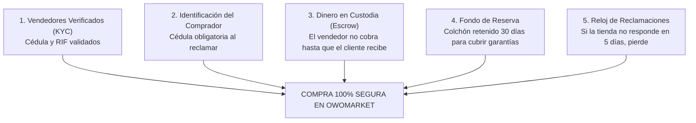

# Guía Completa de OwoMarket: Cómo Funciona el Negocio (Para Todo Público)

> **Versión 1.0 · Septiembre 2026**  
> *Esta guía está escrita en un lenguaje claro, sencillo y sin tecnicismos para que cualquier persona —socios, comerciantes, personal de atención, inversionistas o administradores— entienda de principio a fin cómo funciona OwoMarket, cómo se mueve el dinero, cómo protegemos a compradores y vendedores, y cómo gana la plataforma.*

---

## 1. ¿Qué es OwoMarket en palabras simples?

Imagina un **gran centro comercial digital diseñado específicamente para la realidad de Venezuela**:

1. **El Centro Comercial Central (`owomarket.local`)**:
   Es la entrada principal donde se reúnen todas las tiendas. Un cliente puede pasear por los pasillos virtuales, elegir una camisa de la *Tienda de Ropa*, unos zapatos de la *Zapatería* y un cargador de la *Tienda de Tecnología*, agregarlo todo en un **mismo carrito de compras** y **pagar una sola vez**.
2. **Las Tiendas Propias de cada Comercio (`mitienda.owomarket.local`)**:
   Cada negocio que se afilia recibe su propio local virtual privado. Tiene su propio enlace en internet, su logotipo, sus colores, sus productos y su propia clientela, como si fuera su propia página web, pero con toda la tecnología y el respaldo de OwoMarket por detrás.

---

## 2. Los Tres Protagonistas

| Quién | ¿Quién es en la vida real? | ¿Qué hace en OwoMarket? |
| :--- | :--- | :--- |
| **El Comprador** | El cliente que busca productos desde su teléfono o computadora. | Busca ofertas, compra en varias tiendas a la vez, paga en bolívares por Pago Móvil o Binance, recibe sus paquetes y califica su experiencia. |
| **El Comerciante** | El dueño de un negocio (tienda física o emprendedor digital). | Publica sus productos con fotos y tallas, empaca y envía las compras cuando le avisan que ya pagaron, y cobra sus ganancias en su cuenta bancaria. |
| **El Administrador (OwoMarket)** | El equipo que opera la plataforma. | Actúa como **árbitro y custodio del dinero**: revisa los comprobantes de pago, vigila que las tiendas sean negocios reales, cuida el dinero hasta que el paquete llega a manos del cliente y resuelve disputas si algo sale mal. |

---

## 3. El Viaje del Dinero (Paso a Paso)

Este es el recorrido que sigue cada bolívar y cada dólar desde que alguien hace clic en "Comprar" hasta que el comerciante lo tiene en su banco.

```
 [1. Compra] ──> [2. Pago] ──> [3. Despacho] ──> [4. Entrega] ──> [5. Liberación] ──> [6. Retiro]
  Cliente mete    Paga a Owo    La tienda envía   El cliente      OwoMarket le      El vendedor
  productos en    y el admin    por MRW/Zoom      confirma que    pasa el dinero a  cobra en su
  el carrito      lo aprueba                      le llegó bien   su billetera      cuenta bancaria
```

### Paso 1: Precios en Dólares, Pago en Bolívares (Moneda Dual)
* En Venezuela los precios cambian rápidamente. Para proteger a las tiendas, **todos los productos tienen precio fijado en dólares ($)**.
* Sin embargo, al momento de pagar, el sistema calcula el total en **bolívares (Bs.) usando la tasa oficial del Banco Central de Venezuela (BCV)**.
* **La Tasa Congelada**: En el segundo exacto en que el cliente genera su orden de compra, la tasa del BCV de ese momento queda **"congelada" para ese pedido**. Si mañana el dólar sube o baja, esa compra se cobra y se liquida estrictamente a la tasa que se pactó al inicio.

### Paso 2: ¿A quién le paga el comprador? (Regla de Oro)
> **EL CLIENTE SIEMPRE LE PAGA A OWOMARKET, NUNCA DIRECTAMENTE A LAS TIENDAS.**

* **¿Por qué?** Si el cliente compra en 3 tiendas distintas, sería una pesadilla pedirle que haga 3 Pagos Móviles diferentes a cuentas de desconocidos.
* El cliente hace **un solo pago** a la cuenta bancaria o Binance Pay de OwoMarket.
* El equipo de OwoMarket revisa la referencia bancaria. Cuando confirma que el dinero está en la cuenta, el sistema le da la orden a las tiendas: *"El pedido ya está pagado con total seguridad, pueden despachar"*.

### Paso 3: El Despacho
* Cada tienda empaca sus productos y los envía a la dirección del cliente usando la empresa de encomiendas de su preferencia (MRW, Zoom, Tealca o su propio repartidor local).
* La tienda ingresa en el sistema el número de guía para que el comprador pueda rastrear su paquete.

### Paso 4: La Entrega y la Custodia Segura (Escrow)
Aquí ocurre la magia que evita las estafas:
* Cuando el vendedor entrega el paquete, entra al sistema y marca: *"Ya entregué el pedido"*.
* **¡ATENCIÓN! Marcar "Entregado" NO le da el dinero al vendedor de inmediato.**
* En ese momento, OwoMarket retiene el dinero en una caja fuerte virtual (**custodia o Escrow**) y le envía un mensaje al comprador: *"Tu paquete figura como entregado. ¿Lo recibiste todo en orden?"*.
* El dinero se libera por cualquiera de estas **dos únicas razones**:
  1. **El comprador pulsa "Confirmar Entrega"**: diciendo que todo llegó en perfectas condiciones.
  2. **Pasan 7 días sin que el comprador diga nada**: si el comprador no confirma pero tampoco reclama, el sistema entiende que todo salió bien y libera los fondos automáticamente.

### Paso 5: El Fondo de Reserva de Garantía (30 días)
Para que los compradores tengan la tranquilidad de que sus compras están protegidas:
* Al liberarse el dinero de una venta, **OwoMarket pasa la mayor parte a la billetera disponible del vendedor**, pero **retiene un pequeño porcentaje durante 30 días** (el Fondo de Garantía).
* Ese porcentaje varía según lo confiable que sea la tienda (generalmente entre el 5% y el 10%).
* **¿Para qué sirve?** Si a los 10 días el producto se daña o resulta ser defectuoso y la tienda debe devolver el dinero, OwoMarket ya tiene ese colchón guardado y puede responderle al comprador sin tener que perseguir al comerciante.
* Si a los 30 días no hubo reclamos, **ese dinero retenido se desbloquea al 100% y pasa al saldo libre del vendedor**.

### Paso 6: El Retiro a la Cuenta Bancaria
* El comerciante ve en su pantalla su saldo disponible.
* Hace clic en *"Solicitar Retiro"*, introduce su cuenta bancaria nacional y el monto.
* El administrador de OwoMarket aprueba la solicitud y transfiere los fondos a su banco (descontando una pequeña tarifa interbancaria si es de otro banco).

---

## 4. Las 5 Garantías de OwoMarket (Los 5 Candados contra Estafas)

En el comercio electrónico venezolano existe mucha desconfianza por temor a transferir y no recibir nada, o a enviar un producto y que el pago sea una captura falsa. OwoMarket resuelve esto con **5 candados automáticos**:



1. **Candado 1 · Vendedores Verificados con Cédula y RIF (KYC)**:
   Ninguna tienda puede retirar ni un solo bolívar si primero no ha enviado su cédula de identidad, su RIF fiscal y sus datos legales comprobados. OwoMarket sabe exactamente quién es la persona detrás de cada negocio.
2. **Candado 2 · Cédula del Comprador al Reclamar**:
   Para comprar, al cliente se le pide lo mínimo para que su compra sea rápida. Pero si abre un reclamo formal por garantía, debe registrar su número de cédula. Esto evita reclamos falsos o fraudulentos.
3. **Candado 3 · Entrega Verificada**:
   El vendedor no puede cobrar solo por decir que ya envió. El dinero solo se suelta cuando el comprador confirma que lo tiene en sus manos o vence el plazo de espera.
4. **Candado 4 · El Fondo de Garantía**:
   Cada tienda tiene un respaldo de dinero guardado en la plataforma para responder ante devoluciones o defectos de fábrica.
5. **Candado 5 · El Reloj de Reclamaciones (Fin al "Me dejaron en visto")**:
   * Si un cliente recibe un producto roto o equivocado, abre una reclamación en la plataforma.
   * La tienda tiene un **plazo máximo de 5 días con un reloj en cuenta regresiva** para responder y dar una solución.
   * El sistema le envía dos avisos de alerta a la tienda para recordárselo.
   * **La Regla del Silencio**: Si la tienda ignora al cliente y deja vencer los 5 días sin responder, **el sistema resuelve automáticamente a favor del comprador y le reembolsa su dinero**. Ignorar al cliente ya no es una opción para salirse con la suya.

---

## 5. El Sistema de Reputación: La Confianza Vale Dinero

En OwoMarket, tener buena reputación no es una simple medallita de adorno en el perfil: **determina cuánto dinero se le retiene a la tienda en cada venta**.

| Nivel de Reputación | ¿Cómo se consigue? | ¿Cuánto se le retiene por 30 días? | Beneficio para la tienda |
| :---: | :--- | :---: | :--- |
| **Nivel Alto** 🟢 | Tener al menos 10 ventas entregadas con éxito, cero quejas desatendidas en 90 días y no tener deudas. | **Solo el 5%** | Cobra casi todo su dinero de inmediato. |
| **Nivel Medio** 🟡 | El nivel en el que entra toda tienda nueva, o comercios que tienen deudas pendientes con la plataforma. | **El 10%** | Nivel estándar de protección. |
| **Nivel Bajo** 🔴 | Tiendas que dejaron vencer el reloj de una reclamación sin contestarle al comprador en los últimos 90 días. | **El 20%** | Mayor retención para proteger a los compradores de tiendas descuidadas. |

> **¿Por qué una tienda deudora no se suspende de inmediato?**  
> Si una tienda le debe dinero a la plataforma y la cerramos, **nos aseguramos de que no pague nunca**, porque los comercios pagan vendiendo. En su lugar, el sistema la baja de reputación y va descontando la deuda automáticamente de sus próximas ventas.

---

## 6. ¿Cómo Gana Dinero OwoMarket? (El Modelo de Negocio)

OwoMarket genera ingresos a través de tres vías legítimas y transparentes:

1. **Comisión por Venta Realizada**:
   * Por cada venta completada con éxito, la plataforma descuenta una comisión por el servicio de cobro, tecnología y garantía.
   * Por defecto es el **8%**, pero puede ser menor si la tienda paga un plan de suscripción, o una tasa acordada personalmente con tiendas de alto volumen.
2. **Planes de Suscripción para Tiendas (B2B)**:
   * Las tiendas pueden operar con un plan básico o pagar una membresía mensual para obtener beneficios profesionales:
     * Menor comisión por venta (por ejemplo, bajar al 4% o 5%).
     * Publicar productos ilimitados.
     * Mayor visibilidad y posicionamiento en la portada del centro comercial.
     * Estadísticas avanzadas de sus clientes.
3. **Comisiones de Retiro Bancario**:
   * Una pequeña tarifa fija en retiros hacia bancos distintos a las cuentas oficiales de la plataforma, cubriendo los costos de comisiones interbancarias.

---

## 7. OwO Pass: La Llave Maestra del Comprador

Uno de los mayores fastidios en internet es tener que registrarse y recordar una contraseña diferente para cada página web donde compras.

* **OwO Pass es una cuenta única para todo**:
  * Un cliente se registra una sola vez en `owomarket.local`.
  * A partir de ese momento, si visita la *Tienda de Zapatos*, entra con un solo clic.
  * Si luego visita la *Ferretería*, ya está identificado con un clic.
  * No tiene que volver a escribir su nombre, su teléfono ni sus direcciones de entrega: todo se sincroniza de forma automática y segura.

---

## 8. Notificaciones: Nadie se Queda a Ciegas

Para que no haya sorpresas ni malentendidos, OwoMarket envía alertas inmediatas por dos canales:
1. **La Campana en Pantalla**: Avisos visuales en la esquina superior cuando estás navegando en la plataforma.
2. **Correo Electrónico Automático**:
   * **Obligatorio para todo lo que involucre dinero o fechas límite**: Cada vez que se aprueba un pago, se despacha un paquete, vence una garantía, se abre un reclamo o se transfiere un retiro, llega un correo formal con todos los datos y respaldos.

---

## 9. Preguntas Frecuentes de Negocio

### ¿Qué pasa si el comprador dice que el paquete no llegó?
Se abre un expediente de reclamación. El equipo de administración revisa el número de guía con la empresa de envíos (ej. Zoom o MRW). Si la empresa confirma que se extravió o no se entregó, se le devuelve el dinero al comprador usando los fondos de la venta retenida.

### ¿Qué pasa si el comerciante vende un producto y no tiene inventario?
El pedido se puede cancelar. El dinero del comprador queda a salvo porque OwoMarket lo tiene en custodia, por lo que se le reintegra de inmediato sin depender de la buena voluntad del comerciante.

### ¿Por qué OwoMarket no automatiza el cobro con tarjeta de crédito internacional?
Porque en Venezuela la inmensa mayoría de las transacciones del día a día se realizan en bolívares por **Pago Móvil** o en criptomonedas estables por **Binance Pay**. El sistema está adaptado a cómo compran los venezolanos hoy en día, con conciliación rápida y humana de referencias bancarias.

---

## Resumen en una Frase
> **OwoMarket es la plataforma que permite a cualquier comercio venezolano tener su propia tienda online profesional y vender en un marketplace conjunto, cobrando en bolívares a tasa oficial BCV, con la seguridad de que el comprador no será estafado y el vendedor tiene su pago 100% garantizado.**
