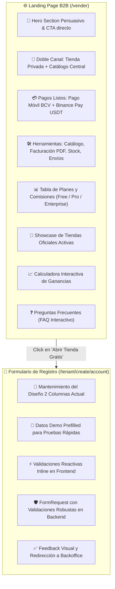

# 📋 Plan de Trabajo: Landing Page B2B para Negocios y Optimización del Registro de Comercios

## 🎯 Objetivo
Diseñar e implementar una **Landing Page de Captación Comercial para Negocios (`/vender`)** de alto impacto visual y persuasivo, junto con el **fortalecimiento de validaciones (Frontend y Backend)** en el formulario de registro de tiendas (`/tenant/create/account`), preservando su diseño visual actual y sus datos de prueba por defecto.

---

## 🗺️ Alcance y Componentes a Desarrollar

---

## 📌 Desglose Detallado por Fases

### 🔹 Fase 1: Landing Page Comercial de Negocios (`/vender` & `/vende-con-nosotros`)
1. **Controlador y Rutas**:
   - `ViewMerchantLandingGETController.php`: Renderiza `marketplace/landing/MerchantLandingPage.tsx` pasando datos de tiendas destacadas y planes de suscripción.
   - Rutas en `src/Marketplace/Infrastructure/Http/Routes/web.php`:
     - `GET /vender`
     - `GET /vende-con-nosotros`
2. **Página Frontend (`MerchantLandingPage.tsx`)**:
   - **Hero Section**: Titular enfocado a comerciantes, badges de beneficios ("Sin costo de entrada", "Listo en 2 minutos"), botón *"Abrir mi Tienda Gratis"* y botón *"Explorar Tiendas"*.
   - **Explicación del Modelo Doble Canal**: Gráfico interactivo mostrando que el comerciante obtiene un subdominio propio (`mitienda.owomarket.local`) y exposición simultánea en el Marketplace Central.
   - **Solución de Pagos Integrada**: Cómo el comercio cobra sin fricción en Bolívares (Pago Móvil con cálculo a tasa oficial BCV) y en Criptomonedas (Binance Pay / USDT).
   - **Ecosistema de Herramientas del Backoffice**: Tarjetas ilustradas de Catálogo con variantes, Facturación digital fiscal en PDF, Envíos por zonas, Cupones, Clientes y Reseñas.
   - **Tabla Comparativa de Planes**: Gratuito, Pro y Enterprise con desglose de características y comisiones.
   - **Showcase de Tiendas Oficiales**: Slider/Grid con logos, nombres y enlaces de tiendas activas (`TECS`, `Anicom`, `Chivo Store`, `Tecno Isekai`, etc.).
   - **Calculadora Interactiva de Ventas**: Selector de volumen de ventas para visualizar el retorno y ahorro de comisiones.
   - **Preguntas Frecuentes (FAQ)**: Acordeón interactivo con respuestas a dudas frecuentes de comerciantes.
   - **Integración con Layout Central**: Enlaces en el Header Navbar y Footer hacia `/vender`.

---

### 🔹 Fase 2: Robustecimiento y Validaciones del Formulario de Registro (`/tenant/create/account`)
1. **Validaciones en Backend (`CreateTenantOwnerAccountFormRequest.php`)**:
   - `name`: Requerido, string, mín 3 caracteres, máx 100.
   - `email`: Requerido, formato email válido, único en la tabla `users`.
   - `phone`: Requerido, formato telefónico flexible (acepta formatos nacionales e internacionales como `04121234567`, `+584121234567`, etc.).
   - `password`: Requerido, mín 8 caracteres, validación con `confirmPassword` / `password_confirmation`.
   - `store_name`: Requerido, mín 3 caracteres, máx 100, único en `tenants`.
   - `tenant_name` / `slug`: Requerido, formato slug válido (solo letras, números y guiones), único en `domains` y `tenants`.
   - Mensajes descriptivos en español y respuesta estructurada en formato estándar `ApiResponse::error('...', 422, $errors)`.
2. **Validaciones y Experiencia en Frontend (`CreateAccountTenantPage.tsx`)**:
   - **Diseño**: Mantener intacto el layout de 2 columnas con el branding de OwOMarket y el banner lateral que le gusta al usuario.
   - **Datos de prueba**: Mantener los valores demo iniciales prellenados (`Jaen Doe`, `Jaen@hoyoverse.com`, etc.) para pruebas rápidas.
   - **Inline Validation**:
     - Estado de errores por campo (`errors.name`, `errors.email`, `errors.phone`, `errors.password`, `errors.store_name`, `errors.tenant_name`).
     - Alerta visual con bordes rojos y texto explicativo debajo de cada input con error.
     - Auto-formateo inteligente del subdominio al escribir el nombre de la tienda (slug automático en minúsculas).
     - Validación reactiva de coincidencia de contraseñas.
     - Toasts/Banners de error y éxito modernos con Flowbite en lugar de `alert()` nativo del navegador.

---

### 🔹 Fase 3: Testing y Verificación Integral
1. **Tests Backend (PHPUnit / Pest)**:
   - `MerchantLandingPageTest.php`: Verificar que `GET /vender` y `GET /vende-con-nosotros` responden 200 OK con los datos de tiendas y planes.
   - `CreateAccountTenantValidationTest.php`: Validar todos los casos borde de registro (datos válidos, email duplicado, subdominio duplicado, teléfono inválido, contraseñas no coincidentes).
2. **Tests Frontend (Vitest & TypeScript)**:
   - Componentes y validaciones con `npm run test:unit`.
   - Verificación de 0 errores con `npm run types`.
   - Verificación de suite completa con `php artisan test`.

---

## 🛡️ Campos Adicionales Sugeridos (Para Consulta con el Usuario)
Actualmente el formulario cuenta con:
- Nombre del propietario (`name`)
- Correo electrónico (`email`)
- Teléfono de contacto (`phone`)
- Contraseña y confirmación (`password`, `confirmPassword`)
- Nombre comercial de la tienda (`store_name`)
- Subdominio de la tienda (`tenant_name`)

**Campos adicionales opcionales a considerar**:
1. *Categoría o Rubro del Negocio* (Selector: Tecnología, Moda, Alimentos, Anime & Hobbies, Otros) -> Útil para categorizar la tienda automáticamente en el Marketplace Central.
2. *Documento de Identidad / RIF* (Opcional en el registro inicial, o configurable luego en el backoffice).
*(Se recomienda mantener el registro lo más ágil posible de 1 solo paso y permitir completar datos fiscales adicionales dentro del Backoffice del Tenant).*

---

## 🚦 Plan de Ejecución y Commits
1. `feat(marketplace): implement merchant landing page for business onboarding on /vender`
2. `feat(tenant): enhance merchant signup form with comprehensive frontend and backend validations`
3. `test(merchant): add feature and unit tests for merchant landing page and tenant registration validations`
