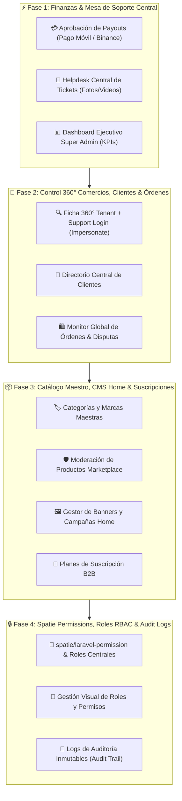

# 📋 Plan Maestro: Panel de Control Super Administrador Global de la Plataforma (OwOMarket Central)

## 🎯 1. Visión General del Proyecto
Este plan maestro estructura el desarrollo integral del **Panel de Control para los Super Administradores de OwOMarket (Dominio Central)**. Su propósito es brindar al equipo directivo, financiero, de soporte y operativo el control 360° sobre todo el ecosistema multi-tienda, transacciones del marketplace, clientes, moderación de catálogo, suscripciones y gobernanza de seguridad con permisos granulares (**Spatie Permission**).

---

## 🏗️ 2. Arquitectura de Fases de Desarrollo

---

## 📦 3. Desglose Detallado por Fases y Módulos

### ⚡ FASE 1: Operaciones Financieras, Helpdesk y Dashboard Ejecutivo

#### Módulo 1.1: Bandeja de Aprobación de Payouts / Liquidaciones
* **Objetivo**: Permitir a los administradores revisar y procesar solicitudes de retiro de saldo de los inquilinos.
* **Archivos Backend**:
  - `src/Admin/Application/UseCase/ListCentralPayoutRequestsUseCase.php`
  - `src/Admin/Application/UseCase/ApproveCentralPayoutRequestUseCase.php`
  - `src/Admin/Application/UseCase/RejectCentralPayoutRequestUseCase.php`
  - Controladores en `src/Admin/Infrastructure/Http/Controller/`
* **Vistas Frontend**:
  - `resources/js/pages/admin/payouts/AdminPayoutsIndexPage.tsx`
  - Modales de aprobación (con input de Número de Referencia / TXID) y de rechazo (motivo).

#### Módulo 1.2: Mesa Central de Tickets de Soporte (Helpdesk Inbox)
* **Objetivo**: Bandeja unificada para atender incidencias de inquilinos y compradores con fotos y videos.
* **Archivos Backend**:
  - `src/SupportTicket/Application/UseCase/ListAdminSupportTicketsUseCase.php`
  - `src/SupportTicket/Application/UseCase/AssignSupportTicketAgentUseCase.php`
  - `src/SupportTicket/Application/UseCase/AdminReplySupportTicketUseCase.php`
* **Vistas Frontend**:
  - `resources/js/pages/admin/support/AdminSupportTicketsPage.tsx`
  - Vista de detalle con chat interactivo, visor multimedia con zoom y reproductor HTML5, selector de estado y prioridad.

#### Módulo 1.3: Dashboard Ejecutivo Super Admin
* **Objetivo**: Reemplazar el placeholder actual por un panel de mando con métricas en tiempo real.
* **Componentes**:
  - Tarjetas de KPIs: GMV total, Comisiones acumuladas, Tiendas activas, Órdenes del día, Payouts pendientes, Tickets sin resolver.
  - Gráfico de evolución de ventas y transacciones.
  - `resources/js/pages/admin/dashboard/AdminDashboardPage.tsx`.

---

### 🏬 FASE 2: Supervisión 360° de Comercios, Clientes Globales y Monitor de Órdenes

#### Módulo 2.1: Ficha 360° del Tenant y Acceso de Soporte (Support Login / Impersonate)
* **Objetivo**: Monitorear la actividad de cada tienda y acceder a su backoffice para soporte técnico 1-click.
* **Vistas & Funcionalidades**:
  - `resources/js/pages/admin/modules/tenants/AdminTenantDetail360Page.tsx`.
  - Historial de ventas de la tienda, productos publicados, notas privadas entre administradores.
  - Generación de token administrativo para acceder al backoffice del inquilino sin solicitar su clave.

#### Módulo 2.2: Directorio Central de Clientes del Marketplace
* **Objetivo**: Administrar la base de datos global de compradores.
* **Vistas & Funcionalidades**:
  - `resources/js/pages/admin/customers/AdminCustomersIndexPage.tsx`.
  - Búsqueda por cédula, nombre, correo o teléfono.
  - Bloqueo/desbloqueo de cuentas por fraude o actividad sospechosa.
  - Historial consolidado de compras multi-tienda y direcciones registradas.

#### Módulo 2.3: Monitor Global de Órdenes y Centro de Disputas / Reembolsos
* **Objetivo**: Auditoría de transacciones del Marketplace y mediación en conflictos.
* **Vistas & Funcionalidades**:
  - `resources/js/pages/admin/orders/AdminGlobalOrdersPage.tsx`.
  - Filtros por tienda proveedora, método de pago (Pago Móvil / Binance) y estado de despacho.
  - Panel de mediación de disputas entre clientes y tiendas.

---

### 📦 FASE 3: Catálogo Maestro, CMS de la Home y Suscripciones B2B

#### Módulo 3.1: Taxonomía Maestra (Categorías y Marcas Globales)
* **Objetivo**: Gestionar el árbol oficial de categorías y marcas maestras que las tiendas sincronizan vía `sync-central`.
* **Vistas Frontend**:
  - `resources/js/pages/admin/catalog/AdminMasterCategoriesPage.tsx`
  - `resources/js/pages/admin/catalog/AdminMasterBrandsPage.tsx`

#### Módulo 3.2: Moderación de Productos para el Marketplace Central
* **Objetivo**: Validar productos postulados por las tiendas para el Marketplace `owomarket.local`.
* **Vistas & Funcionalidades**:
  - `resources/js/pages/admin/catalog/AdminProductsModerationPage.tsx`.
  - Cola de aprobación/rechazo con feedback para el comerciante.

#### Módulo 3.3: Gestor de Banners y Campañas Centrales (Home CMS)
* **Objetivo**: Control visual de la página de inicio del Marketplace.
* **Vistas & Funcionalidades**:
  - `resources/js/pages/admin/cms/AdminHomeBannersPage.tsx`.
  - Creador de sliders principales, promociones destacadas y enlaces a colecciones.

#### Módulo 3.4: Planes de Suscripción y Facturación B2B
* **Objetivo**: Crear y tarifar planes de suscripción para las tiendas (*Free, Pro, Enterprise*).
* **Vistas & Funcionalidades**:
  - `resources/js/pages/admin/plans/AdminSubscriptionPlansPage.tsx`.
  - Configuración de límites de productos, comisiones y precios mensuales/anuales.

---

### 🔒 FASE 4: Spatie Permissions, Roles RBAC y Registro de Auditoría (Audit Trail)

#### Módulo 4.1: Instalación e Integración de `spatie/laravel-permission`
* **Acciones**:
  - Instalación vía Composer: `composer require spatie/laravel-permission`.
  - Publicación y ejecución de migraciones en la base de datos Central.
  - Implementación del Trait `HasRoles` en `Src\Tenant\Infrastructure\Eloquent\Models\User.php` y `App\Models\User.php`.
  - Seeders con roles base: `super_admin`, `support_agent`, `financial_auditor`, `catalog_moderator`.
  - Creación del catálogo completo de permisos (`payouts.approve`, `tenants.suspend`, `tickets.reply`, `catalog.moderate`, `exchange_rate.edit`, `admins.manage`, `audit.view`).

#### Módulo 4.2: Interfaz Visual de Gestión de Roles y Permisos
* **Vistas Frontend**:
  - `resources/js/pages/admin/roles/AdminRolesIndexPage.tsx`.
  - Asignación interactiva de roles y permisos a cada administrador.

#### Módulo 4.3: Registro de Auditoría Inmutable (Audit Trail)
* **Objetivo**: Registrar todas las acciones administrativas críticas.
* **Vistas & Funcionalidades**:
  - `resources/js/pages/admin/audit/AdminAuditLogsPage.tsx`.
  - Tabla de eventos con: Administrador, Acción ejecutada, Recurso afectado, Dirección IP, Timestamp y Detalle de cambios (Diff JSON).

---

## 🧭 4. Actualización del Menú Lateral del Super Admin

En [SidebarDashboardComponent.tsx](file:///c:/laragon/www/owomarket/resources/js/components/ui/SidebarDashboardComponent.tsx), el menú del Super Admin quedará estructurado de la siguiente forma:

1. 📊 **Dashboard General** (`/admin/backoffice/{uuid}/dashboard`)
2. 🏬 **Inquilinos / Tiendas** (Todas, Solicitudes, Suspendidas, Ficha 360°)
3. 💳 **Finanzas & Retiros** (Aprobación de Payouts, Comisiones, Reporte Financiero)
4. 🎫 **Mesa de Soporte** (Bandeja Helpdesk Inquilinos & Clientes)
5. 👤 **Clientes Globales** (Directorio, Historial de Compras, Bloqueos)
6. 🛍️ **Órdenes Marketplace** (Monitor de Ventas, Disputas y Reembolsos)
7. 🏷️ **Catálogo Maestro & CMS** (Categorías, Marcas, Moderación de Productos, Banners Home)
8. 💱 **Tasa BCV / Monedas** (Monitor de Divisas Oficial y Contingencia)
9. 📑 **Planes & Suscripciones** (Tarifas B2B, Comisiones)
10. 🛡️ **Seguridad & Staff** (Administradores, Roles y Permisos Spatie, Logs de Auditoría)

---

## 🧪 5. Plan de Testing y Calidad
- **Backend (PHPUnit / Pest)**: Tests unitarios e integración para cada caso de uso y controlador (mantener 100% de tests pasando en `php artisan test`).
- **Frontend (Vitest & TypeScript)**: Tests de componentes (`npm run test:unit`) y 0 errores de TypeScript (`npm run types`).
- **Commits y Push**: Commits convencionales al finalizar cada componente y push continuo a `origin/moduleProduct`.
