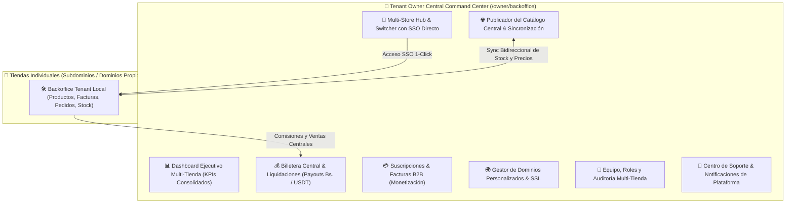

# 📋 Plan Maestro: Módulos y Mejoras para la Cuenta del Inquilino en el Dominio Central (Tenant Owner Hub)

## 🎯 Visión General
El rol de **Tenant Owner** (Dueño de Inquilino / Franquiciado) en el dominio central de OwOMarket requiere una suite de herramientas ejecutivas que le permita gestionar no solo una tienda individual, sino su ecosistema completo de comercio electrónico: múltiples tiendas/sucursales, suscripciones, liquidación de ingresos del Marketplace Central, publicación global de catálogo y configuración corporativa.

---

## 🗺️ Mapa de Arquitectura del Tenant Owner Hub

---

## 🚀 1. Nuevos Módulos para la Cuenta del Inquilino en el Dominio Central

### 🔹 Módulo 1: Hub de Gestión Multi-Tienda y Franquicias (`/owner/stores`)
- **Switcher Rápido de Tiendas**: Selector contextual en la barra superior para alternar entre diferentes marcas o sucursales sin cerrar sesión.
- **Acceso SSO con 1 Clic**: Botón *"Entrar al Backoffice"* que genera un token seguro de sesión y abre la administración de la tienda seleccionada sin pedir credenciales adicionales.
- **Asistente de Creación de Nuevas Tiendas**: Wizard en 3 pasos para desplegar nuevas sucursales (nombre, subdominio, categoría, clonación opcional de catálogo base).
- **Semáforo de Estado Operativo**: Monitoreo de estado por tienda (Activa, En Aprobación, Mantenimiento, Suspendida por Pago).

---

### 🔹 Módulo 2: Billetera Central y Liquidación de Pagos (`/owner/wallet`)
- **Balance Unificado de Ventas del Marketplace Central**:
  - Saldo Disponible para Retiro.
  - Saldo en Tránsito / Retenido por garantía de entrega.
  - Total de Comisiones deducidas transparentemente.
- **Solicitud de Liquidación (Payouts)**:
  - Retiro directo a cuentas bancarias venezolanas vía **Pago Móvil (en Bs. a tasa BCV)**.
  - Retiro en criptoactivos vía **Binance Pay / USDT**.
- **Historial y Comprobantes Contables**:
  - Descarga de comprobantes de pago y conciliación de liquidaciones en PDF y Excel.

---

### 🔹 Módulo 3: Planes de Suscripción y Facturación de la Plataforma (`/owner/billing`)
- **Gestión de Planes por Tienda**:
  - Vista del plan activo (Free / Pro / Enterprise) con fecha de renovación.
  - Barra de consumo de recursos: Productos publicados vs. Límite del plan, cuota de almacenamiento de imágenes.
  - Cambio de plan (Upgrade / Downgrade) con cálculo prorrateado.
- **Métodos de Pago de Membresía**:
  - Configuración de débito recurrente o pago manual por Pago Móvil / Binance Pay.
- **Facturas de la Plataforma**:
  - Descarga de facturas digitales oficiales emitidas por OwOMarket por concepto de comisiones y membresías.

---

### 🔹 Módulo 4: Publicador y Sincronizador de Catálogo Central (`/owner/marketplace-catalog`)
- **Consola de Publicación Global**:
  - Tabla con todos los productos de todas sus tiendas con filtro por tienda de origen.
  - Switch interactivo para **Publicar / Pausar en el Marketplace Central** con 1 clic.
  - Ajuste de precio exclusivo para Marketplace Central (o sincronizado automáticamente con la tienda local).
- **Sincronización Inteligente de Stock**:
  - Descuento de stock en tiempo real: Si un producto se vende en la tienda propia o en el Marketplace Central, el inventario se actualiza en ambos lados al instante.
  - Alerta visual cuando un producto queda sin existencias o está en stock mínimo.
- **Analítica de Productos en el Marketplace**:
  - Métricas de visitas, impresiones en el buscador central y clics por producto.

---

### 🔹 Módulo 5: Gestor de Dominios Personalizados & SSL (`/owner/domains`)
- **Conexión de Dominios Propios**:
  - Guía paso a paso para vincular dominios personalizados (ej: `www.mimarca.com`).
  - Verificador automático de DNS (Comprueba registros CNAME, A y TXT en tiempo real).
  - Aprovisionamiento y renovación automática de certificados SSL gratuitos.

---

### 🔹 Módulo 6: Gestión de Equipo, Roles y Auditoría Multi-Tienda (`/owner/team`)
- **Invitaciones de Usuarios**:
  - Invitar a colaboradores mediante correo electrónico asignándoles acceso a una, varias o todas las tiendas.
- **Roles Granulares**:
  - *Administrador de Tienda*, *Gestor de Catálogo/Inventario*, *Encargado de Despachos/Envíos*, *Contador/Finanzas*.
- **Registro de Auditoría (Activity Log)**:
  - Historial detallado de quién modificó precios, aprobó reembolsos o cambió configuraciones críticas.

---

### 🔹 Módulo 7: Centro de Ayuda, Soporte & Notificaciones (`/owner/support`)
- **Sistema de Tickets de Soporte**:
  - Comunicación directa con los administradores y equipo técnico de OwOMarket.
  - Categorías: Soporte técnico, Consultas de facturación, Mediación de pedidos y Solicitud de verificación.
- **Centro de Notificaciones Central**:
  - Avisos sobre mantenimiento de la plataforma, variaciones oficiales de la tasa BCV, promociones de temporada y recordatorios de renovación de plan.

---

## 🛠️ 2. Mejoras Propuestas a los Módulos Existentes

### 📈 A. Dashboard Central del Tenant Owner ([TenantOwnerDashboardCentralPage.tsx](file:///c:/laragon/www/owomarket/resources/js/pages/tenant/dashboard/TenantOwnerDashboardCentralPage.tsx))
- **De Lista Simple a Command Center**:
  - Añadir 4 KPIs globales: Ventas Totales ($ y Bs. BCV), Total de Pedidos, Calificación Promedio, Productos Activos.
  - Gráfico interactivo de ingresos semanales/mensuales comparativos entre tiendas.
  - Feed de eventos recientes (pedidos pendientes de despacho, stock bajo, nuevas reseñas).

### 📦 B. Módulo de Productos del Inquilino (Tienda Local)
- **Control de Doble Visibilidad**:
  - Checkbox *"Publicar en Marketplace Central"* (por defecto desactivado en la creación para que el inquilino decida conscientemente).
  - Al despublicar del Marketplace Central: mostrar alerta confirmando que el producto seguirá activo y facturable en su tienda privada.
  - Checkbox adicional *"Ocultar en mi Tienda"* para guardar como borrador o pausar venta temporalmente.
- **Sincronización Bidireccional de Variantes**:
  - Mapeo de inventario por talla y color reflejado de inmediato en el catálogo central.

### 🧾 C. Módulo de Facturación & Cobros
- **Automatización Fiscal y Contable**:
  - Cálculo automático en tiempo real de la tasa oficial del BCV en todas las facturas PDF generadas.
  - Reporte mensual exportable en Excel/PDF estructurado para declaraciones tributarias.
  - Manejo de IGTF (Impuesto a las Grandes Transacciones Financieras) en pagos en USD / Cripto.

### 🚚 D. Módulo de Envíos y Logística
- **Impresión Térmica de Guías de Despacho**:
  - Formato listo para etiquetas autoadhesivas (10x15 cm) y hojas de empaque (packing slips).
  - Integración de números de guía de mensajerías nacionales (MRW, Zoom, Tealca).

---

## 📅 Hoja de Ruta Sugerida de Implementación

| Fase | Módulos / Mejoras | Prioridad |
| :--- | :--- | :---: |
| **Fase A** | Dashboard Ejecutivo Central + SSO 1-Click a tiendas locales + Billetera Central | 🔴 Alta |
| **Fase B** | Publicador de Catálogo Central con sync de stock bidireccional + Control de visibilidad | 🔴 Alta |
| **Fase C** | Gestión de Planes de Monetización, Suscripciones y Facturas B2B | 🟡 Media |
| **Fase D** | Gestor de Dominios Personalizados & SSL + Roles de Equipo Multi-Tienda | 🟢 Flexible |
| **Fase E** | Centro de Soporte, Tickets y Auditoría de Actividad | 🟢 Flexible |
