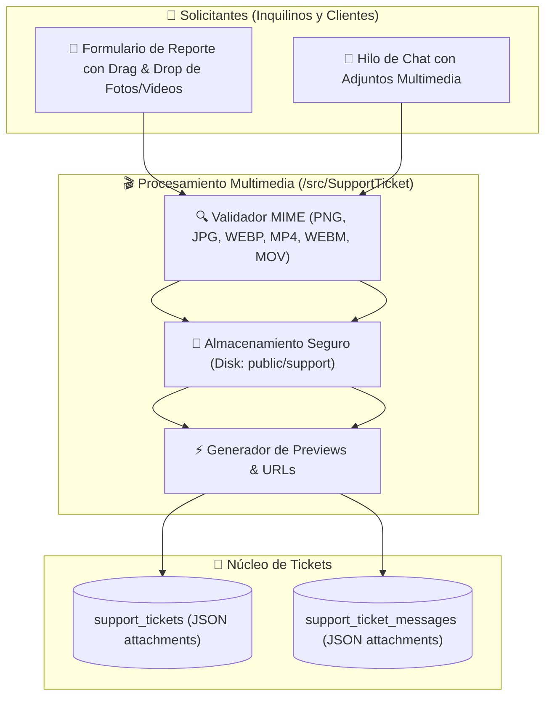

# 📋 Plan de Trabajo: Módulo Universal de Tickets de Soporte, Reporte de Errores y Adjuntos Multimedia (Fotos y Videos)

## 🎯 1. Objetivo General
Diseñar e implementar un **Sistema Centralizado de Tickets de Soporte e Incidencias con Soporte Multimedia Completo** en OwOMarket que permita a:
1. **Inquilinos (Tenant Owners)**: Reportar fallos técnicos en su tienda/backoffice, problemas de sincronización, liquidaciones o facturación, adjuntando capturas de pantalla y videos demostrativos del error.
2. **Clientes Registrados (Central Customers)**: Reportar errores durante la compra, problemas con pedidos o productos dañados adjuntando fotos y videos de evidencia.
3. **Administradores y Equipo Técnico (Staff/Admin)**: Gestionar, clasificar, priorizar y responder a los tickets mediante un hilo conversacional interactivo con reproducción de video y visor de imágenes.

---

## 🗺️ 2. Arquitectura del Módulo y Manejo Multimedia

---

## 🗄️ 3. Modelo de Datos (Base de Datos Central)

### Tabla `support_tickets`
- `id` (UUID, PK)
- `ticket_number` (String, único, ej: `TKT-20260819-XXXX`)
- `requester_type` (`tenant_owner`, `customer`, `guest`)
- `user_id` (UUID, ID del usuario solicitante)
- `tenant_id` (String, nullable - Tienda involucrada si aplica)
- `category` (`technical_error`, `billing_payout`, `order_issue`, `account_access`, `feature_request`, `other`)
- `priority` (`low`, `medium`, `high`, `urgent`)
- `status` (`open`, `in_progress`, `waiting_reply`, `resolved`, `closed`)
- `subject` (String, título del reporte)
- `description` (Text, detalle inicial)
- `attachments` (JSON nullable, array de objetos con `[{url, type: 'image'|'video', original_name, size}]`)
- `metadata` (JSON, información del navegador, URL del error, sistema operativo)
- `last_reply_at` (Timestamp)
- `timestamps`

### Tabla `support_ticket_messages`
- `id` (UUID, PK)
- `ticket_id` (UUID, FK a `support_tickets`)
- `sender_type` (`tenant_owner`, `customer`, `support_agent`, `admin`)
- `sender_id` (UUID)
- `sender_name` (String)
- `message` (Text)
- `attachments` (JSON nullable, array de fotos y videos adjuntos)
- `is_internal_note` (Boolean default false)
- `timestamps`

---

## 🏗️ 4. Estructura Backend (Arquitectura Hexagonal `src/SupportTicket`)

- **Domain**:
  - `Entities/SupportTicket.php`, `SupportTicketMessage.php`
  - `ValueObjects/TicketStatus.php`, `TicketPriority.php`, `TicketCategory.php`
- **Application / Use Cases**:
  - `CreateSupportTicketUseCase.php`: Genera el ticket procesando y guardando archivos multimedia.
  - `ListUserSupportTicketsUseCase.php`: Lista los tickets del usuario con conteo por estado.
  - `GetSupportTicketDetailUseCase.php`: Obtiene el ticket con su historial cronológico de mensajes y adjuntos.
  - `AddMessageToTicketUseCase.php`: Agrega respuesta con adjuntos opcionales y actualiza estados.
  - `UploadSupportAttachmentService.php`: Valida tipos MIME (imágenes y videos hasta 25MB) y guarda en disco.
  - `UpdateTicketStatusUseCase.php`: Cambia estado a Resuelto o Cerrado.
- **Infrastructure / Controllers & Routes**:
  - `ViewTenantOwnerSupportGETController.php`: Renderiza `/tenant/owner/backoffice/{user_uuid}/support`.
  - `ViewCustomerSupportGETController.php`: Renderiza `/account/support`.
  - `CreateSupportTicketPOSTController.php`: API `POST /api/support/tickets` (soporta Multipart/FormData con múltiples archivos).
  - `ListSupportTicketsGETController.php`: API `GET /api/support/tickets`.
  - `GetSupportTicketDetailGETController.php`: API `GET /api/support/tickets/{id}`.
  - `AddSupportTicketMessagePOSTController.php`: API `POST /api/support/tickets/{id}/messages` (soporta Multipart/FormData).
  - `UpdateSupportTicketStatusPATCHController.php`: API `PATCH /api/support/tickets/{id}/status`.

---

## 🎨 5. Interfaces de Usuario (Frontend)

### 1. **Tenant Owner Support Hub** ([TenantOwnerSupportPage.tsx](file:///c:/laragon/www/owomarket/resources/js/pages/tenant/support/TenantOwnerSupportPage.tsx))
- Pestaña de navegación en [TenantOwnerNavTabs.tsx](file:///c:/laragon/www/owomarket/resources/js/components/tenant/TenantOwnerNavTabs.tsx).
- Tarjetas resumen: Total tickets, Abiertos, En Revisión, Resueltos.
- Modal de reporte de error con:
  - Selector de Categoría y Prioridad.
  - Selector de tienda afectada.
  - **Área de carga multimedia (Drag & Drop)** para subir múltiples fotos o videos.
  - Previsualización reactiva con miniaturas de imágenes y badges de video antes de enviar.
- Vista interactiva de Hilo / Chat con visor de imágenes integrado y reproductor de video HTML5.

### 2. **Portal de Soporte para Clientes** ([CustomerSupportPage.tsx](file:///c:/laragon/www/owomarket/resources/js/pages/customer/support/CustomerSupportPage.tsx))
- Integrado en el layout de cuenta de cliente ([CustomerAccountLayout.tsx](file:///c:/laragon/www/owomarket/resources/js/components/layouts/CustomerAccountLayout.tsx)).
- Creación ágil de reportes de error con soporte de fotos y videos de evidencia.

---

## 🧪 6. Plan de Testing y Verificación
- **Backend Tests**: `tests/Feature/SupportTicket/SupportTicketLifecycleTest.php`
  - Creación de ticket con carga simulada de múltiples imágenes y videos (`UploadedFile::fake()->image()` y `UploadedFile::fake()->create('demo.mp4', 5000)`).
  - Envío de mensajes en hilo con adjuntos.
  - Validación de tipos de archivo y límites de tamaño.
- **Frontend Tests**: Pruebas unitarias de componentes con Vitest.
- Verificación de 100% tests pasando (`php artisan test` y `npm run test:unit`) y 0 errores de TypeScript (`npm run types`).
- Commit con Conventional Commits y Push a `origin/moduleProduct`.
