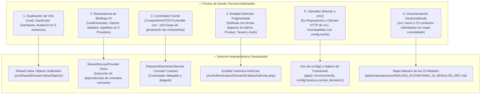

# 📋 Plan de Refactorización: Unificación de Shared, Servicios de Infraestructura y Limpieza de Deuda Técnica

> **Estado:** Pendiente de aprobación  
> **Rama de trabajo:** `moduleProduct`  
> **Áreas afectadas:** `src/Shared/`, `src/Admin/`, `src/Tenant/`, `src/Product/`, `src/Authentication/`, `src/User/`, `app/Providers/`, `planes/anotaciones/`  
> **Tipo:** `refactor` / `chore` (limpieza arquitectónica, desacoplamiento y optimización de configuración)

---

## 1. 🔍 Diagnóstico y Justificación Arquitectónica

Tras la estabilización y validación al 100% de los módulos core y del Storefront público del Tenant, se identificaron 6 puntos de deuda técnica y redundancia estructural que impactan la mantenibilidad, el cumplimiento del estándar DDD y la compatibilidad con el entorno de producción (`config:cache`):



---

## 2. 🗺️ Plan de Implementación por Fases

---

### 🔹 Fase 1: Unificación de Value Objects Compartidos en `src/Shared/Domain/ValueObjects/`

#### Diagnóstico:
Actualmente existen copias idénticas de Value Objects en múltiples contextos:
- `Uuid`: `src/Shared/`, `src/User/`, `src/Tenant/`, `src/Product/`, `src/Authentication/`, `src/Admin/`
- `UserEmail`: `src/User/`, `src/Tenant/`, `src/Product/`, `src/Authentication/`, `src/Admin/`
- `UserName`: `src/User/`, `src/Tenant/`, `src/Product/`, `src/Authentication/`, `src/Admin/`
- `AvatarUrl`: `src/User/`, `src/Tenant/`, `src/Product/`, `src/Authentication/`, `src/Admin/`

#### Acciones:
1. Asegurar que `src/Shared/Domain/ValueObjects/` cuente con las implementaciones robustas de:
   - `Uuid.php`
   - `UserEmail.php`
   - `UserName.php`
   - `AvatarUrl.php`
2. Actualizar los imports (`use Src\Shared\Domain\ValueObjects\...`) en:
   - Entidades, DTOs y Use Cases de `src/Admin/`
   - Entidades, DTOs y Use Cases de `src/Tenant/`
   - Entidades, DTOs y Use Cases de `src/Product/`
   - Entidades, DTOs y Use Cases de `src/Authentication/`
   - Entidades, DTOs y Use Cases de `src/User/`
3. Eliminar los archivos de Value Objects redundantes en los subdirectorios de dominio específicos.

---

### 🔹 Fase 2: Centralización de Bindings de Infraestructura en `SharedServiceProvider`

#### Diagnóstico:
Cinco ServiceProviders registran de forma redundante los mismos contratos:
- `UuidGenerator::class` → `LaravelUuidGenerator::class`
- `PasswordHasher::class` → `LaravelPasswordHasher::class`
- `PasswordValidator::class` → `LaravelPasswordValidator::class`

#### Acciones:
1. Registrar un `SharedServiceProvider.php` (o consolidar en `AppServiceProvider.php`) que vincule una sola vez los contratos transversales:
   ```php
   $this->app->bind(UuidGenerator::class, LaravelUuidGenerator::class);
   $this->app->bind(PasswordHasher::class, LaravelPasswordHasher::class);
   $this->app->bind(PasswordValidator::class, LaravelPasswordValidator::class);
   $this->app->bind(PasswordGeneratorInterface::class, SecurePasswordGeneratorService::class);
   ```
2. Limpiar los bindings redundantes en `AdminServiceProvider.php`, `TenantServiceProvider.php`, `AuthServiceProvider.php` y `UserServiceProvider.php`.

---

### 🔹 Fase 3: Refactorización y Adelgazamiento de `CreateAdminPOSTController`

#### Diagnóstico:
`src/Admin/Infrastructure/Http/Controller/CreateAdminPOSTController.php` contiene ~100 líneas de código privado para generar contraseñas seguras (`generarContrasena`, `validarContrasena`, `generarMultiplesContrasenas`), además de leer `env()` directamente.

#### Acciones:
1. Crear el contrato `Src\Shared\Domain\Contracts\PasswordGenerator` e implementarlo en `Src\Shared\Infrastructure\Security\SecurePasswordGenerator.php`.
2. Inyectar `PasswordGenerator` en `CreateAdminUseCase.php` para que la generación de contraseña por defecto sea una responsabilidad de la capa de aplicación/dominio cuando no se especifique una contraseña previa.
3. Dejar `CreateAdminPOSTController.php` como un controlador delgado conforme a `reglas.md` §2.2:
   - Validar entrada vía FormRequest.
   - Invocar el Use Case.
   - Devolver `ApiResponse::success()`.

---

### 🔹 Fase 4: Consolidación de la Entidad de Dominio `AuthUser`

#### Diagnóstico:
La entidad `AuthUser` se encuentra duplicada en `src/Admin/Domain/Entities/AuthUser.php`, `src/Tenant/Domain/Entities/AuthUser.php`, `src/Product/Domain/Entities/AuthUser.php` y `src/Authentication/Domain/Entities/AuthUser.php`, con firmas divergentes.

#### Acciones:
1. Establecer `src/Authentication/Domain/Entities/AuthUser.php` (o `src/Shared/Domain/Entities/AuthUser.php`) como la entidad de dominio canónica para la representación de identidades de usuario autenticadas.
2. Unificar los casos de uso que consultan usuarios por API (`ConsultAuthUserApiByUuid`) para que hagan referencia al contrato y entidad canónica.
3. Eliminar las clases de entidad duplicadas en `Admin`, `Tenant` y `Product`.

---

### 🔹 Fase 5: Erradicación del uso directo de `env()` en la capa `src/`

#### Diagnóstico:
En producción, cuando se ejecuta `php artisan config:cache`, Laravel vacía las variables de entorno y `env()` retorna `null`. Hay llamadas directas a `env()` en:
- `src/Tenant/Infrastructure/Eloquent/Repositories/TenantRepository.php` (`env('APP_CENTRAL_DOMAIN')`)
- `src/Admin/Infrastructure/Services/AuthApiClient.php` (`env('APP_ENV')`)
- `src/Tenant/Infrastructure/Http/Services/AuthCentralApiClient.php` (`env('APP_ENV')`)
- `src/Tenant/Infrastructure/Http/Services/AuthTenantApiClient.php` (`env('APP_ENV')`)
- `src/Product/Infrastructure/Http/Services/AuthTenantApiClient.php` (`env('APP_ENV')`)
- `src/Authentication/Infrastructure/Services/UserApiTenantClient.php` (`env('APP_ENV')`)
- `src/Authentication/Infrastructure/Services/UserApiCentralClient.php` (`env('APP_ENV')`)
- `src/Authentication/Infrastructure/Services/TenantApiCentralClient.php` (`env('APP_ENV')`)

#### Acciones:
1. Reemplazar `env('APP_ENV') == 'local'` por `app()->environment('local')` o `config('app.env') === 'local'`.
2. Reemplazar `env('APP_CENTRAL_DOMAIN')` por `config('tenancy.central_domains.0', 'owomarket.test')` o `config('app.domain')`.
3. Asegurar que las configuraciones necesarias estén registradas en los archivos correspondientes dentro de `config/` (`config/app.php`, `config/tenancy.php`, etc.).

---

### 🔹 Fase 6: Documentación del Ecosistema de 23 Módulos en `planes/anotaciones/`

#### Acciones:
1. Crear el documento maestro [planes/anotaciones/ANALISIS_ECOSISTEMA_23_MODULOS_SRC.md](file:///c:/laragon/www/owomarket/planes/anotaciones/ANALISIS_ECOSISTEMA_23_MODULOS_SRC.md) que detalle los 23 contextos existentes:
   - **Plataforma Central:** `Admin`, `Tenant`, `CentralCustomer`, `CentralMarketplace`, `Monetization`, `Authentication`, `User`.
   - **Backoffice del Tenant:** `Product`, `Category`, `Brand`, `Attribute`, `Coupon`, `Tax`, `Shipping`, `Billing`, `Customer`, `Order`, `Shipment`, `Review`, `TenantSettings`, `Payment`.
   - **Storefront & Shared:** `Marketplace`, `Shared`.
2. Incluir tablas de base de datos asociadas, contratos de repositorios principales y diagramas de relaciones entre agregados.

---

### 🔹 Fase 7: Validación de Calidad, QA y Estrategia de Commits

#### Acciones:
1. **Tests Automatizados**:
   - Ejecutar suite completa `php artisan test` garantizando 0 regresiones en los 398+ tests existentes.
2. **Tipado TypeScript**:
   - `npm run types` (`tsc --noEmit`) con 0 errores.
3. **Formateo**:
   - `vendor/bin/pint` conforme a PSR-12.
4. **Commits y Sincronización Remota**:
   - Commit 1: `refactor(shared): consolidate common value objects into shared domain`
   - Commit 2: `refactor(providers): centralize shared infrastructure bindings in SharedServiceProvider`
   - Commit 3: `refactor(admin): extract secure password generator and slim down CreateAdminPOSTController`
   - Commit 4: `refactor(auth): unify canonical AuthUser domain entity across contexts`
   - Commit 5: `fix(config): replace direct env calls with config and app helpers for production cache safety`
   - Commit 6: `docs(architecture): create comprehensive analysis document for all 23 src contexts`
   - `git push origin moduleProduct` tras cada commit.

---

## 3. ☑️ Checklist de Control

- [ ] **Fase 1**: Unificación de VOs (`Uuid`, `UserEmail`, `UserName`, `AvatarUrl`) en `src/Shared/Domain/ValueObjects/`.
- [ ] **Fase 2**: Centralización de ServiceProviders y eliminación de bindings redundantes.
- [ ] **Fase 3**: Extracción de `SecurePasswordGenerator` y controlador delgado en `CreateAdminPOSTController.php`.
- [ ] **Fase 4**: Consolidación de `AuthUser` canónico y eliminación de entidades duplicadas.
- [ ] **Fase 5**: Sustitución de `env()` por `config()` y `app()->environment()`.
- [ ] **Fase 6**: Documento maestro `planes/anotaciones/ANALISIS_ECOSISTEMA_23_MODULOS_SRC.md`.
- [ ] **Fase 7**: Validación completa (`php artisan test` 100% verde, `npm run types`, Pint, Commits y Push a origin).
