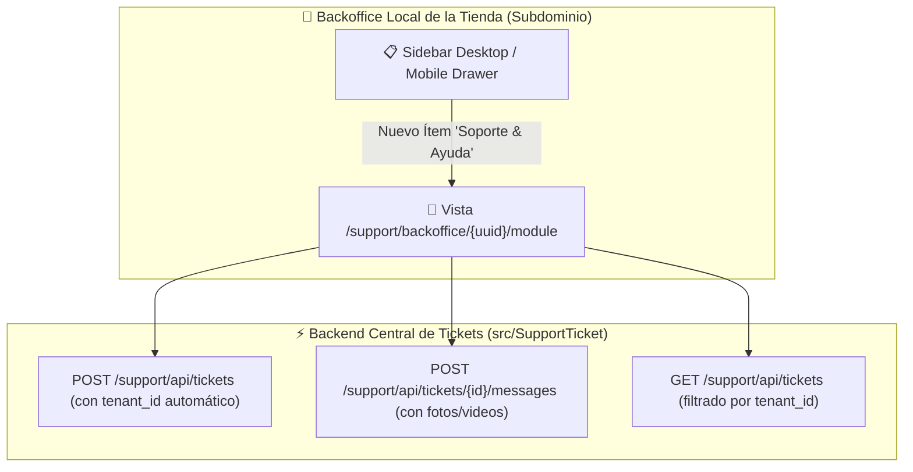

# 📋 Plan de Trabajo: Módulo de Soporte y Reporte de Errores en el Backoffice Local de la Tienda del Inquilino

## 🎯 1. Objetivo General
Habilitar el **Módulo de Soporte y Reporte de Incidencias con Fotos y Videos** directamente dentro del **Backoffice Administrativo Local de cada Tienda Inquilina** (subdominio `tienda.owomarket.local/support/backoffice/{user_uuid}/module`).

De esta manera, tanto los **Dueños de Tienda (Owner)** como los **Administradores de Tienda (Admin/Staff)** podrán:
1. Reportar fallos específicos de su tienda sin tener que salir al dominio central.
2. El `tenant_id` se asocia automáticamente a la tienda actual.
3. Adjuntar múltiples fotos y videos de errores (ej: fallas al guardar productos, cálculo de impuestos, envíos, facturación).
4. Ver el historial de tickets de su tienda y conversar en tiempo real con el equipo técnico de OwOMarket.

---

## 🗺️ 2. Arquitectura de Navegación & Rutas en el Inquilino

---

## 🏗️ 3. Componentes y Archivos a Modificar / Crear

### 1. **Rutas del Inquilino**:
- `routes/tenant.php`: Registrar prefijo `support` apuntando a `src/SupportTicket/Infrastructure/Http/Routes/tenant.php`.
- `src/SupportTicket/Infrastructure/Http/Routes/tenant.php`:
  - `GET /backoffice/{user_uuid}/module` -> `ViewTenantStoreSupportGETController` (Renderiza `tenant/support/TenantStoreSupportPage`).
  - `GET /api/tickets` -> `ListTenantStoreSupportTicketsGETController`.
  - `POST /api/tickets` -> `CreateTenantStoreSupportTicketPOSTController`.
  - `POST /api/tickets/{id}/messages` -> `AddTenantStoreSupportMessagePOSTController`.

### 2. **Menús de Navegación del Backoffice Local**:
- [SidebarDashboardComponent.tsx](file:///c:/laragon/www/owomarket/resources/js/components/ui/SidebarDashboardComponent.tsx): Agregar ítem *"Soporte & Reportes"* con icono de soporte en la sección de `owner`/`admin`.
- [NavBarMovilDashboardComponent.tsx](file:///c:/laragon/www/owomarket/resources/js/components/ui/NavBarMovilDashboardComponent.tsx): Agregar ítem *"Soporte & Reportes"* en el menú lateral móvil.

### 3. **Vista Frontend**:
- `resources/js/pages/tenant/support/TenantStoreSupportPage.tsx`:
  - Panel nativo del Backoffice de la tienda.
  - Métricas de tickets de la tienda actual.
  - Modal con previsualización de imágenes y videos antes de subir.
  - Chat interactivo con reproductor de video HTML5 y visor de capturas.

---

## 🧪 4. Plan de Testing y Verificación
- **Backend Tests**: `tests/Feature/Tenant/TenantStoreSupportApiTest.php`
  - Renderizado de vista `/support/backoffice/{uuid}/module` en inquilino.
  - Creación de ticket con adjuntos en contexto de inquilino (`tenant()->id`).
  - Respuestas en hilo y actualización de estado.
- **Frontend Tests**: Unit tests con Vitest.
- 100% tests pasando (`php artisan test` y `npm run test:unit`) y 0 errores de TypeScript (`npm run types`).
- Commit con Conventional Commits y Push a `origin/moduleProduct`.
